###  Homework0 Report

*Claim*: I use *jadenq* as my username to login the instance with Putty and SSH key pair, Java version is java-1.8.0-openjdk-amd64, Hadoop version is Hadoop-2.9.2, Google Cloud Platform VMs as my setting up environment.

#### Table of Content

[TOC]

#### 0.Google Cloud Platform

##### References

1. https://www.youtube.com/watch?v=fmh94mNQHQc

##### Setup

Setting up the VM on Google Cloud, use username and password to login my VM.


##### Putty

Used the method from reference to manage this instance via Putty and prepare to use password to login.

```shell
vim /etc/ssh/sshd_config #set passwordAuthentication to yes`

service sshd restart  #restart sshd service

adduser jaden # add user and set password so I can use password to login in the future
```

#### 1.Java environment

##### References

1. https://blog.csdn.net/zbj18314469395/article/details/86064849
2. https://stackoverflow.com/questions/9612941/how-to-set-java-environment-path-in-ubuntu
3. https://blog.csdn.net/qq496013218/article/details/73195867
4. https://hadoop.apache.org/docs/stable/hadoop-project-dist/hadoop-common/SingleCluster.html
5. https://vitux.com/how-to-setup-java_home-path-in-ubuntu/

```shell
sudo apt-get install openjdk-8-jdk # download jdk8 which support hadoop2.9.x
java -version

# Edit the system Path file
export JAVA_HOME=/usr/lib/jvm/java-1.8.0-openjdk-amd64
echo $JAVA_HOME
export PATH=$PATH:$JAVA_HOME/bin
echo PATH
sudo vim /etc/environment
```

#### 2.Install Hadoop

##### References

1. https://hadoop.apache.org/docs/stable/hadoop-project-dist/hadoop-common/SingleCluster.html

```shell
# install requisite softwares
sudo apt-get install ssh
sudo apt-get install pdsh
# download hadoop2.9.2
wget https://archive.apache.org/dist/hadoop/common/hadoop-2.9.2/hadoop-2.9.2.tar.gz
tar xvzf hadoop-2.9.2.tar.gz /usr/local# unzip it 
```

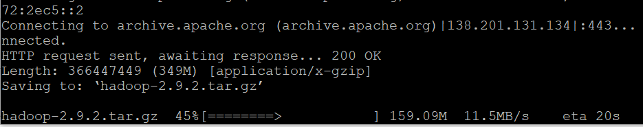

```shell
# edit hadoop-env.sh
vim hadoop-2.9.2/etc/hadoop/hadoop-env.sh
# set to the root of your Java installation
whereis java
export JAVA_HOME=/usr/lib/jvm/java-1.8.0-openjdk-amd64
```

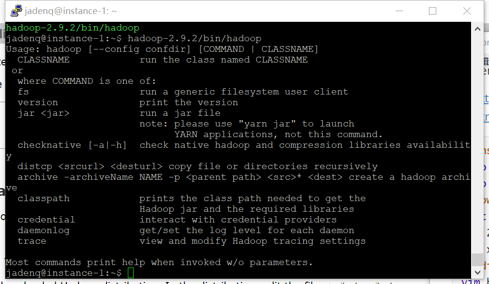

#### 3.Configure single-node Hadoop - Homework0.a

**a. [20 marks] Single-node Hadoop Setup**

##### References

1. Apache Official Tutorialhttps://hadoop.apache.org/docs/stable/hadoop-project-dist/hadoop-common/SingleCluster.html
2. Tutorial2http://mobitec.ie.cuhk.edu.hk/ierg4300Fall2021/tutorial/tutorial2/ 
3. https://blog.csdn.net/u013197629/article/details/73608613

##### Setup

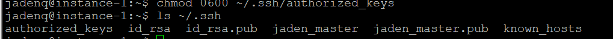

```shell
# Create an User Account for Hadoop
sudo useradd -m hadoop -s /bin/bash
sudo passwd hadoop
sudo adduser hadoop sudo

# set pk name of SSH as hadoop
sudo apt-get install openssh-server
cd ~/.ssh/
ssh-keygen -t rsa
cat ./hadoop.pub >> ./authorized_keys
cat ./id_rsa.pub >> ./authorized_keys
# change the owner as hadoop
chmod 0600 ~/.ssh/authorized_keys
sudo chown -R hadoop ./hadoop
# check and give hadoop permission to change files
sudo chmod 777 /usr/local/hadoop
su hadoop
cd /usr/local/hadoop
./bin/hadoop version
```

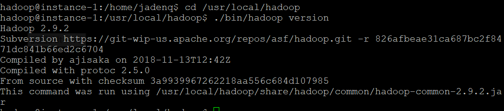

##### Tests

###### Test1 Wordcount

```shell
# run a wordcount
mkdir ./input
cp ./etc/hadoop/*.xml ./input   
./bin/hadoop jar ./share/hadoop/mapreduce/hadoop-mapreduce-examples-*.jar grep ./input ./output 'dfs[a-z.]+'
cat ./output/*   
rm -r ./output
```

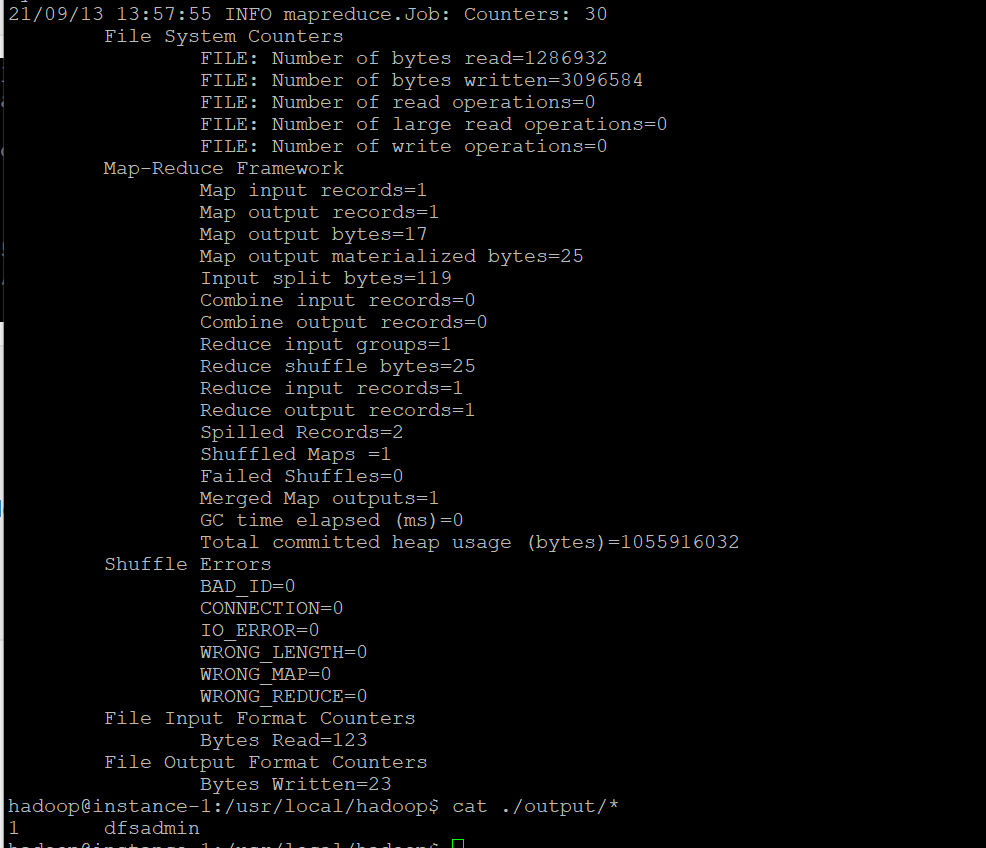

###### Test2 Terasort

```shell
# run Terasort

# generate the data for sorting
./bin/hadoop jar \
./share/hadoop/mapreduce/hadoop-mapreduce-examples-2.9.2.jar \
teragen 100000 terasort/input
# terasort the generated data
./bin/hadoop jar \
./share/hadoop/mapreduce/hadoop-mapreduce-examples-2.9.2.jar \
terasort terasort/input terasort/output
# validate the output is sorted
./bin/hadoop jar \
./share/hadoop/mapreduce/hadoop-mapreduce-examples-2.9.2.jar \
teravalidate terasort/output terasort/check
```

Test result: the result of TeraValidate

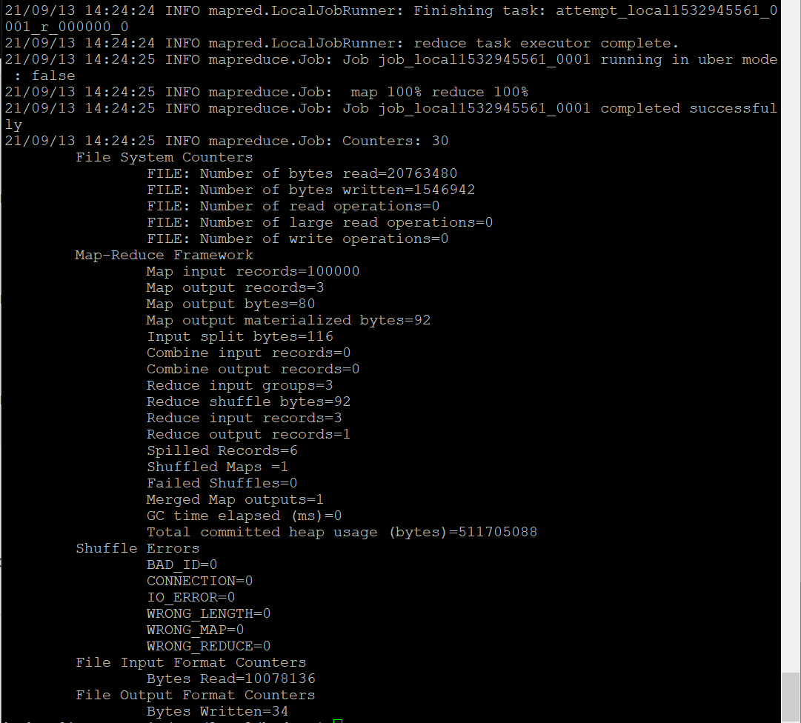

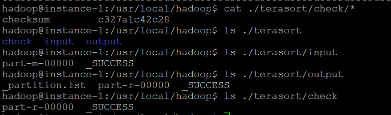

###### Execution

```shell
bin/hdfs namenode -format # need to reformat everytime change settings
sbin/start-dfs.sh # why still need to input password
wget http://localhost:50070/ # get a index.html file
```

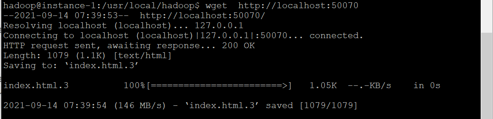

Set the firewall rules to let IP of my home wi-fi to get access this instance.

And get access on my PC:

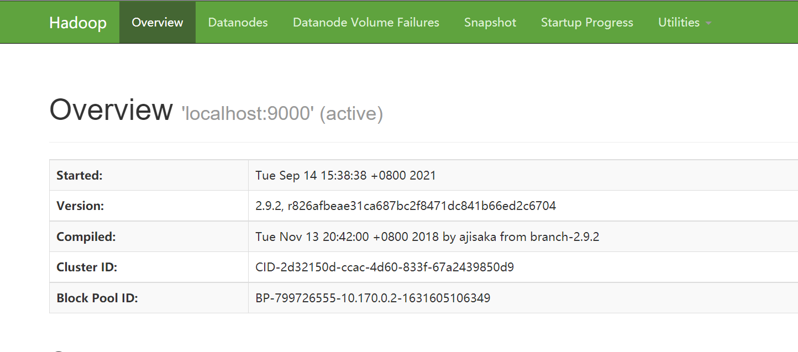

#### 4.Multi-node Hadoop Cluster Setup - Homework0.b

##### References

1. https://www.youtube.com/watch?v=4eBtwf_AcaQ&list=PLYEGL9-7r3BPfwlMFt1lARZrjmqu0OGpF&index=3
2. https://www.edureka.co/blog/setting-up-a-multi-node-cluster-in-hadoop-2.X/
3. https://github.com/vibiks/gcp/blob/master/Hadoop_multi_node_cluster_install_document.pdf
4. https://cloud.tencent.com/developer/article/1448531?from=14588

##### Prepare 4VMs

Using the image of instance-1 to create namenode-1, datanode-1, datanode-2, datanode-3 as master machine and slave machines repectively.

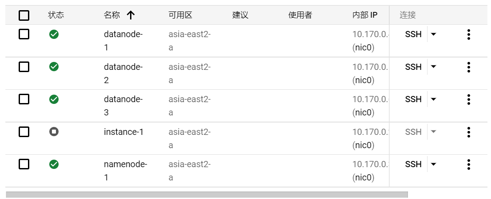

##### Create a new user to control the multi-node cluster

Create user called hduser in all the VMs.

```shell
sudo -i
adduser hduser
```

##### Communication among instances

###### a.Enable SSH and password authentication in SSHD configuration

Configure this file on namenode-1, datanode-1, datanode-2, datanode-3, datanode-4 respectively.

```shell
vi /etc/ssh/sshd_config
# set ChallengeResponseAuthentication and PasswordAuthentication to yes
service sshd restart
```

###### b. Add name of node and internal IP into host file

By doing this, the instances can communication with eachother by calling the SSH and namenode instead of IP address.

Using the following lines to get host information of all the VMs.

```shell
#get host information
hostname -i
hostname -f
#add host information of other VMs to host file
vi /etc/hosts
```

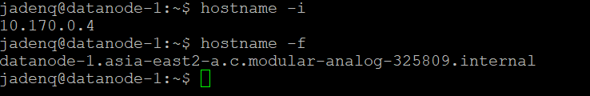

Add the hostname information to all the VMs.

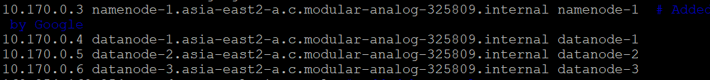

###### c.SSH key pair setup

Create SSH key pair in namenode-1 and send public key to datanodes to let namenode communicate with other nodes without password.

```shell
su hduser
cd ~
ssh-keygen -t rsa -P ""
# Send public key to datanode-1,2,3.
ssh-copy-id -i /home/hduser/.ssh/id_rsa.pub hduser@datanode-1
ssh-copy-id -i /home/hduser/.ssh/id_rsa.pub hduser@datanode-2
ssh-copy-id -i /home/hduser/.ssh/id_rsa.pub hduser@datanode-3
ssh-copy-id -i /home/hduser/.ssh/id_rsa.pub hduser@namenode-3
```

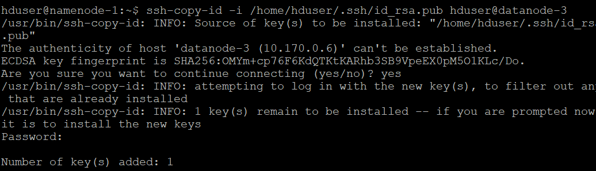

Give permission to hduser.

```shell
chmod 0600 ~/.ssh/authorized_keys
```

###### d. Test the connection

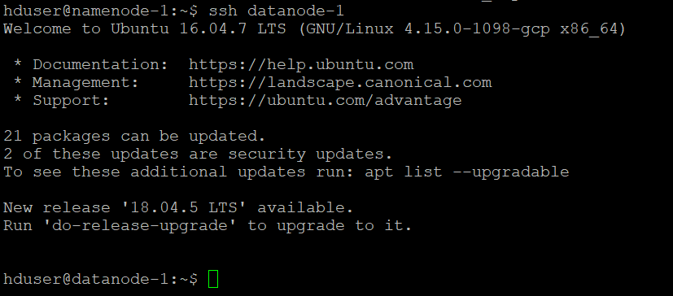

VMs are connected using SSH.

##### Hadoop Configuration

###### a. Set up configuration files and add Java path to hadoop environment

```shell
# give permission
chown -R hduser:hduser /usr/local/hadoop
# create path for further implementation
mkdir -p /usr/local/hadoop_store/tmp
mkdir -p /usr/local/hadoop_store/hdfs/namenode
mkdir -p /usr/local/hadoop_store/hdfs/datanode
mkdir -p /usr/local/hadoop_store/hdfs/secondarynamenode
chown -R hduser:hduser /usr/local/hadoop_store
su hduser
```

Set up hdfs-site.xml

```shell
vi /usr/local/hadoop/etc/hadoop/hdfs-site.xml
```

```xml
<configuration>
    <property>
    <name>dfs.replication</name>
    <value>4</value>
    <description>Default block replication.
    The actual number of replications can be specified when the file is created.
    The default is used if replication is not specified in create time.
    </description>
    </property>
    <property>
    <name>dfs.namenode.name.dir</name>
    <value>file:/usr/local/hadoop_store/hdfs/namenode</value>
    </property>
    <property>
    <name>dfs.datanode.data.dir</name>
    <value>file:/usr/local/hadoop_store/hdfs/datanode</value>
    </property>
    <property>
    <name>dfs.namenode.checkpoint.dir</name>
    <value>file:/usr/local/hadoop_store/hdfs/secondarynamenode</value>
    </property>
    <property>
    <name>dfs.namenode.checkpoint.period</name>
    <value>3600</value>
    </property>
</configuration>
```

Set up core-site.xml.

```shell
vi /usr/local/hadoop/etc/hadoop/core-site.xml
```

```xml
<configuration>
    <property>
    <name>hadoop.tmp.dir</name>
    <value>/usr/local/hadoop_store/tmp</value>
    <description>A base for other temporary directories.</description>
    </property>
    <property>
    <name>fs.default.name</name>
    <value>hdfs://namenode-1:54310</value>
    <description>
    The name of the default file system. A URI whose scheme and authority determine the FileSystem
    implementation. The uri's scheme determines the config property fs.SCHEME.impl) naming the
    FileSystem implementation class. The uri's authority is used to determine the host, port, etc. for a
    filesystem.
    </description>
    </property>
</configuration>
```

Set up mapred-site.xml to configure the host and port.

```shell
 vi /usr/local/hadoop/etc/hadoop/mapred-site.xml
```

```xml
<configuration>
<property>
<name>mapreduce.framework.name</name>
<value>yarn</value>
</property>
<property>
 <name>mapred.job.tracker</name>
 <value>namenode-1:54311</value>
 <description>The host and port that the MapReduce job tracker runs
 at. If "local", then jobs are run in-process as a single map
 and reduce task.
 </description>
</property>
</configuration>
```

Set up yarn-site.xml to manage resource.

```shell
vi /usr/local/hadoop/etc/hadoop/yarn-site.xml
```

For namenode-1:

```xml
<configuration>
    <!-- Site specific YARN configuration properties -->
    <property>
     <name>yarn.resourcemanager.hostname</name>
     <value>namenode-1</value>
    </property>
    <property>
    <name>yarn.nodemanager.aux-services</name>
    <value>mapreduce_shuffle</value>
    </property>
    <property>
    <name>yarn.nodemanager.aux-services.mapreduce.shuffle.class</name>
    <value>org.apache.hadoop.mapred.ShuffleHandler</value>
    </property>
</configuration>
```

Add Java path.

```shell
echo 'export JAVA_HOME=/usr/lib/jvm/java-1.8.0-openjdk-amd64' >> /usr/local/hadoop/etc/hadoop/hadoop-env.sh
```

###### b. Configure environment variable

```shell
su hduser
vi /home/hduser/.bashrc
```

```shell
# add these commands
export HADOOP_PREFIX=/usr/local/hadoop
export HADOOP_HOME=/usr/local/hadoop
export HADOOP_MAPRED_HOME=${HADOOP_HOME}
export HADOOP_COMMON_HOME=${HADOOP_HOME}
export HADOOP_HDFS_HOME=${HADOOP_HOME}
export YARN_HOME=${HADOOP_HOME}
export HADOOP_CONF_DIR=${HADOOP_HOME}/etc/hadoop
# Native Path
export HADOOP_COMMON_LIB_NATIVE_DIR=${HADOOP_PREFIX}/lib/native
export HADOOP_OPTS="-Djava.library.path=$HADOOP_PREFIX/lib"
export PATH=$PATH:$HADOOP_HOME/bin:$HADOOP_HOME/sbin
export JAVA_HOME=/usr/lib/jvm/java-1.8.0-openjdk-amd64
export JRE_HOME=/usr/lib/jvm/java-1.8.0-openjdk-amd64/jre
export PATH=$PATH:/usr/lib/jvm/java-1.8.0-openjdk-amd64/bin:/usr/lib/jvm/java-1.8.0-openjdk-amd64/jre/bin
```

```shell
source ~/.bashrc
```

###### c. Copy the configuration files to other 3 VMs

Due to the limited permission of namenode hduser account, I can copy the configuration files to /home/hduser first, then move the files to the correct path with root account in datanode.

```shell
cd /usr/local/hadoop/etc/hadoop
# need to be moved to /usr/local/ under root account
scp -r hdfs-site.xml core-site.xml mapred-site.xml yarn-site.xml hadoop-env.sh datanode-1:/home/hduser
scp -r /usr/local/hadoop_store datanode-1:/home/hduser/
# no further movement needed
scp -r /home/hduser/.bashrc datanode-1:/home/hduser/

# need to be moved to /usr/local/ under root account
scp -r hdfs-site.xml core-site.xml mapred-site.xml yarn-site.xml hadoop-env.sh datanode-2:/home/hduser
scp -r /usr/local/hadoop_store datanode-2:/home/hduser/
# no further movement needed
scp -r /home/hduser/.bashrc datanode-2:/home/hduser/

# need to be moved to /usr/local/ under root account
scp -r hdfs-site.xml core-site.xml mapred-site.xml yarn-site.xml hadoop-env.sh datanode-3:/home/hduser
scp -r /usr/local/hadoop_store datanode-3:/home/hduser/
# no further movement needed
scp -r /home/hduser/.bashrc datanode-3:/home/hduser/
```

Move the files to corresponding path and authorize the hduser account.

```shell
# enter datanode-1,2,3 respectively and run the command
ssh datanode-1 # same for datanode-2,3
sudo -i
cd /home/hduser
mv /home/hduser/hadoop_store /usr/local
mv hdfs-site.xml core-site.xml mapred-site.xml yarn-site.xml hadoop-env.sh /usr/local/hadoop/etc/hadoop/

chown -R hduser:hduser /usr/local/hadoop
chown -R hduser:hduser /usr/local/hadoop_store
exit
```

###### d. Format namenode

Add the datanodes instance name in the slaves file,

```shell
su hduser
vi /usr/local/hadoop/etc/hadoop/slaves
```

setup as follow,

```shell
#hostname
namenode-1
datanode-1
datanode-2
datanode-3
```

and finally format.

```shell
hadoop namenode -format
```


##### Set ssh without password

```shell
#If you don't already have openssh-server installed:

sudo apt-get upgrade
sudo apt-get update
sudo apt-get install openssh-server
sudo service ssh start
#Then take the following steps to enable sshing to localhost:

cd ~/.ssh
ssh-keygen to generate a public/private rsa key pair; use the default options
cat id_rsa.pub >> authorized_keys to append the key to the authorized_keys file
chmod 640 authorized_keys to set restricted permissions
sudo service ssh restart to pickup recent changes
ssh localhost
```

##### Run multi-node Hadoop

```shell
start-dfs.sh
jps
```

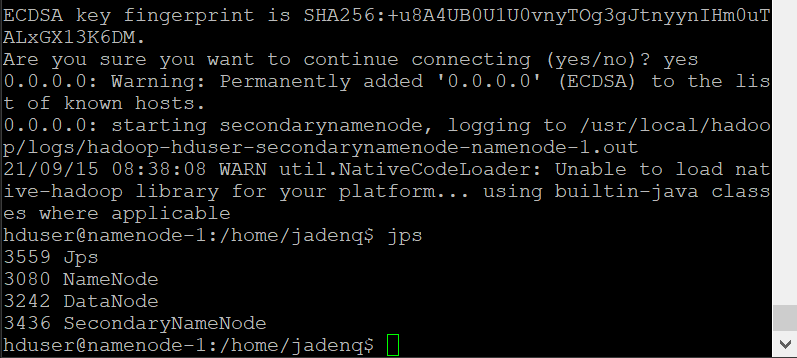

```shell
start-yarn.sh
```

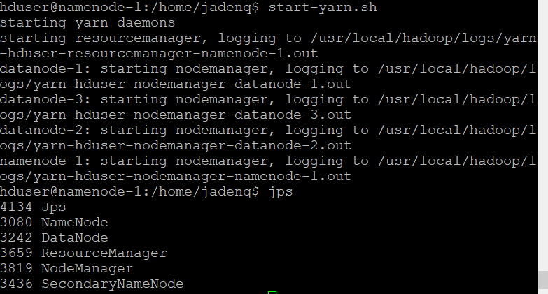

##### Run Terasort and compare the running time

###### a. Teragen 2GB data.

```shell
cd /usr/local/hadoop
# generate a 2GB dataset
./bin/hadoop jar \
./share/hadoop/mapreduce/hadoop-mapreduce-examples-2.9.2.jar \
teragen 20000000 terasort/input
```

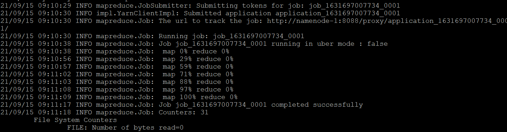

###### b. Terasort 2GB dataset

```shell
# terasort
./bin/hadoop jar \
./share/hadoop/mapreduce/hadoop-mapreduce-examples-2.9.2.jar \
terasort terasort/input terasort/output
```

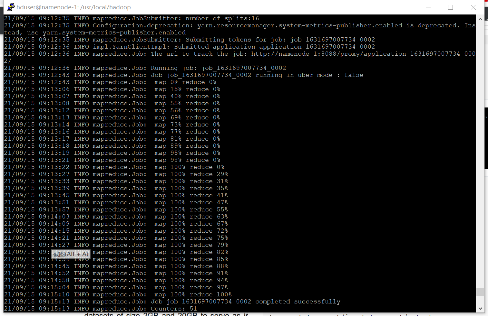

This job is in 16 splits. The Running time of Terasort (2GB) from job submission (17:12:36) to completion (17:15:11) is **155s**. 


###### c. Teragen 20GB dataset

```shell
# remove the 2GB dataset to try 20GB dataset
hadoop fs -rm -r /user/hduser/terasort/input
hadoop fs -rm -r /user/hduser/terasort/output
# generate a 20GB dataset
./bin/hadoop jar \
./share/hadoop/mapreduce/hadoop-mapreduce-examples-2.9.2.jar \
teragen 200000000 terasort/input
```

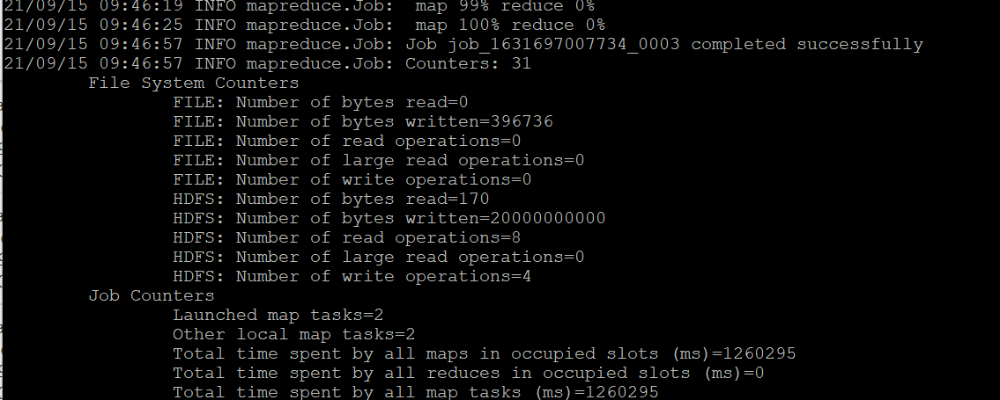

The 20GB teragen job takes 11 minutes. 

###### d. Terasort 20GB dataset

```shell
# terasort
./bin/hadoop jar \
./share/hadoop/mapreduce/hadoop-mapreduce-examples-2.9.2.jar \
terasort terasort/input terasort/output
```

Start the job:
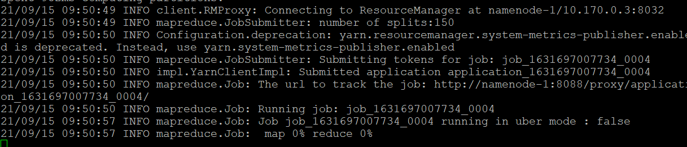

Time record from port 8088.


This job is in 150 splits. Running time of Terasort (20GB) from job start (17:50:50) to completion (19:00:55) is **4205s**. 

###### d. Analysis of sorting time

The quick sort algorithm has a time complexity of $Ο(NlogN)$ (best case, and $O(N^2)$ in worst case) and memory complexity of $lgN$. Theoretically, the sorting time of 20GB dataset should be between 3569s to 15500s, so the result turns out to be reasonable.

#### 5.Run Python scripts on Hadoop - Homework0.c

##### References

1. HDFS conceptshttps://cwiki.apache.org/confluence/display/HADOOP2/ImportantConcepts
2. Trouble shootinghttps://stackoverflow.com/questions/52076577/error-java-lang-runtimeexception-pipemapred-waitoutputthreads-subprocess-fa/61624913#61624913

##### Prepare example data and scripts

###### a. Download Shakespeare data

```shell
mkdir /home/hduser/pre_data
cd /home/hduser/pre_data
# username and password
wget --http-user=ierg4300  --http-passwd=fall2021ierg http://mobitec.ie.cuhk.edu.hk/ierg4300Fall2021/homework/shakespeare.zip
unzip shakespeare.zip
rm /home/hduser/pre_data/shakespeare.zip
# rename as txt file
mv /home/hduser/pre_data/shakespeare /home/hduser/pre_data/shakespeare.txt 
```

###### b. Copy Shakespeare data to HDFS

```shell
cd /usr/local/hadoop
bin/hadoop dfs -copyFromLocal /home/hduser/pre_data /user/hduser/shakespeare
bin/hadoop dfs -ls
```

###### c. Prepare Python scripts

```shell
# paste the python scripts in vim and save
mkdir /home/hduser/python_scripts 
vim /home/hduser/python_scripts/mapper.py
vim /home/hduser/python_scripts/reducer.py
# important authorization
chmod a+x /home/hduser/python_scripts/mapper.py
chmod a+x /home/hduser/python_scripts/reducer.py
```

##### Run Python scripts

```shell
# hadoop fs -rm -r /user/hduser/shakespeare/output
./bin/hadoop jar \
./share/hadoop/tools/lib/hadoop-streaming-2.9.2.jar \
-file /home/hduser/python_scripts/mapper.py -mapper /home/hduser/python_scripts/mapper.py \
-file /home/hduser/python_scripts/reducer.py -reducer /home/hduser/python_scripts/reducer.py \
-input shakespeare/* \
-output shakespeare/output
```

###### Trouble shooting

**Problem**

*Error: java.lang.RuntimeException: PipeMapRed.waitOutputThreads(): subprocess failed with code 2/127*

**Solution**

​	Edit python files for execution
> 1. Add execution mode to python files :
>   chmod a+x mapper.py
>
>   chmod a+x reducer.py
>
> 2. Add have 2 lines at first :
>
>    first line :  `#!/usr/bin/python` 
>
>    second line : `# -*-coding:utf-8 -*`
>
> 3. Other tries:
>
>    Set data file to txt file.
>
>    Install Python using command: sudo apt install python3, python, python-minimal

###### Result

The running time from submitting job (19:48:59) to completion (19:49:28) is **29s**.

Time record from 8088 port.


Start:

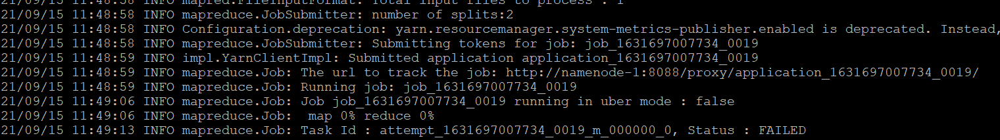

End:

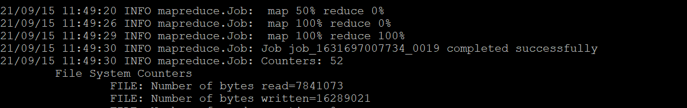

View part of the result.

```shell
hadoop fs -cat /user/hduser/shakespeare/output/*
```

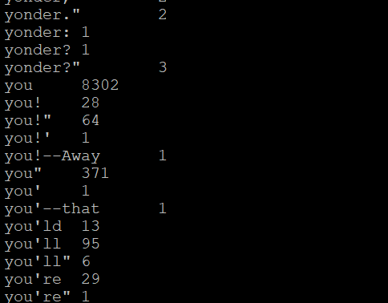

#### 6.Compiling the Java WordCount program for MapReduce - Homework0.d:meat_on_bone:[Bonus]

##### Reference

1. https://hadoop.apache.org/docs/stable/hadoop-mapreduce-client/hadoop-mapreduce-client-core/MapReduceTutorial.html

##### Run Java WordCount script

###### a. Prepare Java script.

```shell
mkdir /home/hduser/java_scripts
vim /home/hduser/java_scripts/WordCount.java
```

###### b. Run Java script

```shell
# hadoop fs -rm -r /user/hduser/shakespeare/output
export HADOOP_CLASSPATH=${JAVA_HOME}/lib/tools.jar
# compile java
bin/hadoop com.sun.tools.javac.Main WordCount.java
jar cf wc.jar WordCount*.class
# the full class name in Java file
./bin/hadoop jar wc.jar org.apache.hadoop.examples.WordCount shakespeare/* shakespeare/output
```

###### c. Result

The running time from submitting job (20:29:01) to completion (20:29:19) is **18s**, 11s faster than Python script!


#### 7.Conclusion

All the successful jobs log is listed below.


- The configuration and connection part of cluster is the most time-consuming, need to take seriously.
- For the Terasort of 2GB (157s running time) and 20GB dataset (4205s running time), the quick sort algorithm has a time complexity of $Ο(NlogN)$ (best case, and $O(N^2)$ in worst case) and memory complexity of $lgN$. Theoretically, the sorting time of 20GB dataset should be between 3569s to 15500s, so the result turns out to be reasonable.
- Java scripts for MapReduce work is **faster** than Python script, the reason based on my experience is, the Java is less dynamic than Python because of the JVM, and Java can more easily put thread into different cores.

#### References

1. SSH keys setuphttps://www.youtube.com/watch?v=fmh94mNQHQc
2. Official tutorialhttps://hadoop.apache.org/docs/stable/hadoop-project-dist/hadoop-common/SingleCluster.html
3. Java setup in Ubuntuhttps://blog.csdn.net/zbj18314469395/article/details/86064849
4. https://stackoverflow.com/questions/9612941/how-to-set-java-environment-path-in-ubuntu
5. https://blog.csdn.net/qq496013218/article/details/73195867
6. https://hadoop.apache.org/docs/stable/hadoop-project-dist/hadoop-common/SingleCluster.html
7. https://vitux.com/how-to-setup-java_home-path-in-ubuntu/
8. Apache Official Tutorialhttps://hadoop.apache.org/docs/stable/hadoop-project-dist/hadoop-common/SingleCluster.html
9. Tutorial2http://mobitec.ie.cuhk.edu.hk/ierg4300Fall2021/tutorial/tutorial2/ 
10. https://blog.csdn.net/u013197629/article/details/73608613
11. https://www.youtube.com/watch?v=4eBtwf_AcaQ&list=PLYEGL9-7r3BPfwlMFt1lARZrjmqu0OGpF&index=3
12. https://www.edureka.co/blog/setting-up-a-multi-node-cluster-in-hadoop-2.X/
13. https://github.com/vibiks/gcp/blob/master/Hadoop_multi_node_cluster_install_document.pdf
14. https://cloud.tencent.com/developer/article/1448531?from=14588
15. HDFS conceptshttps://cwiki.apache.org/confluence/display/HADOOP2/ImportantConcepts
16. Trouble shootinghttps://stackoverflow.com/questions/52076577/error-java-lang-runtimeexception-pipemapred-waitoutputthreads-subprocess-fa/61624913#61624913
17. Official tutorial about Java mapreducehttps://hadoop.apache.org/docs/stable/hadoop-mapreduce-client/hadoop-mapreduce-client-core/MapReduceTutorial.html

#### Student Discussion

I discussed with Xu Ting and Tang Shixing about the configuration problems and trouble shooting issues, no code copied.