## Homework3 Report

[TOC]

### Q1

#### Question(a)

If columns C1 and C2 have similarity $T_1$, pick any band ($r$ rows), the probability that some row in band unequal is $(1-{T_1}^r)^B$. So the probability that at least 1 band identical is $1-(1-{T_1}^r)^B$, so the inequality is $P_1≤1-(1-{T_1}^r)^B$.

Follows the same logic, if columns C1 and C2 have similarity $T_2$,we can get $P_2≥1-(1-{T_2}^r)^B$.

#### Question(b)

I use python to help me to determine a reasonable value pair of (r, B).

##### Method1

Step1, write down the relationship between r and B given the aforementioned error requirements, which is $log_{(1-{T_2}^r)}(1-P2)>=B>=log_{(1-{T_1}^r)}(1-P1)$. 

Step2, use r as x-axis and B as y-axis and the given $T_1,T_2,P_1,P_2$ to draw a 2-D plot, and find the corresponding area in the plot.

Step3, select a point from the area to indicate a r, B pair that meet the requirements.

##### Method2

Step1, list a set of possible value pairs (r, B).

Step2, draw the inequality relationship in 2-D plot between the similarity and probability of sharing a bucket, calculate the false positive and false negative probability with the plot.

Step3, plot $T_1,T_2,P_1,P_2$ requirements as square region on the plot, find the curves (plotted by r, B value pairs) that can be satisfied.

#### Question(c)

I use visualization to find the pair of values for (r, B).

##### Method1

Step1, use r as x-axis and B as y-axis and the given $T_1,T_2,P_1,P_2$ to draw a 2-D plot, and find the corresponding area (indicated as the *filled orange area*) in the plot.

Step2, select a point from the area to indicate a r, B pair that meet the requirements.

##### Method2

Step1, list a set of possible value pairs (r, B).

Step2, draw the inequality relationship in 2-D plot between the similarity and probability of sharing a bucket, calculate the false positive and false negative probability with the plot.

Step3, plot $T_1,T_2,P_1,P_2$ requirements as square region on the plot, avoid the region that doesn't meet the requirement and fine tune the r, B.

```python
import numpy as np
import matplotlib as mpl
import matplotlib.pyplot as plt
import pandas as pd
from scipy import integrate
%matplotlib inline

# r, b
def cal_p(x,r,b):
    return 1 - (1 - x**r)**b

def LSHplot(param_sets, req):
    # similarity
    x = np.linspace(0, 1, 1000)
    plt.axis([-0.02, 1.02, -0.02, 1.02])
    for i in range(len(param_sets)):
        r = param_sets[i][0]
        b = param_sets[i][1]
        p = 1 - (1 - x**r)**b
        threshold = (1/b)**(1/r)
        cal_p = lambda x, r, b: 1-(1-x**r)**b
        v1, err = integrate.quad(cal_p, 0, threshold, args = (r,b))
        v2, err = integrate.quad(cal_p, threshold, 1, args = (r,b))
        TP = v2
        FN = (1-threshold) - v2
        FP = v1
        F1 = TP/(TP+0.5*(FN+FP))
        param_sets[i].append(cal_p(0.3, r, b))
        param_sets[i].append(cal_p(0.8, r, b))
        param_sets[i].append(threshold)
        param_sets[i].append(FN)
        param_sets[i].append(FP)
        param_sets[i].append(F1)
        label_ = 'r='+str(r)+',b='+str(b)
        plt.plot(x, p, label = label_)
        plt.xlabel("Similarity")
        plt.ylabel("Prob. sharing a bucket")
    plt.plot(req[0],req[2], marker = 'x', c = 'k', markersize = 5)
    plt.plot(req[1],req[3], marker = 'x', c = 'k', markersize = 5)
    plt.vlines(req[0], -0.02, req[2], linestyles = 'dashed', color = 'k')
    plt.vlines(req[1], req[3],1.02, linestyles= 'dashed', color = 'k')
    plt.hlines(req[3], -0.02, req[1], linestyles = 'dashed', color = 'k')
    plt.hlines(req[2], req[0], 1.02, linestyles = 'dashed', color = 'k')
    plt.legend()
    
def rbPlot(a,b,requirements):
    # similarity
    r = np.linspace(a, b, 100)
    t1 = requirements[0]
    t2 = requirements[1]
    p1 = requirements[2]
    p2 = requirements[3]
    b1 = [math.log((1-p1), (1-t1**r_i)) for r_i in r]
    b2 = [math.log((1-p2), (1-t2**r_i)) for r_i in r]
    z1 = np.array(b1)
    z2 = np.array(b2)
    plt.plot(r, b1, label = 'T1 = 0.8, P1 = 0.95')
    plt.plot(r, b2, label = 'T2 = 0.3, P2 = 0.05')
    plt.fill_between(r, b1, b2,where=z2>z1, facecolor = 'bisque')
    plt.xlabel('r')
    plt.ylabel('b')
    plt.legend()
```

```python
param_sets = [[5,10], [5,20], [10,10], [10, 20],[10,30],[6,15]]
requirements = [0.8, 0.3, 0.95, 0.05] # T1, T2, P1, P2
LSHplot(param_sets, requirements) # plot in 2-d
result = pd.DataFrame(param_sets, columns = ['r','b','s=0.3','s=0.8','threshold','FN', 'FP', 'F1-Score'])
result
rbPlot(1,6,requirements)
```

|      |  r   | b    |  s=0.3   |  s=0.8   | threshold |    FN    |    FP    | F1-Score |
| ---: | :--: | ---- | :------: | :------: | :-------: | :------: | :------: | :------: |
|    0 |  5   | 10   | 0.024036 | 0.981131 | 0.630957  | 0.025121 | 0.083506 | 0.863614 |
|    1 |  5   | 20   | 0.047494 | 0.999644 | 0.549280  | 0.024090 | 0.072020 | 0.898764 |
|    2 |  10  | 10   | 0.000059 | 0.678860 | 0.794328  | 0.015188 | 0.057895 | 0.839041 |
|    3 |  10  | 20   | 0.000118 | 0.896869 | 0.741134  | 0.015563 | 0.053535 | 0.875657 |
|    4 |  10  | 30   | 0.000177 | 0.966881 | 0.711685  | 0.015402 | 0.051257 | 0.891167 |
|    5 |  6   | 15   | 0.010879 | 0.989539 | 0.636773  | 0.022228 | 0.072015 | 0.878591 |

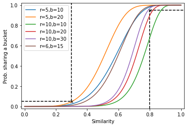

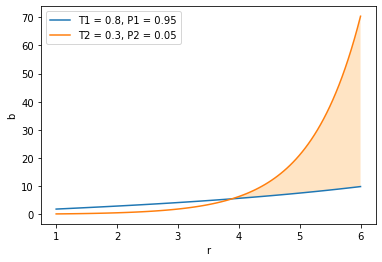

We can derive from these curves that $r$=10, $B$=30 can meet the requirements of $T_1$=0.8, $T_2$=0.3, $P_1$=0.95 and $P_2$=0.05, according to the probability calculated and the r-B curve area. Besides, there are still many options for value pairs (r, B) like (6, 15), (5,10) etc.

The value pair (10,30) is relatively the most balanced in false positive and false negative according to F1-score. The (5, 10) pair is relatively high in the probability of mistake, especially high false positive.

### Q2

#### Question(a)

##### Data preprocessing

###### Download

```shell
gzip train-images-idx3-ubyte.gz -d 
gzip t10k-images-idx3-ubyte.gz -d 
gzip train-labels-idx1-ubyte.gz -d 
gzip t10k-labels-idx1-ubyte.gz -d 
```

```shell
hdfs dfs -mkdir hw3
hdfs dfs -copyFromLocal hw3/data/test.txt ./hw3 
hdfs dfs -copyFromLocal hw3/data/train.txt ./hw3 
```

###### Convert from ubyte to digital

Ubyte version of MINIST file description from official website.

```
[offset] [type]          [value]          [description]
0000     32 bit integer  0x00000801(2049) magic number (MSB first)
0004     32 bit integer  60000            number of items
0008     unsigned byte   ??               label
0009     unsigned byte   ??               label
........
xxxx     unsigned byte   ??               label
```

```python
import sys
import os
import numpy as np
# Reference: StackOverflow by Punnerud
def preprocess(img_f, label_f, train = True):
	image_size = 28
	if train == True:
		img_num = 60000
		file_name = 'train'
	else: 
		img_num = 10000
		file_name = 'test'
	img_f = open(img_f, 'rb')
	label_f = open(label_f, 'rb')

	# bypass the header info
	img_f.read(16)
	label_f.read(8)
	# load the data
	img_buf = img_f.read(image_size * image_size * img_num)
	label_buf = label_f.read(img_num)
	# reformat and reshape data
	img_data = np.frombuffer(img_buf, dtype=np.uint8).astype(np.int)
	label_data = np.frombuffer(label_buf, dtype=np.uint8).astype(np.int)
	img_data = img_data.reshape(img_num, image_size*image_size)
	label_data = label_data.reshape(img_num,1)
	# integrate the result
	output_dir = './' + file_name + '.txt'
	with open(output_dir, mode = 'w', encoding = 'utf-8') as pre:
		for i in range(img_num):
			img = ' '.join(str(d) for d in img_data[i])
			label = str(label_data[i][0])
			pre.write(img+'\t'+label+'\n')
	return 'Finished Converting '+ file_name + ' files.'
preprocess('train-images.idx3-ubyte', 'train-labels.idx1-ubyte', True)
preprocess('t10k-images.idx3-ubyte', 't10k-labels.idx1-ubyte', False)
```

###### Result of preprocessing

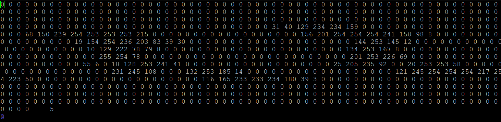

The data are format into a line of 0-255 digital data and label separated with table. Saved in this [link](https://pan.baidu.com/s/1UDfm3zlZ2bbYN5sHLEZoTA)(extract code: 7klp).

```shell
# check the lines of output
wc -l test.txt
wc -l train.txt
```

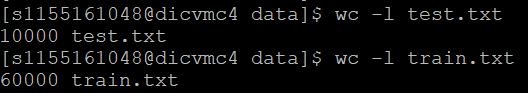

##### Question reframing

This task can be reframed into map and reduce tasks manipulating vectors for distributed computing, here are explanations and code.

###### What should the mappers do

- read the previous centroids, create new centroid file if it's the 1st iteration
- find the closest centroid for each image vector
- key: closest centroid index for this image, value: image vector

###### What should the reducers do

- aggregate the result from different mappers
  - count the aggregated number of each centroid
  - add up the distance to closest points of each centroid
- update centroid value according to the aggregated result and save to txt file
- key: centroid index indicating the cluster, value: counts of images in this cluster

##### Code

###### cen_gen_new.py

To generate the initial centroid file, randomly select from training sample points, random seed as argument value input. 

```python
import numpy as np
import random
import os
import sys
# set up the initial centroid random seed

random_seed = sys.argv[1]
random.seed(random_seed)
centroid_file = 'centroid_'+str(random_seed)+'.txt'
file = "./data/train.txt"

# centroid_file: save to this file, centroids: 10 * 784, counts: 10 * 1
def save_centroid(centroid_file, centroids, counts):
	with open(centroid_file, mode = 'w', encoding = 'utf-8') as cent:
		for i in range(0, 10):
			cent_i = 'Centroid ' + str(i) + ':'
			img = [str(centroids[i][j]) for j in range(28*28)]
			img = ' '.join(img)
			cent_i = cent_i + img + ',' + str(counts[i]) + '\n'
			cent.write(cent_i)
	cent.close()

dice = [random.randint(1, 60000) for i in range(10)] 
sample = []
with open(file) as samples:
	line_count = 0
	for line in samples.readlines():
		line_count += 1
		if line_count in dice:
			line.strip()
			img, label = line.split('\t')
			img = [int(img_item) for img_item in img.split(' ')]
			sample.append(img)
		else: continue

# initialize centroid and create file if it doesn't exist at the first iteration
if not os.path.exists(centroid_file):
	# randomly selected centroid from data points
	random_img = sample
	# centroid from randomly generated values 
	# random_img = [[random.randint(0, 225) for j in range(28*28)] for i in range(10)]
	# intialize as 0
	counts = [0 for i in range(10)]
	save_centroid(centroid_file, random_img, counts)

assert (os.path.getsize(centroid_file) > 0), "Empty initial centroid file!"
```

###### mapper_a1.py

```python
#!/usr/bin/env python3

import sys
import os
import random
import numpy as np

# set up the initial centroid random seed
random_seed = 1229
random.seed(random_seed)
centroid_file = 'centroid_'+str(random_seed)+'.txt'

# calculate the distance between two points (represented with vector)
# a: centroid 1*784, b: sample 1*784, index: which centroid
def distance(centroid, sample):
	return np.linalg.norm(centroid - sample)

# save as centroid format file
# centroid_file: save to this file, centroids: 10 * 784, counts: 10 * 1
def save_centroid(centroid_file, centroids, counts):
	with open(centroid_file, mode = 'w', encoding = 'utf-8') as cent:
		for i in range(0, 10):
			cent_i = 'Centroid ' + str(i) + ':'
			img = [str(centroids[i][j]) for j in range(28*28)]
			img = ' '.join(img)
			cent_i = cent_i + img + ',' + str(counts[i]) + '\n'
			cent.write(cent_i)
	cent.close()

assert (os.path.getsize(centroid_file) > 0), "Empty initial centroid file!"

# initialize the centroids and counts
centroids = np.zeros((10, 28 * 28))
count = np.zeros((10, 1))

# read the centorids file
with open(centroid_file) as cents:
	for line in cents.readlines():
		line = line.strip()
		line, count = line.split(',')
		header, cent = line.split(':')
		header, index = header.split(' ')
		cent = cent.split(' ')
		centroids[int(index)] = cent

# map: only need to find out the closest centroid for each point
for line in sys.stdin:
	line = line.strip()
	img, label = line.split('\t')
	img = [int(img_item) for img_item in img.split(' ')]
	# label = int(label)

	# shortest distance, start with index 0
	# d: distance, s_d: shortest distance, s_index: shortest centroid index
	s_d = distance(centroids[0], img)
	s_index = 0
	for i in range(1, 10):
		d = distance(centroids[i], img)
		if d < s_d:
			s_d = d
			s_index = i
		else: continue

	# format intermediate result as string
	img = ' '.join(str(k) for k in img)
	print('%s\t%s' % (str(s_index), img))
```

###### reducer_a1.py

```python
#!/usr/bin/env python3
import sys
import os
import numpy as np

cur_s_index = None
count = 1
centroid = np.zeros(28*28)

# save as centroid format file
# centroid: 1 * 784, count: 1*1
def format_centroid(cur_s_index, centroid, count):
	assert (len(centroid) == 784), "Wrong dimension: "+str(len(centroid))+ " It should be (784,)"
	new_centroid = [str(centroid[i] / count) for i in range(28*28)]
	new_centroid = ' '.join(new_centroid)
	# save the count number
	count = str(count)
	rst = "Centroid " + str(cur_s_index) + ":" + new_centroid + "," + count
	return rst

for line in sys.stdin:
	line = line.strip()
	s_index, img = line.split('\t')
	img = img.split(' ')
	s_index = int(s_index)
	# deal with only one index at a time

	if(cur_s_index == s_index):
		count = count + 1
		centroid = [centroid[i] + int(img[i]) for i in range(28*28)]
	else:
		# cal the average, get new centroids and print
		if cur_s_index is not None:
			print(format_centroid(cur_s_index, centroid, count))
		# renew a centroid
		centroid = np.zeros(28*28)
		count = 1
	# update the index
	cur_s_index = s_index

# last line: end of iteration
if count > 0:
	# if the last few lines has the same index with the above line
	print(format_centroid(cur_s_index, centroid, count))
else:
	# if the last line has a different index with the above lines
	img = [int(img[i]) for i in range(28*28)]
	print(format_centroid(cur_s_index, img, count))
```

###### run_a.sh

Script to run this task.

```shell
# give permission
chmod +x mapper_a1.py reducer_a1.py
# remove old centroid file
rm centroid_*

# generate the initial centroid file
python3 cen_gen_new.py 1229
# iteration loop
for i in `seq 1 10`;
do
	# remove old output
	hdfs dfs -rm -r ./hw3/output_a1
	# run mapreduce
	hadoop jar /usr/lib/hadoop-mapreduce/hadoop-streaming.jar \
	-D mapred.output.key.comparator.class=org.apache.hadoop.mapred.lib.KeyFieldBasedComparator \
	-D mapred.job.name='Job_a1' \
	-D mapred.map.tasks=20 \
	-D mapred.reduce.tasks=10 \
	-D mapred.text.key.comparator.options=-k1n \
	-file mapper_a1.py -mapper mapper_a1.py \
	-file reducer_a1.py -reducer reducer_a1.py \
	-file centroid_1229.txt \
	-input ./hw3/train.txt \
	-output ./hw3/output_a1
	# save output
	hdfs dfs -cat ./hw3/output_a1/* > centroid_1229_new.txt
	# save the final
	cat centroid_1229_new.txt > centroid_1229.txt
	# save all iterations as log
	cat centroid_1229_new.txt >> centroid_1229_all.txt
	# delete the output
	hdfs dfs -rm -r ./hw3/output_a1
done
```

##### Result

I ran this K-means in two experiments, for 10 iterations and 15 iterations. The count number of sample points assigned to these 10 centroids doesn't change much, so I consider it as converged. I used a fixed random seed (1229) to set the two experiments.

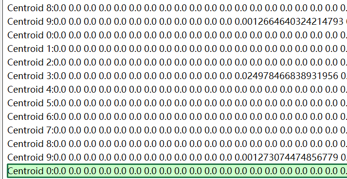

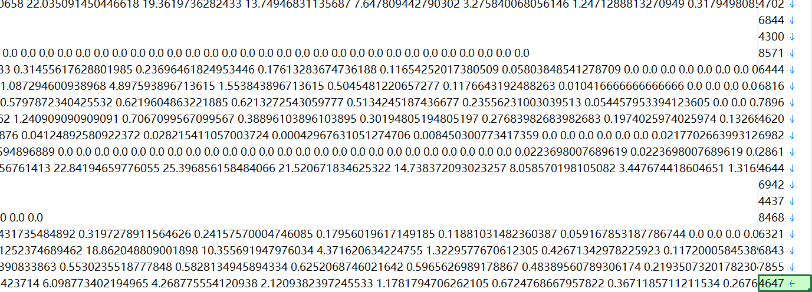

The result is stored as *centroid_1229_10iters.txt* and *centroid_1229_15iters.txt*, which can be found in this link: https://pan.baidu.com/s/1UDfm3zlZ2bbYN5sHLEZoTA extract code: 7klp.

##### Condition of convergence

For the $t$ th iteration, the number of changed data point comparing with the last iteration is $var_{tk} = count_{t,k} -count_{t-1,k}$,  therefore, the total number of change in the $t$ th iteration is $Σ_{i=1}^{K}var_{tk}$, the changing rate for the $t$ th iteration is defined as $\frac{Σ_{i=1}^{K}var_{tk}}{N}* 100\%$. 

If the index of data points doesn't change much for over 3 rounds (the changed data points is less than 1% of total number of data points), I consider the situation as converged. 

As investigated, I choose 10 to 20 iterations as proper time of iterations to run the following experiments. The following code shows how I evaluate the change of index.

The reason I choose not to use ***loss function*** is, the given threshold for loss to stop the iteration doesn't always work under certain random seed situation. Bad initialization can lead to local optimal, and the K-means iteration loop forever with an uniformed loss threshold to determine when to converge.

```python
import numpy as np

# fname = 'centroid_1229_all_15iters.txt'
# fname = 'centroid_1229_all_10iters.txt'
# fname = 'centroid_1001_all.txt'

fname = 'centroid_324_all.txt'

count = 0
iteration = 0
rec_count = {}
last_count = {}
with open(fname) as f:
	for line in f.readlines():
		count = count + 1
		line.strip()
		index, img_count = line.split(':')
		img, count = img_count.split(',')
		index = int(index[-1])
		count = int(count)
		cur_count = {index:count}
		rec_count.update(cur_count)
		if count % 10 == 0:
			iteration = iteration + 1
			if iteration == 1:
				last_count.update(rec_count)
				continue
			else:
				diff_count = {key: np.abs(last_count[key] - rec_count.get(key, 0)) for key in last_count}
				score = sum(diff_count.values()) / 60000
				print(score)
				last_count.update(rec_count)

print(diff_count)
```

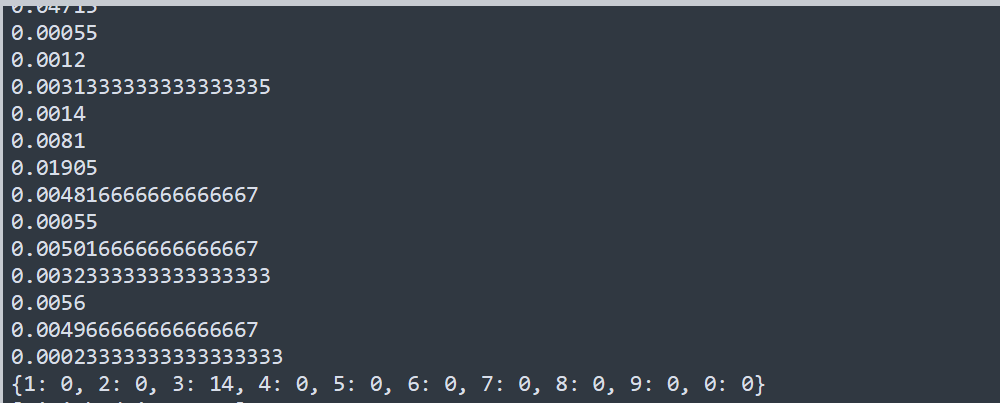

#### Question(b)

##### Solution illustration

For each random seed, I get the result as following.

Step1, I use mapreduce version of K-means with 3 different random seeds (**1229, 324, 1001**), run 10 to 20 iterations to get the converged result centroid files respectively.

Step2, based on the resulted centroid file from Step1, I use mapreduce to get the assigned cluster index for every training data point. This step requires the most *time complexity*, so I choose to use Mapreduce in this step.

Step3, based on *train.txt* file and the result from Step2, I join the image data point, K-means assigned index and ground truth label in one single table called GT_cluster.

Step4, use pandas to calculate the required numbers and accuracy.

Step1,2 are on clusters, Step3, 4 are on single machine.

##### Code and intermediate results

###### Step1

The code for Step1 is the same as question(a), so I prefer not to repeat.

The result of Step1 is stored in the [link](https://pan.baidu.com/s/1UDfm3zlZ2bbYN5sHLEZoTA)(extract code: 7klp) as file, *centroid_1229_new.txt*, *centroid_324_new.txt*, *centroid_1001_new.txt*. 

###### Step2

mapper_b2.py

```python
#!/usr/bin/env python3

import sys
import os
import random
import numpy as np

# set up the initial centroid random seed
random_seed = sys.argv[1]
random.seed(random_seed)
centroid_file = 'centroid_'+str(random_seed)+'_new.txt'

# calculate the distance between two points (represented with vector)
# a: centroid 1*784, b: sample 1*784, index: which centroid
def distance(centroid, sample):
	return np.linalg.norm(centroid - sample)

# initialize the centroids and counts
centroids = np.zeros((10, 28 * 28))
count = np.zeros((10, 1))
# read the centorids file
with open(centroid_file) as cents:
	for line in cents.readlines():
		line = line.strip()
		line, count = line.split(',')
		header, cent = line.split(':')
		header, index = header.split(' ')
		cent = cent.split(' ')
		centroids[int(index)] = cent
assert (os.path.getsize(centroid_file) > 0), "Empty initial centroid file!"
# map: only need to find out the closest centroid for each point

for line in sys.stdin:
	line = line.strip()
	img, label = line.split('\t')
	img = [int(img_item) for img_item in img.split(' ')]
	# label = int(label)

	# shortest distance, start with index 0
	# d: distance, s_d: shortest distance, s_index: shortest centroid index
	s_d = distance(centroids[0], img)
	s_index = 0
	for i in range(1, 10):
		d = distance(centroids[i], img)
		if d < s_d:
			s_d = d
			s_index = i
		else: continue

	# format intermediate result as string
	img = ' '.join(str(k) for k in img)
	print('%s\t%s' % (str(s_index), img))
```

reducer_b2.py

```python
#!/usr/bin/env python3
import sys
import os
import numpy as np

for line in sys.stdin:
	line = line.strip()
	print(line)
```

run_b.sh

```shell
# give permission
chmod +x mapper_b2.py reducer_b2.py

# remove old output
hdfs dfs -rm -r ./hw3/output_b2
# run mapreduce
hadoop jar /usr/lib/hadoop-mapreduce/hadoop-streaming.jar \
-D mapred.output.key.comparator.class=org.apache.hadoop.mapred.lib.KeyFieldBasedComparator \
-D mapred.job.name='Job_b2' \
-D mapred.map.tasks=20 \
-D mapred.reduce.tasks=5 \
-D mapred.text.key.comparator.options=-k1n \
-file mapper_b2.py -mapper 'mapper_b2.py 1229' \
-file reducer_b2.py -reducer reducer_b2.py \
-file centroid_1229_new.txt \
-input ./hw3/train.txt \
-output ./hw3/output_b2

# save output
hdfs dfs -cat ./hw3/output_b2/* > cluster_1229.txt
hdfs dfs -rm -r ./hw3/output_b2

hadoop jar /usr/lib/hadoop-mapreduce/hadoop-streaming.jar \
-D mapred.output.key.comparator.class=org.apache.hadoop.mapred.lib.KeyFieldBasedComparator \
-D mapred.job.name='Job_b2' \
-D mapred.map.tasks=20 \
-D mapred.reduce.tasks=5 \
-D mapred.text.key.comparator.options=-k1n \
-file mapper_b2.py -mapper 'mapper_b2.py 324' \
-file reducer_b2.py -reducer reducer_b2.py \
-file centroid_324_new.txt \
-input ./hw3/train.txt \
-output ./hw3/output_b2
# save output
hdfs dfs -cat ./hw3/output_b2/* > cluster_324.txt
hdfs dfs -rm -r ./hw3/output_b2

hadoop jar /usr/lib/hadoop-mapreduce/hadoop-streaming.jar \
-D mapred.output.key.comparator.class=org.apache.hadoop.mapred.lib.KeyFieldBasedComparator \
-D mapred.job.name='Job_b2' \
-D mapred.map.tasks=20 \
-D mapred.reduce.tasks=5 \
-D mapred.text.key.comparator.options=-k1n \
-file mapper_b2.py -mapper 'mapper_b2.py 1001' \
-file reducer_b2.py -reducer reducer_b2.py \
-file centroid_1001_new.txt \
-input ./hw3/train.txt \
-output ./hw3/output_b2
# save output
hdfs dfs -cat ./hw3/output_b2/* > cluster_1001.txt
hdfs dfs -rm -r ./hw3/output_b2
```

The result of Step2 is stored in the [link](https://pan.baidu.com/s/1UDfm3zlZ2bbYN5sHLEZoTA)(extract code: 7klp) as file, *cluster_1229.txt*, *cluster_324.txt*, *cluster_1001.txt*.  The cluster result looks like the following page, each image (the 2nd column) is assigned with an index (the 1st column, separation is '\t').

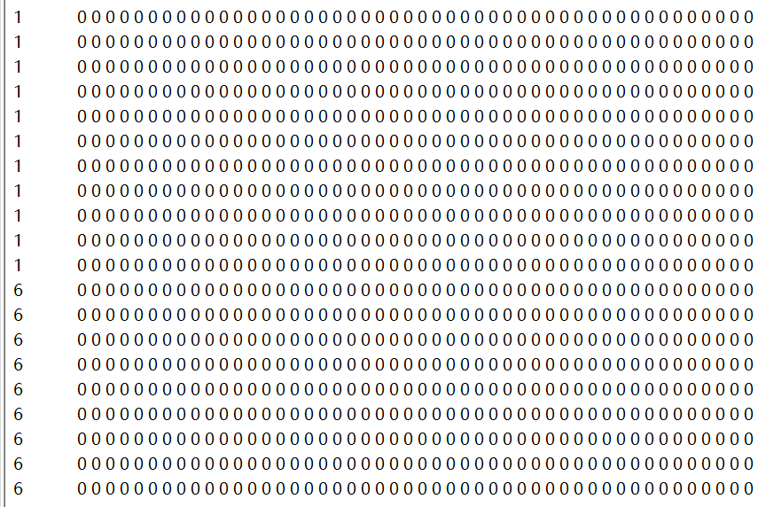

###### Step3

Join the table of ground truth and cluster index on image data, this step is not time consuming, it only takes less than 2s on single machine.

```python
# TODOs
# 1. count the number of images belong to this cluster
# 2. find the major label for this cluster
# 3. count the number of correctly clustered images
# 4. cal the calssification accuracy
# Files needed: a) K-means result, b)train.txt

import sys
import os
import numpy as np
import gc
import pandas as pd

random_seed = sys.argv[1]
train_file = './data/train.txt'
cluster_file = './cluster_'+str(random_seed)+'.txt'

img_train = []
label_train = []
with open(train_file) as samples:
	for line in samples.readlines():
		line = line.strip()
		img, label = line.split('\t')
		label = int(label)
		img = [int(img_item) for img_item in img.split(' ')]
		img_train.append(img)
		label_train.append(label)
# ground truth table

GT = pd.DataFrame({'label':label_train, 'img':img_train})

del img_train, label_train
gc.collect()

img_cluster = []
index_cluster = []
with open(cluster_file) as data:
	for line in data.readlines():
		line = line.strip()
		index, img = line.split('\t')
		index = int(index)
		img = [int(img_item) for img_item in img.split(' ')]
		img_cluster.append(img)
		index_cluster.append(index)

cluster_result = pd.DataFrame({'index':index_cluster, 'img':img_cluster})

del img_cluster, index_cluster
gc.collect()

GT_cluster = GT.merge(cluster_result, how = 'left', on='img')

del GT, cluster_result
gc.collect()
```

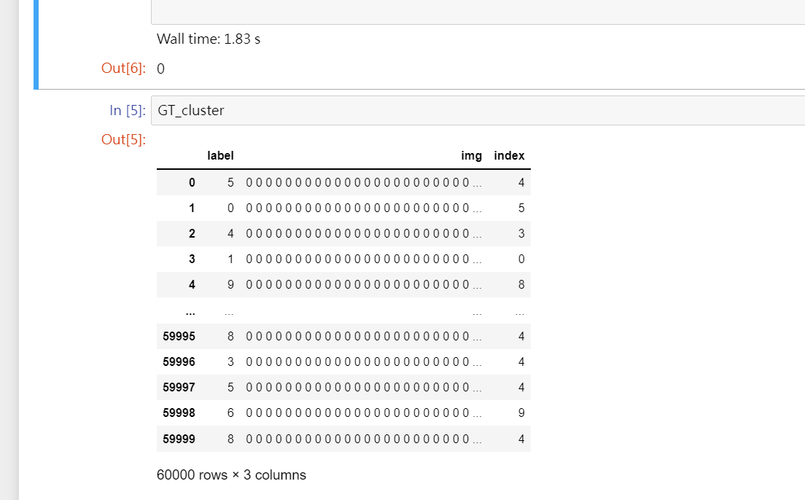

###### Step4

Summary the result.

```python
num_train_images = list(GT_cluster['index'].value_counts().sort_index())
# group by index
for i in range(10):
    name='index_'+str(i)
    locals()['index_'+str(i)]=GT_cluster[GT_cluster['index'] == i]

num_correct = []
major_label = []
acc = [] # acc
for i in range(10):
    n_c = locals()['index_'+str(i)]['label'].value_counts().max()
    m_l = locals()['index_'+str(i)]['label'].value_counts().idxmax()
    n_a = len(locals()['index_'+str(i)]) # number of images in this index
    num_correct.append(n_c)
    major_label.append(m_l)
    acc.append((n_c / n_a)*100)

result = pd.DataFrame({'#train images to this cluster': num_train_images, 'major label': major_label,
                      '#correct clustered':num_correct, 'accuracy': acc})
result
```

Output example is shown as below (random seed is 1229).

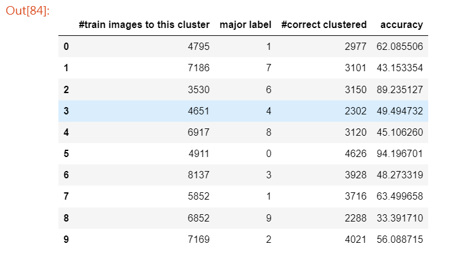

##### Result

###### Table 1. The Accuracy of Clustering Performance with Random Seed 1229

| Cluster Number | #Train images belongs to the cluster | Major Label of central images | #Correctly clustered images | Classification Accuracy(%) |
| :------------: | :----------------------------------: | :---------------------------: | :-------------------------: | :------------------------: |
|    ***0***     |              ***4795***              |            ***1***            |         ***2977***          |      ***62.085506***       |
|       1        |                 7186                 |               7               |            3101             |         43.153354          |
|       2        |                 3530                 |               6               |            3150             |         89.235127          |
|       3        |                 4651                 |               4               |            2302             |         49.494732          |
|       4        |                 6917                 |               8               |            3120             |         45.106260          |
|       5        |                 4911                 |               0               |            4626             |         94.196701          |
|       6        |                 8137                 |               3               |            3928             |         48.273319          |
|    ***7***     |              ***5852***              |            ***1***            |         ***3716***          |      ***63.499658***       |
|       8        |                 6852                 |               9               |            2288             |         33.391710          |
|       9        |                 7169                 |               2               |            4021             |         56.088715          |
|   Total Set    |                60000                 |              NA               |            33229            |       **55.381667**        |

###### Table 2. The Accuracy of Clustering Performance with Random Seed 324

| Cluster Number | #Train images belongs to the cluster | Major Label of central images | #Correctly clustered images | Classification Accuracy(%) |
| :------------: | :----------------------------------: | :---------------------------: | :-------------------------: | :------------------------: |
|       0        |                 4914                 |               0               |            4624             |         94.098494          |
|       1        |                 6219                 |               4               |            2374             |         38.173340          |
|       2        |                 8672                 |               1               |            6188             |         71.356089          |
|       3        |                 5161                 |               6               |            4104             |         79.519473          |
|       4        |                 5777                 |               2               |            4126             |         71.421153          |
|       5        |                 5804                 |               5               |            1430             |         24.638181          |
|       6        |                 6850                 |               3               |            3582             |         52.291971          |
|       7        |                 6440                 |               8               |            3044             |         47.267081          |
|       8        |                 5893                 |               9               |            2778             |         47.140675          |
|       9        |                 4270                 |               7               |            3974             |         93.067916          |
|   Total Set    |                60000                 |              NA               |            36224            |       **60.373333**        |

###### Table 3. The Accuracy of Clustering Performance with Random Seed 1001

| Cluster Number | #Train images belongs to the cluster | Major Label of central images | #Correctly clustered images | Classification Accuracy(%) |
| :------------: | :----------------------------------: | :---------------------------: | :-------------------------: | :------------------------: |
|       0        |                 5987                 |               5               |            2217             |         37.030232          |
|    ***1***     |              ***2966***              |            ***0***            |         ***2738***          |      ***92.312879***       |
|       2        |                 6444                 |               3               |            3288             |         51.024209          |
|    ***3***     |              ***5917***              |            ***7***            |         ***2162***          |      ***36.538787***       |
|    ***4***     |              ***2809***              |            ***0***            |         ***2367***          |      ***84.264863***       |
|       5        |                 6155                 |               4               |            2560             |         41.592201          |
|       6        |                 5247                 |               8               |            3301             |         62.912140          |
|    ***7***     |              ***6892***              |            ***7***            |         ***2824***          |      ***40.975044***       |
|       8        |                 8260                 |               6               |            4311             |         52.191283          |
|       9        |                 9323                 |               1               |            6434             |         69.012121          |
|   Total Set    |                60000                 |              NA               |            32202            |         **53.67**          |

This result can be reproduced using file *evaluation.ipynb, cluster_1001.txt, cluster_324.txt, cluster_1001.txt*, *train.txt, test.txt* by changing the validation number (variable: part = 1,2,3,4,5). Code and results are attached in this [link](https://pan.baidu.com/s/1UDfm3zlZ2bbYN5sHLEZoTA)(extract code: 7klp).

##### Explanation

The following screen shot shows the ground truth label of initial centroids selected by the 3 different random seeds (1229,324,1001 respectively),  

1. the *324 random seed selected as many as different labels as possible*, which means the initial centroids are far away from each other and the starting point separated in the dimension to *prevent from falling into local optimal*.

2. meanwhile, the number label "5" is hard for K-means to classify according to the poor performance in all three results, and this label can damage the result easily, but the second random seed (324) provide the K-means model with good initialization, which means there are sufficient start points from label "5" to help recognize the correct labels. 

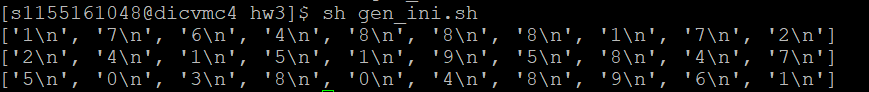

So I choose random seed 324 to continue question(c).

#### Question(c)

##### Data preparation

I use Linux command to prepare the data.

```shell
# get the total set of data
cat train.txt > all.txt
cat test.txt >> all.txt
# split the dataset
split -l 14000 all.txt
# dataset is separated into xaa, xab, xac, xad, xae
cat xab xac xad xae > train_part_1.txt
cat xaa xac xad xae > train_part_2.txt
cat xaa xab xad xae > train_part_3.txt
cat xaa xab xac xae > train_part_4.txt
cat xaa xab xac xad > train_part_5.txt
# copy to hdfs
hdfs dfs -copyFromLocal hw3/data/train_part_1.txt ./hw3 
hdfs dfs -copyFromLocal hw3/data/train_part_2.txt ./hw3 
hdfs dfs -copyFromLocal hw3/data/train_part_3.txt ./hw3 
hdfs dfs -copyFromLocal hw3/data/train_part_4.txt ./hw3 
hdfs dfs -copyFromLocal hw3/data/train_part_5.txt ./hw3 
hdfs dfs -copyFromLocal hw3/data/xaa ./hw3 
hdfs dfs -copyFromLocal hw3/data/xab ./hw3 
hdfs dfs -copyFromLocal hw3/data/xac ./hw3 
hdfs dfs -copyFromLocal hw3/data/xad ./hw3 
hdfs dfs -copyFromLocal hw3/data/xae ./hw3 
```

Then run code in Question(a) and Question(b) with slight modification in input value, the execution script is *run_c.sh*, I store in the [link](https://pan.baidu.com/s/1UDfm3zlZ2bbYN5sHLEZoTA)(extract code: 7klp) since there are too many lines, please check if you wish.

##### Result

###### Table. 4. The accuracy of k-means clustering performance under 5-fold cross validation

| Testing set | Classification Accuracy (%) |
| :---------: | :-------------------------: |
|   Part 1    |           59.636            |
|   Part 2    |           58.550            |
|   Part 3    |           57.957            |
|   Part 4    |           61.029            |
|   Part 5    |           57.186            |
|   Average   |           58.872            |

This result can be reproduced using file *evaluation.ipynb, cluster_p1.txt, cluster_p1.txt, cluster_p1.txt, cluster_p1.txt, cluster_p1.txt*, *xaa, xab, xac, xad, xae* by changing the validation number (variable: part = 1,2,3,4,5). Code and results are attached in this [link](https://pan.baidu.com/s/1UDfm3zlZ2bbYN5sHLEZoTA)(extract code: 7klp).

### Q3

#### Question(a)

E-step can be performed in mappers and M-step be performed in reducers because of the mapper can deal with a cluster once at a time.

##### Initialize

Initialize randomly.

> for k in length(clusters):
>
> ​	$q_k ←$ random probability # randomly generate
>
> ​	$π_k←\frac{Number of points in k}{Total number of points}$

Or use K-means result to initialize.

> for k in length(clusters):
>
> ​	$q_k ← prob(cluster_k)$ # get means from K-means cluster
>
> ​	$π_k←\frac{Number of points in k}{Total number of points}$
>

##### Mapper

> $E-Step$: **key** is k, **value** is binary image data point(pixels) and $γ$ (value saved as string)
>
> for line in lines:
>
> ​	$γ(z_{nk})=\frac{π_kp(x_n|q_k)}{Σ_{j=1}^Kπ_jp(x_n|q_k)}$ # for loop K to get this
>
> ​	print $k, pixels_n, γ(z_{nk})$

##### Reducer

> $M-Step$: **key** is k, **value** is $q_k, π_k$
>
> for line in lines:
>
> ​	if ($k_{current} = k$): 
>
> ​		# aggregate the intermediate result if the data point has the same k
>
> ​		$q_k = \frac{Σ_{n=1}^Nγ(z_{nk})x_n}{Σ_{n=1}^Nγ(z_{nk})}$ # re-compute $π_k$ and $q_k$
>
> ​		$π_k=\frac{Σ_{n=1}^Nγ(z_{nk})}{N}$
>
> ​	else condition: # loop back calculate other $π_k$ and $q_k$ 
>
> ​		print $k, pixels_n q_k, π_k$
>
> ​		$k←k_{current}$
>
> #last line
>
> print $k,pixels_n q_k, π_k$

#### Question(b)

##### Python implementation

I choose to convert the dataset into numpy array because using numpy to do math, i.e. computing matrix, adding up log are much more easier.

###### myBMM.py

```python
# inspired by Valentin Iovene tgy and Saulius Lukauskas's work
# Some of the functions like the log_P etc. are taken from scikit-learn's GMM implementation
from datetime import datetime
import sys
import numpy as np
from sklearn.cluster import KMeans

EPS = np.finfo(float).eps

class bmm:
	def __init__(self, n_components, iters = 50, threshold = 1e-2,verbose = False):
		# number of clusters
		self.n_components = n_components
		# max iterations
		self.iters = iters
		# convergence threshold
		self.threshold = threshold
		# print report or not
		self.verbose = verbose
		# cluster number
		k = self.n_components
		# pi
		self.weights = np.array([1 / k for _ in range(k)])
		# q
		self.means = None
		# converge condition
		self.converged_ = False

	def fit(self,x, means = None, labels = None):
		k = self.n_components
		n = x.shape[0]
		d = x.shape[1]

		## initialization ##

		# self.means = np.ndarray(shape = (k,d))
		# use kmeans to initialize mean
		self.means = kmeans_init(x, k, means = means, verbose = self.verbose)
		
		start = datetime.now()
		iterations = 0
		# convergence setup
		prev_log_likelihood = None
		cur_log_likelihood = -np.inf
		# iterate
		while iterations <= self.iters:
			elapsed = datetime.now() - start

			## E step ##
			# cal the new log_likelihood and responsibility: γ
			log_likelihood, gamma = self.score_compute(x)
			cur_log_likelihood = log_likelihood.mean()

			# report
			if self.verbose:
				print('[{:02d}] likelihood = {} (elapsed {})'
                      .format(iterations, cur_log_likelihood, elapsed))
			# converge or not
			if prev_log_likelihood is not None:
				change = abs(cur_log_likelihood - prev_log_likelihood)
				if change < self.threshold:
					self.converged_ = True
					break

			## M step ##
			self.m_step(x, gamma)
			iterations += 1

        # convergence
		end = datetime.now()
		elapsed = end - start
		print('converged in {} iterations in {}'.format(iterations, elapsed))
	# use BMM to predict
	def predict(self, x):
		return np.sum(np.exp(self.log_P(x)), 1)

	# calculate the component of γ: p(x_n | q_k) in a log version
	def log_P(self, x):

		k = self.n_components
		pi = self.weights 
		q = self.means
		x_c = 1 - x
		q_c = 1 - q
		log_support = np.ndarray(shape=(x.shape[0], k))

		for i in range(k):
			log_support[:, i] = (
				np.sum(x * np.log(q[i, :].clip(min=1e-50)), 1) \
                + np.sum(x_c * np.log(q_c[i, :].clip(min=1e-50)), 1))

		return log_support

    # calculate the γ： responsibility
	def score_compute(self, x):
		log_support = self.log_P(x)
		lpr = log_support + np.log(self.weights)
		logprob = np.logaddexp.reduce(lpr, axis=1)
		responsibilities = np.exp(lpr - logprob[:, np.newaxis])
		return logprob, responsibilities

	# using matrix to calculate p_i and q_k
	def m_step(self, x, z):
		# z is gamma - responsibility
		weights = z.sum(axis=0)
		weighted_x_sum = np.dot(z.T, x)
		inverse_weights = 1.0 / (weights[:, np.newaxis] + 10 * EPS)
		# update pi
		self.weights = (weights / (weights.sum() + 10 * EPS) + EPS)
        # update q
		self.means = weighted_x_sum * inverse_weights

# initialize using kmeans
def kmeans_init(x, k, means = None, verbose = False):
	if means is None:
		kmeans = KMeans(n_clusters = k, 
			verbose = int(verbose)).fit(x).cluster_centers_
	else:
		kmeans = means[:k,:]
	return kmeans
```

###### RUN

run_BMM.ipynb

```python
# import data
import numpy as np
from myBMM import bmm

fname = './train.txt'
fname = './test.txt'
img_set = []
label_set = []

with open(fname) as samples:
    for line in samples.readlines():
        line.strip()
        img, label = line.split('\t')
        img = [int(img_item) for img_item in img.split(' ')]
        img_set.append(img)
        label = int(label)
        label_set.append(label)
test_data = img_set
test_label = label_set
# process the data to binary
test_data = np.reshape(test_data, (10000, 784))
test_data_binary = np.where(test_data > 128, 1, 0)

# run the bmm
k = 10
# n = 10000
model = bmm(k, verbose = True)

model.fit(test_data_binary)

# predict
test_pred = model.predict(test_data_binary)
# evaluation
##TO BE CONTINUE##
```

The code can be found at [link1](https://pan.baidu.com/s/1UDfm3zlZ2bbYN5sHLEZoTA)(extract code: 7klp) and [link2](http://34.92.21.104:8888/notebooks/iems5709/hw3/run_BMM.py.ipynb) (pwd: jaden321).

###### Result

The code can be used to train BMM parameters, but need more time to implement other functions for my *bmm* class module to make it a classifier to get the accuracy.

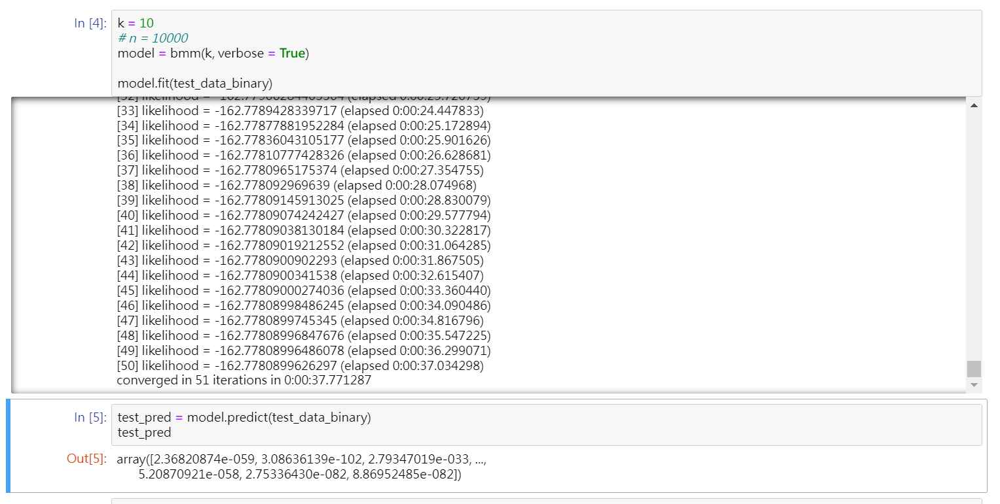

##### Mapreduce implementation

To be continue...

#### Reference

Discussed with Cheng Ka Kit about Question1 and Question2 dataset, with Li Yonghui about the idea about how to implementing K-means and convergence condition in Question2.

1. Preprocess the dataset. https://stackoverflow.com/questions/40427435/extract-images-from-idx3-ubyte-file-or-gzip-via-python

2. Derivation of BMM using EM methods, ML homework from CMU. https://www.cs.cmu.edu/~bapoczos/Classes/ML10715_2015Fall/assignments/hw2_sol.pdf

3. Example for BMM in Python.https://github.com/lukauskas/bernoulli-mixture-model

4. Example of GMM in Python by scikit-learn. https://github.com/scikit-learn/scikit-learn

5. Linux command to loop. https://www.cyberciti.biz/faq/bash-for-loop/

   