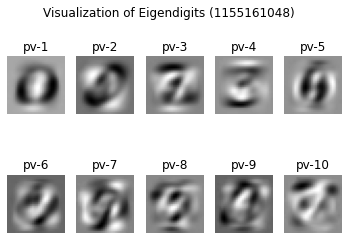

### Homework4 Report

[TOC]

All the code and intermediate result can be found in this link:

https://drive.google.com/drive/folders/1W4e4KTsampXuRkSIjMQw_1vtlRk2kgJc?usp=sharing

### Question1

##### 1. PCA (1.a)

###### 1.1 Scaling
A function to standardize the data as 2-D array data type.
<font size = 5>$z = \frac{x_i-μ(X)}{σ(X)}$</font>


```python
def standardize_data(X):
    '''
    This function standardize an array, its substracts mean value, 
    and then divide the standard deviation.
    
    param 1: array 
    return: standardized array
    '''    
    rows, columns = X.shape
    
    standardizedArray = np.zeros(shape=(rows, columns))
    tempArray = np.zeros(rows)
    
    for column in range(columns):
        
        mean = np.mean(X[:,column])
        std = np.std(X[:,column])
        tempArray = np.empty(0)
        
        for element in X[:,column]:
            
            tempArray = np.append(tempArray, ((element - mean) / std))
 
        standardizedArray[:,column] = tempArray
    
    return standardizedArray
```


```python
# # Standardizing data
X = [[7,4,3,4],
          [4,1,8,3],
          [6,3,5,2],
          [8,3,2,10],
          [4,5,0,9],
          [1,3,2,5],
          [6,6,3,2],
          [8,3,3,6]]
X = np.array(X)
X = standardize_data(X)
```

###### 1.2 Covariance matrix
Covariance matrices, like correlation matrices, contain information about the amount of variance shared between pairs of variables. That is our method of optimizing.

<font size=4>$Covariance Matrix = \frac{1}{n-1}(X-\tilde{x})^T(X-\tilde{x})$</font>

```python
# Calculating the covariance matrix

# covariance_matrix = np.cov(X.T)
covariance_matrix = (X.T@X) /( X.shape[0] - 1)
covariance_matrix
```


    array([[ 1.14285714e+00,  1.35526185e-01, -2.97278203e-17,
             1.68261412e-01],
           [ 1.35526185e-01,  1.14285714e+00, -7.72827076e-01,
             5.32089304e-02],
           [-2.97278203e-17, -7.72827076e-01,  1.14285714e+00,
            -7.50665339e-01],
           [ 1.68261412e-01,  5.32089304e-02, -7.50665339e-01,
             1.14285714e+00]])

###### 1.3 Eigenvectors and Eigenvalues
Eigen-decomposition of the Covariance Matrix, we get project matrix from this.


```python
# Using np.linalg.eig function
eigen_values, eigen_vectors = np.linalg.eig(covariance_matrix)
print("Eigenvector: \n",eigen_vectors,"\n")
print("Eigenvalues: \n", eigen_values, "\n")
```

    Eigenvector: 
     [[ 0.13644815  0.13976035  0.9089799  -0.36824516]
     [ 0.51054059 -0.499269   -0.26274585 -0.64887857]
     [-0.68503892 -0.70183311  0.18139953 -0.07243056]
     [ 0.50144979 -0.48849545  0.26798204  0.66189571]] 
    
    Eigenvalues: 
     [2.26831228 0.07060051 1.15328872 1.07922706] 

###### 1.4 Select principle components to get project matrix


```python
# Calculating the explained variance on each of components
eigen_v_sort = np.flip(np.sort(eigen_values))
variance_explained = []
for i in eigen_v_sort:
     variance_explained.append((i/sum(eigen_v_sort))*100)
        
print(variance_explained)
```

    [49.6193311513078, 25.22819072096042, 23.608091986225205, 1.5443861415065827]

```python
# Find the eigenvector with the 2 highest contribution
# ranking by eigenvalues

cumulative_variance_explained = np.cumsum(variance_explained)
print(cumulative_variance_explained)
```

    [ 49.61933115  74.84752187  98.45561386 100.        ]

```python
# Visualizing the eigenvalues and finding the "elbow" in the graphic
sns.lineplot(x = [1,2,3,4], y=cumulative_variance_explained)
plt.xlabel("Number of components")
plt.ylabel("Cumulative explained variance")
plt.title("Explained variance vs Number of components")
```


    Text(0.5, 1.0, 'Explained variance vs Number of components')


```python
print('Sorted eigenvalues: ',eigen_v_sort)
eigen_v_argsort = np.flip(np.argsort(eigen_values))
print('Ranked index of eigenvectors: ',eigen_v_argsort)
```

    Sorted eigenvalues:  [2.26831228 1.15328872 1.07922706 0.07060051]
    Ranked index of eigenvectors:  [0 2 3 1]

```python
# Using the two largest components 
projection_matrix = (eigen_vectors.T[:][(eigen_v_argsort[:2])]).T
print(projection_matrix)
```

    [[ 0.13644815  0.9089799 ]
     [ 0.51054059 -0.26274585]
     [-0.68503892  0.18139953]
     [ 0.50144979  0.26798204]]


###### 1.5 Use project matrix to project data into lower dimension.

<font size = 4>$X_{pca} = X · P$</font>


```python
# Getting the product of original standardized X and the eigenvectors 
X_pca = X.dot(projection_matrix)
print(X_pca)
```

    [[ 0.15100763  0.39059057]
     [-2.83262452  0.04251018]
     [-1.23978299  0.14493442]
     [ 1.21585172  1.46588103]
     [ 2.13427285 -0.78910758]
     [-0.09174666 -1.85020038]
     [ 0.45982034 -0.57570604]
     [ 0.20320163  1.17109781]]

```python
plt.scatter(X_pca[:,0],X_pca[:,1])
plt.show()
```


##### 2. SVD (1.b)

Contrary to PCA, SVD does not center the data before computing the singular value decomposition. This means it can work with sparse matrices efficiently.


```python
X = [[7,4,3,4],
          [4,1,8,3],
          [6,3,5,2],
          [8,3,2,10],
          [4,5,0,9],
          [1,3,2,5],
          [6,6,3,2],
          [8,3,3,6]]
X = np.array(X)
def SVD_UV(M):
    eigen_values, eigen_vectors = np.linalg.eig(M)
    print("Eigenvector: \n",eigen_vectors,"\n")
    print("Eigenvalues: \n", np.real(np.round(eigen_values, decimals = 5)), "\n")
    # in this case, there are 4 eigenvectos
    V = []
    for i in range(len(eigen_values)):
        locals()['v'+str(i+1)] = eigen_vectors.T[i]
        V.append(locals()['v'+str(i+1)])
    V = np.array(V).T
    return V, eigen_vectors, eigen_values
```

###### 2.1 Get matrix U
<font size = 4>$X=UΣV^T$</font>

Get $XX^T$, then, $λ_1,λ_2,λ_3...λ_m$ are eigenvalues and $u_1,u_2,...u_m$ are eigenvectors. $U = [u_1　u_2　u_3　...　u_m]$


```python
U, e_vec, e_val = SVD_UV(X@X.T)
print(np.real(U))
```

    Eigenvector: 
     [[-0.35879436+0.j         -0.13087218+0.j         -0.28210155+0.j
      -0.10937713+0.j         -0.69305193+0.j          0.11830377+0.j
       0.19237939+0.27083558j  0.19237939-0.27083558j]
     [-0.28185628+0.j         -0.55444447+0.j          0.63656428+0.j
       0.18285205+0.j          0.14329702+0.j         -0.40617149+0.j
      -0.24826586-0.09626346j -0.24826586+0.09626346j]
     [-0.29904526+0.j         -0.41572783+0.j         -0.10187329+0.j
      -0.00868583+0.j         -0.26148609+0.j          0.5980671 +0.j
       0.5859327 +0.j          0.5859327 -0.j        ]
     [-0.49389927+0.j          0.33677013+0.j          0.2283382 +0.j
      -0.43277044+0.j          0.2981359 +0.j         -0.02465343+0.j
       0.1621392 +0.13409572j  0.1621392 -0.13409572j]
     [-0.37730965+0.j          0.55209639+0.j          0.01359903+0.j
       0.36706183+0.j         -0.12062198+0.j         -0.23324755+0.j
      -0.04439811-0.222658j   -0.04439811+0.222658j  ]
     [-0.20822796+0.j          0.17480329+0.j          0.25822969+0.j
       0.57548639+0.j         -0.1489307 +0.j          0.5237536 +0.j
       0.14577733+0.22954853j  0.14577733-0.22954853j]
     [-0.31759845+0.j         -0.23075496+0.j         -0.61867822+0.j
       0.36465993+0.j          0.54235454+0.j         -0.36607748+0.j
      -0.28143366-0.06501134j -0.28143366+0.06501134j]
     [-0.41457069+0.j         -0.02460867+0.j         -0.05529814+0.j
      -0.41029286+0.j          0.10491203+0.j          0.00138573+0.j
      -0.43073563-0.19155119j -0.43073563+0.19155119j]] 
    
    Eigenvalues: 
     [669.14457  80.19933  28.6748   16.98129   0.       -0.        0.
       0.     ] 
    
    [[-0.35879436 -0.13087218 -0.28210155 -0.10937713 -0.69305193  0.11830377
       0.19237939  0.19237939]
     [-0.28185628 -0.55444447  0.63656428  0.18285205  0.14329702 -0.40617149
      -0.24826586 -0.24826586]
     [-0.29904526 -0.41572783 -0.10187329 -0.00868583 -0.26148609  0.5980671
       0.5859327   0.5859327 ]
     [-0.49389927  0.33677013  0.2283382  -0.43277044  0.2981359  -0.02465343
       0.1621392   0.1621392 ]
     [-0.37730965  0.55209639  0.01359903  0.36706183 -0.12062198 -0.23324755
      -0.04439811 -0.04439811]
     [-0.20822796  0.17480329  0.25822969  0.57548639 -0.1489307   0.5237536
       0.14577733  0.14577733]
     [-0.31759845 -0.23075496 -0.61867822  0.36465993  0.54235454 -0.36607748
      -0.28143366 -0.28143366]
     [-0.41457069 -0.02460867 -0.05529814 -0.41029286  0.10491203  0.00138573
      -0.43073563 -0.43073563]]


###### 2.2 Get matrix V
<font size = 4>$X=UΣV^T$</font>
<font size = 3>Get $X^TX$, </font> then, $λ_1,λ_2,λ_3...λ_n$ are eigenvalues and $v_1,v_2,...v_n$ are eigenvectors. $V = [v_1　v_2　v_3　...　v_n]$


```python
V, e_vec, e_val = SVD_UV(X.T@X)
print(V)
```

    Eigenvector: 
     [[ 0.63105699  0.23810187 -0.63073597 -0.3837274 ]
     [ 0.37716355 -0.05714198  0.71340467 -0.58782329]
     [ 0.32578001  0.74254078  0.30085856  0.50198078]
     [ 0.59445952 -0.62343844  0.05205803  0.50520526]] 
    
    Eigenvalues: 
     [669.14457  80.19933  16.98129  28.6748 ] 
    
    [[ 0.63105699  0.23810187 -0.63073597 -0.3837274 ]
     [ 0.37716355 -0.05714198  0.71340467 -0.58782329]
     [ 0.32578001  0.74254078  0.30085856  0.50198078]
     [ 0.59445952 -0.62343844  0.05205803  0.50520526]]


###### 2.3 Get matrix Σ
<font size = 4>$X=UΣV^T$</font>

<font size = 3>Because U and V are orthogonal, so $U^{-1} = U^T, V^{-1} = V^T$</font>, 

```python
# method 1
Sigma = U.T@X@V
Sigma = np.real(np.round(Sigma, decimals = 5))
Sigma
```


    array([[-25.86783,  -0.     ,  -0.     ,   0.     ],
           [ -0.     ,  -8.95541,   0.     ,  -0.     ],
           [ -0.     ,   0.     ,   0.     ,   5.35489],
           [ -0.     ,   0.     ,   4.12084,  -0.     ],
           [  0.     ,  -0.     ,   0.     ,  -0.     ],
           [ -0.     ,  -0.     ,  -0.     ,   0.     ],
           [  0.     ,  -0.     ,  -0.     ,   0.     ],
           [  0.     ,  -0.     ,  -0.     ,   0.     ]])


```python
#method2
# Select U and V
dim = 4 # 1 ~ 4
Sigma = []
for i in range(dim):
    sig = list(np.zeros(dim))
    sig[i] = np.sqrt(e_val[i])
    Sigma.append(sig)
Sigma = np.array(Sigma)
Sigma
```


    array([[25.86782891,  0.        ,  0.        ,  0.        ],
           [ 0.        ,  8.95540787,  0.        ,  0.        ],
           [ 0.        ,  0.        ,  4.12083655,  0.        ],
           [ 0.        ,  0.        ,  0.        ,  5.35488596]])

###### 2.4 Select U and V
The first 2 vectors that has the 2 largest eigenvalues to do dimension deduction.


```python
V = V.T[:2].T
U = U.T[:2].T
dim = 2
low_Sigma = np.zeros([dim,dim])
selected_v = np.flip(np.sort(Sigma[Sigma!=0]))[:2]
for i in range(dim):
    low_Sigma[i][i] = selected_v[i]
low_Sigma
```


###### 2.5 Calculate $X_{SVD}$
<font size = 4>$X_{SVD}=UΣ$</font>


```python
X_svd = U@low_Sigma
print(X_svd)
plt.scatter(X_svd[:,0],X_svd[:,1])
plt.show()
```

    [[ -9.28123122+0.j  -1.17201372+0.j]
     [ -7.29101013+0.j  -4.96527639+0.j]
     [ -7.73565166+0.j  -3.72301227+0.j]
     [-12.77610177+0.j   3.01591383+0.j]
     [ -9.76018138+0.j   4.9442484 +0.j]
     [ -5.38640526+0.j   1.56543473+0.j]
     [ -8.21558229+0.j  -2.06650476+0.j]
     [-10.72404369+0.j  -0.2203807 +0.j]]


###### 2.6 Use scipy and sklearn to double check the SVD

```python
# SCIPY
from scipy.linalg import svd
X = [[7,4,3,4],
          [4,1,8,3],
          [6,3,5,2],
          [8,3,2,10],
          [4,5,0,9],
          [1,3,2,5],
          [6,6,3,2],
          [8,3,3,6]]
X = np.array(X)
U, s, VT = svd(X)
print('U:   ',U)
print('Sigma: ',s)
print('V.T: ',VT)
Sigma = np.zeros([2,2])
dim = 2
for i in range(dim):
    Sigma[i][i] = s[i]
d_U = U.T[:2]
d_U = d_U.T
print('d_U:  ',d_U)
X_svd = d_U@Sigma
print(X_svd)
plt.scatter(X_svd[:,0],X_svd[:,1])
plt.show()
#Sklearn
from sklearn.decomposition import TruncatedSVD
# define transform
svd = TruncatedSVD(n_components=2)
# prepare transform on dataset
svd.fit(X)
# apply transform to dataset
X_svd = svd.transform(X)
plt.scatter(X_svd[:,0],X_svd[:,1])
plt.show()
```

```
[[ -9.28123122   1.17201372]
 [ -7.29101013   4.96527639]
 [ -7.73565166   3.72301227]
 [-12.77610177  -3.01591383]
 [ -9.76018138  -4.9442484 ]
 [ -5.38640526  -1.56543473]
 [ -8.21558229   2.06650476]
 [-10.72404369   0.2203807 ]]
```

The result of third party implementations are all the same with mine.


### Question2

With the reduced dimensional space (M = 20), get the data saved as`test_my_20_pca.txt`and`train_my_20_pca.txt`  I redo the K-means clustering.

```shell
hdfs dfs -mkdir hw4
hdfs dfs -copyFromLocal ./test_my_20_pca.txt ./hw4
hdfs dfs -copyFromLocal ./train_my_20_pca.txt ./hw4
```

##### 3. Implement PCA to MINIST dataset


```python
from sklearn.decomposition import PCA
from sklearn.preprocessing import StandardScaler
import os

# I implement new standardize method to deal with the image data
def standardize_img(img_data):
    row, col = img_data.shape[0], img_data.shape[1]
    s_img = []
    for i in range(col):
        x = img_data[:,i].reshape(-1, 1)
        x = StandardScaler().fit_transform(x)
        s_img.append(x.reshape(1,row))
    s_img = np.array(s_img)
    result = np.zeros([row, col])
    for i in range(row):
        for j in range(col):
            result[i][j] = s_img[j][0][i]
    return result

# my implementation of PCA purly with Numpy
def myPCA(X, M):
    X = standardize_img(X)
    covariance_matrix = (X.T@X) / (X.shape[0] - 1)
    eigen_values, eigen_vectors = np.linalg.eig(covariance_matrix)
    eigen_v_argsort = np.flip(np.argsort(eigen_values))
    values_ = eigen_values[eigen_v_argsort[:M]]
    components_ = (eigen_vectors.T[:][(eigen_v_argsort[:M])])
    projection_matrix = components_.T
    X_pca = X.dot(projection_matrix)
    return X_pca, components_, values_, eigen_vectors,eigen_values

# implementation of PCA of sklearn as reference
def useSkPCA(X, M):    
    X = standardize_img(X)
    pca = PCA(n_components=M)
    pca.fit(X)
    X_pca = pca.transform(X)
    ratio = pca.explained_variance_ratio_
    values = pca.explained_variance_
    comp = pca.components_
    return X_pca, ratio, values, comp

# load data
def load_raw(fname):
    img_set = []
    label_set = []
    with open(fname) as samples:
        for line in samples.readlines():
            line.strip()
            img, label = line.split('\t')
            img = [int(img_item) for img_item in img.split(' ')]
            img_set.append(img)
            label = int(label)
            label_set.append(label)
    img_set = np.array(img_set)
    label_set = np.array(label_set)
    return img_set, label_set

# save new data
def save_data(data, label,components,  fname, M):
    np.savetxt(fname, data, delimiter = " ", fmt = '%.3f')
    np.savetxt(fname[:-4]+str(M)+'components.txt', components_, delimiter=" ", fmt = '%.3f')
    samples = open(fname, 'r+')
    pca_samp = open(fname[:-4]+str(M)+'_pca.txt', 'a')
    count = 0
    for line in samples.readlines():
        line.strip()
        # assign ID for each img to identify
        new_line = line[:-1]+'\t'+str(label[count])+'\t'+str(count)+'\n'
        count = count + 1
        pca_samp.write(new_line)
    samples.close()
    pca_samp.close()
    os.remove(fname)
    print('PCA data saved as: ', fname[:-4]+str(M)+'pca.txt')
    print('Components saved as: ',fname[:-4]+str(M)+'components.txt')

def visualize_eigenPic(reduce_dim,num_viz_pca,pv_dir):
    # load principle vectors from your local machine, e.g., here we suppose that the PCA vectors of the training
    # set is stored in a file named 'pca_components_20' in the ./mnist/ directory
#     pv_dir = 'mnist/pca_components_' + str(reduce_dim)
    
    pvs = np.empty((reduce_dim, 784))
    with open(pv_dir, 'r') as f:
        # Some pre-processing steps, depending on how you store your principle vectors
        # Here, we suppose that each row is corresponding to a principle vectors with string
        # type, e.g, a row can be: '0.5, 0.2, 0.3, ..., 0.21', each element is separated by ','.
        for k, line in enumerate(f.readlines()):
            line = line.strip().split(' ')
            # the k-th principle vectors
            pv_k = np.array(list(map(float, line)))
            pvs [k] = pv_k

    # visualize the principle vectors
    fig, ax = plt.subplots(num_viz_pca // 5, 5)
    # YOU NEED TO FILL IN YOUR SID IN THE FOLLOWING LINE
    fig.suptitle('Visualization of Eigendigits ({})'.format('1155161048'))
    ax = ax.reshape(-1)
    for k, pv in enumerate(pvs [:num_viz_pca]):
        pv = pv.reshape(28, 28)
        ax[k].imshow(pv, cmap='gray')
        ax[k].set_title('pv-{}'.format(k + 1))
        ax[k].axis('off')

    fig.savefig('./viz_pca_vectors_{}.png'.format(num_viz_pca))


```

###### 3.1 Test the correctness of myPCA from Question1 using PCA - sklearn package (2.a)


```python
X = [[7,4,3,4],
          [4,1,8,3],
          [6,3,5,2],
          [8,3,2,10],
          [4,5,0,9],
          [1,3,2,5],
          [6,6,3,2],
          [8,3,3,6]]
X = np.array(X)
test_pca1, components_, values_, eigen_vectors,eigen_values = myPCA(X, 2)
test_pca2, test_ratio, test_values, test_comp = useSkPCA(X, 2)
print(test_pca1)
print(test_pca2)
print('I get the same result with standard sklearn PCA package! Woooh~')
print('The result are only different in scale.')
```

    [[ 0.15100763  0.39059057]
     [-2.83262452  0.04251018]
     [-1.23978299  0.14493442]
     [ 1.21585172  1.46588103]
     [ 2.13427285 -0.78910758]
     [-0.09174666 -1.85020038]
     [ 0.45982034 -0.57570604]
     [ 0.20320163  1.17109781]]
    [[-0.15100763 -0.39059057]
     [ 2.83262452 -0.04251018]
     [ 1.23978299 -0.14493442]
     [-1.21585172 -1.46588103]
     [-2.13427285  0.78910758]
     [ 0.09174666  1.85020038]
     [-0.45982034  0.57570604]
     [-0.20320163 -1.17109781]]
    I get the same result with standard sklearn PCA package! Woooh~
    The result are only different in scale.


###### 3.2 Dimension reduction for MINIST dataset


```python
fname = './train.txt'
train_data, train_label = load_raw(fname)
fname = './test.txt'
test_data, test_label = load_raw(fname)
```


```python
print(train_data.shape)
print(test_data.shape)
M = 20 # new dimension
```

Use my original function


```python
%%time
test_data_pca, components_, values_ = myPCA(test_data, M)
train_data_pca, components_, values_ = myPCA(train_data, M)
save_data(test_data_pca, test_label , components_, 'test_my_.txt', M)
save_data(train_data_pca, train_label, components_, 'train_my_.txt', M)
```

    PCA data saved as:  test_my_20pca.txt
    Components saved as:  test_my_20components.txt
    PCA data saved as:  train_my_20pca.txt
    Components saved as:  train_my_20components.txt
    Wall time: 4.77 s

Use sklearn PCA function


```python
%%time
test_data_pca, _, values_, components_= useSkPCA(test_data, M)
train_data_pca, _, values_, components_ = useSkPCA(train_data, M)
save_data(test_data_pca, test_label , components_, 'test_skt_.txt', M)
save_data(train_data_pca, train_label, components_, 'train_skt_.txt', M)
```

    PCA data saved as:  test_skt_20pca.txt
    Components saved as:  test_skt_20components.txt
    PCA data saved as:  train_skt_20pca.txt
    Components saved as:  train_skt_20components.txt
    Wall time: 6.04 s

```python
components_.shape
```


    (20, 784)

Double check: my implementation of PCA


```python
reduce_dim = M
num_viz_pca = 10
pv_dir = 'train_my_'+str(M)+'components.txt'
visualize_eigenPic(reduce_dim,num_viz_pca, pv_dir)
```




Double check: third party sklearn implementation of PCA


```python
reduce_dim = M
num_viz_pca = 10
# pv_dir = 'test_my_'+str(M)+'components.txt'
pv_dir = 'train_skt_'+str(M)+'components.txt'
visualize_eigenPic(reduce_dim,num_viz_pca, pv_dir)
```


###### 3.3 K-means clustering code recap (2.b)

I used the code from homework3 to redo this part, details of the code and implementation can be found there in `Homework3_Report.pdf`.

**cen_gen_new.py**

To generate the initial centroid file, randomly select from training sample points, random seed as argument value input. 

```python
import numpy as np
import random
import os
import sys
# set up the initial centroid random seed

# part = sys.argv[1]
random_seed = sys.argv[1]
random.seed(random_seed)
centroid_file = 'centroid_'+str(random_seed)+'.txt'
file = "./train_my_20_pca.txt"
dim = 20

# centroid_file: save to this file, centroids: 10 * 784, counts: 10 * 1
def save_centroid(centroid_file, centroids, counts):
	with open(centroid_file, mode = 'w', encoding = 'utf-8') as cent:
		for i in range(0, 10):
			cent_i = 'Centroid ' + str(i) + ':'
			img = [str(centroids[i][j]) for j in range(dim)]
			img = ' '.join(img)
			cent_i = cent_i + img + ',' + str(counts[i]) + '\n'
			cent.write(cent_i)
	cent.close()

dice = [random.randint(1, 59999) for i in range(10)] 
sample = []
with open(file) as samples:
	line_count = 0
	for line in samples.readlines():
		line_count += 1
		if line_count in dice:
			line.strip()
			img, label, ID = line.split('\t')
			img = [float(img_item) for img_item in img.split(' ')]
			sample.append(img)
		else: continue
# initialize centroid and create file if it doesn't exist at the first iteration
if (not os.path.exists(centroid_file)) or (not os.path.getsize(centroid_file) > 0):
	# randomly selected centroid from data points
	random_img = sample
	# intialize as 0
	counts = [0 for i in range(10)]
	save_centroid(centroid_file, random_img, counts)

assert (os.path.getsize(centroid_file) > 0), "Empty initial centroid file!"

```

###### mapper_a1.py

```python
#!/usr/bin/env python3

import sys
import os
import random
import numpy as np

random_seed = sys.argv[1]
random.seed(random_seed)
centroid_file = 'centroid_'+str(random_seed)+'.txt'
dim = 20
# calculate the distance between two points (represented with vector)
# a: centroid 1*784, b: sample 1*784, index: which centroid
def distance(centroid, sample):
	return np.linalg.norm(centroid - sample)

# save as centroid format file
# centroid_file: save to this file, centroids: 10 * 784, counts: 10 * 1
def save_centroid(centroid_file, centroids, counts):
	with open(centroid_file, mode = 'w', encoding = 'utf-8') as cent:
		for i in range(0, 10):
			cent_i = 'Centroid ' + str(i) + ':'
			img = [str(centroids[i][j]) for j in range(dim)]
			img = ' '.join(img)
			cent_i = cent_i + img + ',' + str(counts[i]) + '\n'
			cent.write(cent_i)
	cent.close()

assert (os.path.getsize(centroid_file) > 0), "Empty initial centroid file!"

# initialize the centroids and counts
centroids = np.zeros((10, dim))
count = np.zeros((10, 1))

# read the centorids file

with open(centroid_file) as cents:
	for line in cents.readlines():
		line = line.strip()
		line, count = line.split(',')
		header, cent = line.split(':')
		header, index = header.split(' ')
		cent = cent.split(' ')
		centroids[int(index)] = cent

# map: only need to find out the closest centroid for each point

for line in sys.stdin:
	line = line.strip()
	img, label = line.split('\t')
	img = [float(img_item) for img_item in img.split(' ')]
	# label = int(label)

	# shortest distance, start with index 0
	# d: distance, s_d: shortest distance, s_index: shortest centroid index
	s_d = distance(centroids[0], img)
	s_index = 0
	for i in range(1, 10):
		d = distance(centroids[i], img)
		if d < s_d:
			s_d = d
			s_index = i
		else: continue

	# format intermediate result as string
	img = ' '.join(str(k) for k in img)
	print('%s\t%s' % (str(s_index), img))
```

**reducer_a1.py**

```python
#!/usr/bin/env python3

import sys
import os
import numpy as np

cur_s_index = None
count = 1
dim = 20
centroid = np.zeros(dim)

# save as centroid format file
# centroid: 1 * 784, count: 1*1
def format_centroid(cur_s_index, centroid, count):
	assert (len(centroid) == 784), "Wrong dimension: "+str(len(centroid))+ " It should be (784,)"
	new_centroid = [str(centroid[i] / count) for i in range(dim)]
	new_centroid = ' '.join(new_centroid)
	# save the count number
	count = str(count)
	rst = "Centroid " + str(cur_s_index) + ":" + new_centroid + "," + count
	return rst

for line in sys.stdin:
	line = line.strip()
	s_index, img = line.split('\t')
	img = img.split(' ')
	s_index = int(s_index)
	# deal with only one index at a time

	if(cur_s_index == s_index):
		count = count + 1
		centroid = [centroid[i] + float(img[i]) for i in range(dim)]
	else:
		# cal the average, get new centroids and print
		if cur_s_index is not None:
			print(format_centroid(cur_s_index, centroid, count))
		# renew a centroid
		centroid = np.zeros(dim)
		count = 1
	# renew the index
	cur_s_index = s_index

# last line: end of iteration
if count > 0:
	# if the last few lines has the same index with the above line
	print(format_centroid(cur_s_index, centroid, count))
else:
	# if the last line has a different index with the above lines
	img = [float(img[i]) for i in range(dim)]
	print(format_centroid(cur_s_index, img, count))
```

**mapper_b2.py**

```python
#!/usr/bin/env python3

import sys
import os
import random
import numpy as np

# set up the initial centroid random seed
random_seed = sys.argv[1]
random.seed(random_seed)
centroid_file = 'centroid_'+str(random_seed)+'_new.txt'
dim = 20

# calculate the distance between two points (represented with vector)
# a: centroid 1*784, b: sample 1*784, index: which centroid
def distance(centroid, sample):
	return np.linalg.norm(centroid - sample)

# initialize the centroids and counts
centroids = np.zeros((10, dim))
count = np.zeros((10, 1))
# read the centorids file
with open(centroid_file) as cents:
	for line in cents.readlines():
		line = line.strip()
		line, count = line.split(',')
		header, cent = line.split(':')
		header, index = header.split(' ')
		cent = cent.split(' ')
		centroids[int(index)] = cent
assert (os.path.getsize(centroid_file) > 0), "Empty initial centroid file!"
# map: only need to find out the closest centroid for each point

for line in sys.stdin:
	line = line.strip()
	img, label = line.split('\t')
	img = [float(img_item) for img_item in img.split(' ')]
	# label = int(label)

	# shortest distance, start with index 0
	# d: distance, s_d: shortest distance, s_index: shortest centroid index
	s_d = distance(centroids[0], img)
	s_index = 0
	for i in range(1, 10):
		d = distance(centroids[i], img)
		if d < s_d:
			s_d = d
			s_index = i
		else: continue

	# format intermediate result as string
	img = ' '.join(str(k) for k in img)
	print('%s\t%s' % (str(s_index), img))
```

**reducer_b2.py**

```python
#!/usr/bin/env python3
import sys
import os
import numpy as np
for line in sys.stdin:
	line = line.strip()
	print(line)
```

**run4_a.sh**

```shell
# give permission
chmod +x mapper_a1.py reducer_a1.py
# remove old centroid file
# rm centroid_*

# generate the initial centroid file
python3 cen_gen_new.py 324
# iteration loop
for i in `seq 1 15`;
do
	# remove old output
	hdfs dfs -rm -r ./hw4/output_a1
	# run mapreduce
	hadoop jar /usr/lib/hadoop-mapreduce/hadoop-streaming.jar \
	-D mapred.output.key.comparator.class=org.apache.hadoop.mapred.lib.KeyFieldBasedComparator \
	-D mapred.job.name='Job_a1' \
	-D mapred.map.tasks=20 \
	-D mapred.reduce.tasks=5 \
	-D mapred.text.key.comparator.options=-k1n \
	-file mapper_a1.py -mapper mapper_a1.py \
	-file reducer_a1.py -reducer reducer_a1.py \
	-file centroid_324.txt \
	-input ./hw4/train_my_20_pca.txt \
	-output ./hw4/output_a1
	# save output
	hdfs dfs -cat ./hw4/output_a1/* > centroid_324_new.txt
	# save the final
	cat centroid_324_new.txt > centroid_324.txt
	# save all iterations as log
	cat centroid_324_new.txt >> centroid_324_all.txt
	# delete the output
	hdfs dfs -rm -r ./hw4/output_a1
done

# generate the initial centroid file
python3 cen_gen_new.py 1229
# iteration loop
for i in `seq 1 15`;
do
	# remove old output
	hdfs dfs -rm -r ./hw4/output_a1
	# run mapreduce
	hadoop jar /usr/lib/hadoop-mapreduce/hadoop-streaming.jar \
	-D mapred.output.key.comparator.class=org.apache.hadoop.mapred.lib.KeyFieldBasedComparator \
	-D mapred.job.name='Job_a1' \
	-D mapred.map.tasks=20 \
	-D mapred.reduce.tasks=5 \
	-D mapred.text.key.comparator.options=-k1n \
	-file mapper_a1.py -mapper mapper_a1.py \
	-file reducer_a1.py -reducer reducer_a1.py \
	-file centroid_1229.txt \
	-input ./hw4/train_my_20_pca.txt \
	-output ./hw4/output_a1
	# save output
	hdfs dfs -cat ./hw4/output_a1/* > centroid_1229_new.txt
	# save the final
	cat centroid_1229_new.txt > centroid_1229.txt
	# save all iterations as log
	cat centroid_1229_new.txt >> centroid_1229_all.txt
	# delete the output
	hdfs dfs -rm -r ./hw4/output_a1
done


# generate the initial centroid file
python3 cen_gen_new.py 1001
# iteration loop
for i in `seq 1 15`;
do
	# remove old output
	hdfs dfs -rm -r ./hw4/output_a1
	# run mapreduce
	hadoop jar /usr/lib/hadoop-mapreduce/hadoop-streaming.jar \
	-D mapred.output.key.comparator.class=org.apache.hadoop.mapred.lib.KeyFieldBasedComparator \
	-D mapred.job.name='Job_a1' \
	-D mapred.map.tasks=20 \
	-D mapred.reduce.tasks=5 \
	-D mapred.text.key.comparator.options=-k1n \
	-file mapper_a1.py -mapper mapper_a1.py \
	-file reducer_a1.py -reducer reducer_a1.py \
	-file centroid_1001.txt \
	-input ./hw4/train_my_20_pca.txt \
	-output ./hw4/output_a1
	# save output
	hdfs dfs -cat ./hw4/output_a1/* > centroid_1001_new.txt
	# save the final
	cat centroid_1001_new.txt > centroid_1001.txt
	# save all iterations as log
	cat centroid_1001_new.txt >> centroid_1001_all.txt
	# delete the output
	hdfs dfs -rm -r ./hw4/output_a1
done
```

**run4_b.sh**

```shell
# give permission
chmod +x mapper_b2.py reducer_b2.py

# remove old output
hdfs dfs -rm -r ./hw4/output_b2
# run mapreduce
hadoop jar /usr/lib/hadoop-mapreduce/hadoop-streaming.jar \
-D mapred.output.key.comparator.class=org.apache.hadoop.mapred.lib.KeyFieldBasedComparator \
-D mapred.job.name='Job_b2' \
-D mapred.map.tasks=20 \
-D mapred.reduce.tasks=5 \
-D mapred.text.key.comparator.options=-k1n \
-file mapper_b2.py -mapper 'mapper_b2.py 1229' \
-file reducer_b2.py -reducer reducer_b2.py \
-file centroid_1229_new.txt \
-input ./hw4/train_my_20_pca.txt \
-output ./hw4/output_b2

# save output
hdfs dfs -cat ./hw4/output_b2/* > cluster_1229.txt
hdfs dfs -rm -r ./hw4/output_b2

hadoop jar /usr/lib/hadoop-mapreduce/hadoop-streaming.jar \
-D mapred.output.key.comparator.class=org.apache.hadoop.mapred.lib.KeyFieldBasedComparator \
-D mapred.job.name='Job_b2' \
-D mapred.map.tasks=20 \
-D mapred.reduce.tasks=5 \
-D mapred.text.key.comparator.options=-k1n \
-file mapper_b2.py -mapper 'mapper_b2.py 324' \
-file reducer_b2.py -reducer reducer_b2.py \
-file centroid_324_new.txt \
-input ./hw4/train_my_20_pca.txt \
-output ./hw4/output_b2
# save output
hdfs dfs -cat ./hw4/output_b2/* > cluster_324.txt
hdfs dfs -rm -r ./hw4/output_b2

hadoop jar /usr/lib/hadoop-mapreduce/hadoop-streaming.jar \
-D mapred.output.key.comparator.class=org.apache.hadoop.mapred.lib.KeyFieldBasedComparator \
-D mapred.job.name='Job_b2' \
-D mapred.map.tasks=20 \
-D mapred.reduce.tasks=5 \
-D mapred.text.key.comparator.options=-k1n \
-file mapper_b2.py -mapper 'mapper_b2.py 1001' \
-file reducer_b2.py -reducer reducer_b2.py \
-file centroid_1001_new.txt \
-input ./hw4/train_my_20_pca.txt \
-output ./hw4/output_b2
# save output
hdfs dfs -cat ./hw4/output_b2/* > cluster_1001.txt
hdfs dfs -rm -r ./hw4/output_b2
```

###### 3.4 Clustering result

The code for clustering is the same as homework3, I added a ID column to identify each image.


```python
# TODOs
# 1. count the number of images belong to this cluster
# 2. find the major label for this cluster
# 3. count the number of correctly clustered images
# 4. cal the calssification accuracy
# Files needed: a) K-means result, b)train.txt
import sys
import os
import numpy as np
import gc
import pandas as pd

random_seed = 324
train_file = './train_my_20_pca.txt'
cluster_file = './cluster_'+str(random_seed)+'.txt'

img_train = []
label_train = []
ID_train = []
with open(train_file) as samples:
    for line in samples.readlines():
        line = line.strip()
        img, label,ID = line.split('\t')
        label = int(label)
        # img = [int(img_item) for img_item in img.split(' ')]
        img_train.append(img)
        label_train.append(label)
        ID_train.append(ID)
# ground truth table

GT = pd.DataFrame({'label':label_train, 'img':img_train, 'ID':ID_train})

del img_train, label_train, ID_train
gc.collect()

img_cluster = []
index_cluster = []
ID_cluster = []
with open(cluster_file) as data:
    for line in data.readlines():
        line = line.strip()
        index, img, ID = line.split('\t')
        index = int(index)
        # img = [int(img_item) for img_item in img.split(' ')]
        img_cluster.append(img)
        index_cluster.append(index)
        ID_cluster.append(ID)

cluster_result = pd.DataFrame({'index':index_cluster, 'img':img_cluster, 'ID':ID_cluster})

del img_cluster, index_cluster
gc.collect()

GT_cluster = GT.merge(cluster_result, how = 'left', on='ID')

del GT, cluster_result
gc.collect()
GT_cluster.drop(columns = 'img_y', axis = 1, inplace = True)
GT_cluster.rename({'img_x':'img'}, axis = 1, inplace = True)

GT_cluster
```


```python
num_train_images = list(GT_cluster['index'].value_counts().sort_index())
# group by index
for i in range(10):
    name='index_'+str(i)
    locals()['index_'+str(i)]=GT_cluster[GT_cluster['index'] == i]

num_correct = []
major_label = []
acc = [] # acc
for i in range(10):
    n_c = locals()['index_'+str(i)]['label'].value_counts().max()
    m_l = locals()['index_'+str(i)]['label'].value_counts().idxmax()
    n_a = len(locals()['index_'+str(i)]) # number of images in this index
    num_correct.append(n_c)
    major_label.append(m_l)
    acc.append((n_c / n_a)*100)

result = pd.DataFrame({'#train images to this cluster': num_train_images, 'major label': major_label,
                      '#correct clustered':num_correct, 'accuracy': acc})
result
```

**Table 1. The Accuracy of Clustering Performance with Random Seed 324**

| Cluster Number | #Train images belongs to the cluster | Major Label of central images | #Correctly clustered images | Classification Accuracy(%) |
| :------------: | :----------------------------------: | :---------------------------: | :-------------------------: | :------------------------: |
|       0        |                 3845                 |               0               |            3511             |         91.313394          |
|       1        |                 3651                 |               4               |            1580             |         43.275815          |
|       2        |                10887                 |               1               |            6496             |         59.667493          |
|       3        |                 7968                 |               6               |            3951             |         49.585843          |
|       4        |                 3817                 |               2               |            2294             |         60.099555          |
|       5        |                 4746                 |               7               |            2993             |         63.063633          |
|       6        |                 7658                 |               3               |            3878             |         50.639854          |
|       7        |                 9389                 |               9               |            2933             |         31.238684          |
|       8        |                 6813                 |               5               |            2307             |         33.861735          |
|       9        |                 1226                 |               7               |            1068             |         87.112561          |
| **Total Set**  |                60000                 |               -               |            31011            |           51.685           |

**Table 1. The Accuracy of Clustering Performance with Random Seed 1229**

| Cluster Number | #Train images belongs to the cluster | Major Label of central images | #Correctly clustered images | Classification Accuracy(%) |
| :------------: | :----------------------------------: | :---------------------------: | :-------------------------: | :------------------------: |
|       0        |                 5998                 |               1               |            3563             |         59.403134          |
|       1        |                 7405                 |               7               |            3694             |         49.885213          |
|       2        |                 3831                 |               0               |            3272             |         85.408510          |
|       3        |                 7537                 |               4               |            2757             |         36.579541          |
|       4        |                 3857                 |               2               |            1538             |         39.875551          |
|       5        |                 6074                 |               5               |            2375             |         39.101087          |
|       6        |                 7596                 |               6               |            4503             |         59.281201          |
|       7        |                10500                 |               1               |            3113             |         29.647619          |
|       8        |                 1584                 |               7               |             928             |         58.585859          |
|       9        |                 5618                 |               2               |            2121             |         37.753649          |
|   Total Set    |                60000                 |               -               |            27864            |           46.44            |

**Table 1. The Accuracy of Clustering Performance with Random Seed 1001**

| Cluster Number | #Train images belongs to the cluster | Major Label of central images | #Correctly clustered images | Classification Accuracy(%) |
| :------------: | :----------------------------------: | :---------------------------: | :-------------------------: | :------------------------: |
|       0        |                 6166                 |               3               |            2007             |         32.549465          |
|       1        |                 3188                 |               0               |            2709             |         84.974906          |
|       2        |                 3727                 |               2               |            1884             |         50.550040          |
|       3        |                 5464                 |               5               |            1912             |         34.992679          |
|       4        |                 3612                 |               2               |            1401             |         38.787375          |
|       5        |                 5100                 |               4               |            1723             |         33.784314          |
|       6        |                 6031                 |               8               |            3030             |         50.240424          |
|       7        |                 9780                 |               7               |            3704             |         37.873211          |
|       8        |                 6050                 |               6               |            4566             |         75.471074          |
|       9        |                10882                 |               1               |            6554             |         60.227899          |
|   Total Set    |                60000                 |               -               |            29490            |           49.15            |

### Question3

##### 4.Recomender Systems

###### 4.1 Item-Item Collaborative Filtering (3.a)

```python
# rating matrix
R = [
    [2,1,5,4,3,np.nan],
    [np.nan, 2, np.nan,3, 5,4],
    [5,np.nan,4,1,4,2],
    [2,3,4,5,np.nan, np.nan],
    [np.nan,4,1,np.nan,3,2]
]

# goal: R[3][4]
R = np.array(R)
```


```python
sims = []
for i in range(6):
    a = R.T[4] - np.nanmean(R.T[4])
    b = R.T[i] - np.nanmean(R.T[i])
    a[np.isnan(a)] = 0
    b[np.isnan(b)] = 0
    print(b)
    sim = np.corrcoef(a,b)[0][1]
    sims.append(sim)
print('similarity',sims)    
```

    [-1.  0.  2. -1.  0.]
    [-1.5 -0.5  0.   0.5  1.5]
    [ 1.5  0.   0.5  0.5 -2.5]
    [ 0.75 -0.25 -2.25  1.75  0.  ]
    [-0.75  1.25  0.25  0.   -0.75]
    [ 0.          1.33333333 -0.66666667  0.         -0.66666667]
    similarity [0.30772872744833185, -0.1685499656158105, 0.17588161767036212, -0.2930471350766347, 1.0, 0.7385489458759964]

```python
index1 =np.flip(np.argsort(sims))[2:4][0]
index2 = np.flip(np.argsort(sims))[2:4][1]
w1 = sims[index1]
w2 = sims[index2]
pred = (w1*R.T[index1][3] + w2 * R.T[index2][3]) / (w1 + w2)
print(pred)
```

Since the user score of second most similar movie (movie F) is not available, I use the third most similar movie (movie C) of movie E to predict the score.

predicted_result = (0.3077 *  2 + 0.1759 * 4) / (0.3077 + 0.1759) = 2.727

    2.727369128661609


###### 4.2 User-User Collaborative Filtering (3.a)

```python
sims = []
for i in range(5):
    a = R[3] - np.nanmean(R[3])
    b = R[i] - np.nanmean(R[i])
    a[np.isnan(a)] = 0
    b[np.isnan(b)] = 0
    print(b)
    sim = np.dot(a, b)/(np.linalg.norm(a)*np.linalg.norm(b))
#     sim = np.corrcoef(a,b)[0][1]
    sims.append(sim)
print('similarity',sims)
```

    [-1. -2.  2.  1.  0.  0.]
    [ 0.  -1.5  0.  -0.5  1.5  0.5]
    [ 1.8  0.   0.8 -2.2  0.8 -1.2]
    [-1.5 -0.5  0.5  1.5  0.   0. ]
    [ 0.   1.5 -1.5  0.   0.5 -0.5]
    similarity [0.7071067811865475, 0.0, -0.7620634755325442, 0.9999999999999998, -0.29999999999999993]

```python
index1 =np.flip(np.argsort(sims))[1:3][0]
index2 = np.flip(np.argsort(sims))[1:3][1]
w1 = sims[index1]
w2 = sims[index2]
pred = (w1*R[index1][4] + w2 * R.T[index2][4]) / (w1 + w2)
print(pred)
```

predicted_result = (0.7071 * 3 + 0 * 5) / 0.7071 = 3

    3.0

###### 4.3 Matrix Factorization (3.b, 3.c)

**(3.b)**

By comparing the result with the collaborative filtering, I modified the parameters (alpha and steps) to decrease the loss in gradient descent training process. I slightly turn on the alpha and steps, log the loss to see what's going on. 

The result of matrix factorization is larger than result from collaborative filtering, but highly related on the selection of number of **latent features**. I think this method can be well applied if we have more information about the movies, like how many genres of movies are involved, the result can be much more reliable if we can select latent features number wisely based on business logic.

I tried different latent features 3,4,5, and find out that when number of latent features is 3, we can get the lowest loss. The code and result can be found below (3.c).

**(3.c)**

The prediction results are as follows, the problem about this algorithm implementation is, when updating matrix P and Q, we should update step by step, which means when the $P_{ij}$ is updated, the new $Q_{ij}$ should use the current $P_{ij}$ at this step instead of the renewed one. I use a temporary variable to realize it.

I run multiple experiments but the results are very close when I use the same random seed to initiate the matrix.


```python
######################### Original #############################################
def bug_matrix_factorization(R, P, Q, K, steps=5000, alpha=0.0002, beta=0.02):
    Q = Q.T
    for step in range(steps):
        for i in range(len(R)):
            for j in range(len(R[i])):
                if R[i][j] > 0:
                    eij = R[i][j] - numpy.dot(P[i,:],Q[:,j])
                    for k in range(K):
                        P[i][k] = P[i][k] + alpha * (2 * eij * Q[k][j] - beta * P[i][k])
                        Q[k][j] = Q[k][j] + alpha * (2 * eij * P[i][k] - beta * Q[k][j])
        eR = numpy.dot(P,Q)
        e = 0
        for i in range(len(R)):
            for j in range(len(R[i])):
                if R[i][j] > 0:
                    e = e + pow(R[i][j] - numpy.dot(P[i,:],Q[:,j]), 2)
                    for k in range(K):
                        e = e + (beta/2) * ( pow(P[i][k],2) + pow(Q[k][j],2) )
        if step % 2000 == 0:
            print('loss:',e)
        if e < 0.001:
            break
    return P, Q.T


##################### Use Temp ################################
def matrix_factorization(R, P, Q, K, steps=5000, alpha=0.0002, beta=0.02):
    Q = Q.T
    for step in range(steps):
        for i in range(len(R)):
            for j in range(len(R[i])):
                if R[i][j] > 0:
                    eij = R[i][j] - numpy.dot(P[i,:],Q[:,j])
                    for k in range(K):
                        # we should use old P value to update Q
                        P_temp = P[i][k] + alpha * (2 * eij * Q[k][j] - beta * P[i][k])
                        Q_temp = Q[k][j] + alpha * (2 * eij * P[i][k] - beta * Q[k][j])
                        P[i][k] = P_temp
                        Q[k][j] = Q_temp
        eR = numpy.dot(P,Q)
        e = 0
        for i in range(len(R)):
            for j in range(len(R[i])):
                if R[i][j] > 0:
                    e = e + pow(R[i][j] - numpy.dot(P[i,:],Q[:,j]), 2)
                    for k in range(K):
                        e = e + (beta/2) * ( pow(P[i][k],2) + pow(Q[k][j],2) )
        if step % 2000 == 0:
            print('loss:',e)
        if e < 0.001:
            break
    return P, Q.T

R = [
    [2,1,5,4,3,np.nan],
    [np.nan, 2, np.nan,3, 5,4],
    [5,np.nan,4,1,4,2],
    [2,3,4,5,np.nan, np.nan],
    [np.nan,4,1,np.nan,3,2]
]

R = numpy.array(R)
```

###### K = 5: Latent feature is 5.


```python
config = {
    'steps': 20000,
    'alpha':0.001,
    'beta': 0.02,
    'K': 5,
    'seed':2022
}
N = len(R)
M = len(R[0])
K = config['K']

print('---matrix factorization without bug---')
numpy.random.seed(config['seed'])
P = numpy.random.rand(N,K)
Q = numpy.random.rand(M,K)
nP, nQ = matrix_factorization(R, P, Q, config['K'], config['steps'], config['alpha'], config['beta'])
nR = numpy.dot(nP, nQ.T)
print('prediction result:',nR[3][4])
print('---matrix factorization with bug---')
numpy.random.seed(config['seed'])
P = numpy.random.rand(N,K)
Q = numpy.random.rand(M,K)
nP, nQ = bug_matrix_factorization(R, P, Q, config['K'], config['steps'], config['alpha'], config['beta'])
nR = numpy.dot(nP, nQ.T)
print('prediction result:',nR[3][4])
```

    ---matrix factorization without bug---
    loss: 115.15941820924297
    loss: 2.1919335322802587
    loss: 2.162208998044252
    loss: 2.1440971647548923
    loss: 2.1328026985670734
    loss: 2.1255645091797666
    loss: 2.1207803432701433
    loss: 2.1175135458708776
    loss: 2.1152100297149863
    loss: 2.11353650292119
    prediction result: 3.371551540207195
    ---matrix factorization with bug---
    loss: 115.15139010751504
    loss: 2.1919804903960993
    loss: 2.16225220485502
    loss: 2.1441320487619167
    loss: 2.132829207157622
    loss: 2.125584046896405
    loss: 2.120794533512445
    loss: 2.1175237980526784
    loss: 2.1152174437171953
    loss: 2.113541895126308
    prediction result: 3.371627196107824


###### K = 4: Latent feature is 4.


```python
config = {
    'steps': 20000,
    'alpha':0.001,
    'beta': 0.02,
    'K': 4,
    'seed':2022
}

N = len(R)
M = len(R[0])
K = config['K']
print('---matrix factorization without bug---')
numpy.random.seed(config['seed'])
P = numpy.random.rand(N,K)
Q = numpy.random.rand(M,K)
nP, nQ = matrix_factorization(R, P, Q, config['K'], config['steps'], config['alpha'], config['beta'])
nR = numpy.dot(nP, nQ.T)
print('prediction result:',nR[3][4])
print('---matrix factorization with bug---')
numpy.random.seed(config['seed'])
P = numpy.random.rand(N,K)
Q = numpy.random.rand(M,K)
nP, nQ = bug_matrix_factorization(R, P, Q, config['K'], config['steps'], config['alpha'], config['beta'])
nR = numpy.dot(nP, nQ.T)
print('prediction result:',nR[3][4])
```

    ---matrix factorization without bug---
    loss: 130.16521120768215
    loss: 2.1555623148434
    loss: 2.138547309906638
    loss: 2.13232211032492
    loss: 2.128050177578919
    loss: 2.1249381282023116
    loss: 2.1225525265334344
    loss: 2.120648679493193
    loss: 2.119083560292019
    loss: 2.1177697424048474
    prediction result: 3.8933722122588046
    ---matrix factorization with bug---
    loss: 130.1573156887477
    loss: 2.1552576252238387
    loss: 2.138428540480703
    loss: 2.13229328512433
    loss: 2.1280660886097498
    loss: 2.1249752907186124
    loss: 2.122598719037936
    loss: 2.120697583794476
    loss: 2.119131967546837
    loss: 2.1178160880899153
    prediction result: 3.894096603597353


###### K = 3: Latent feature is 3.


```python
config = {
    'steps': 20000,
    'alpha':0.001,
    'beta': 0.02,
    'K': 3,
    'seed':2022
}
N = len(R)
M = len(R[0])
K = config['K']

print('---matrix factorization without bug---')
numpy.random.seed(config['seed'])
P = numpy.random.rand(N,K)
Q = numpy.random.rand(M,K)
nP, nQ = matrix_factorization(R, P, Q, config['K'], config['steps'], config['alpha'], config['beta'])
nR = numpy.dot(nP, nQ.T)
print('prediction result:',nR[3][4])
print('---matrix factorization with bug---')
numpy.random.seed(config['seed'])
P = numpy.random.rand(N,K)
Q = numpy.random.rand(M,K)
nP, nQ = bug_matrix_factorization(R, P, Q, config['K'], config['steps'], config['alpha'], config['beta'])
nR = numpy.dot(nP, nQ.T)
print('prediction result:',nR[3][4])
```

    ---matrix factorization without bug---
    loss: 156.66533049221385
    loss: 2.308218201678767
    loss: 2.1939000551328043
    loss: 2.177345375268604
    loss: 2.1685430629610747
    loss: 2.1637171639747828
    loss: 2.160974486755346
    loss: 2.159354244880864
    loss: 2.158358864370828
    loss: 2.1577238171927915
    prediction result: 3.4068988876470887
    ---matrix factorization with bug---
    loss: 156.6567149019913
    loss: 2.3095077909769777
    loss: 2.1937351505581697
    loss: 2.1772614998001782
    loss: 2.168502384603019
    loss: 2.1636991121688522
    loss: 2.1609679536857427
    loss: 2.1593532735467793
    loss: 2.1583603356080805
    loss: 2.157726153623477
    prediction result: 3.4066860745949143

### Reference

I discussed about question1,2 with Cheng Ka Kit, Li Yonghui and Hua Peisong, no code sharing.

1. SVD dimensionality reduction. https://stats.stackexchange.com/questions/107533/how-to-use-svd-for-dimensionality-reduction-to-reduce-the-number-of-columns-fea