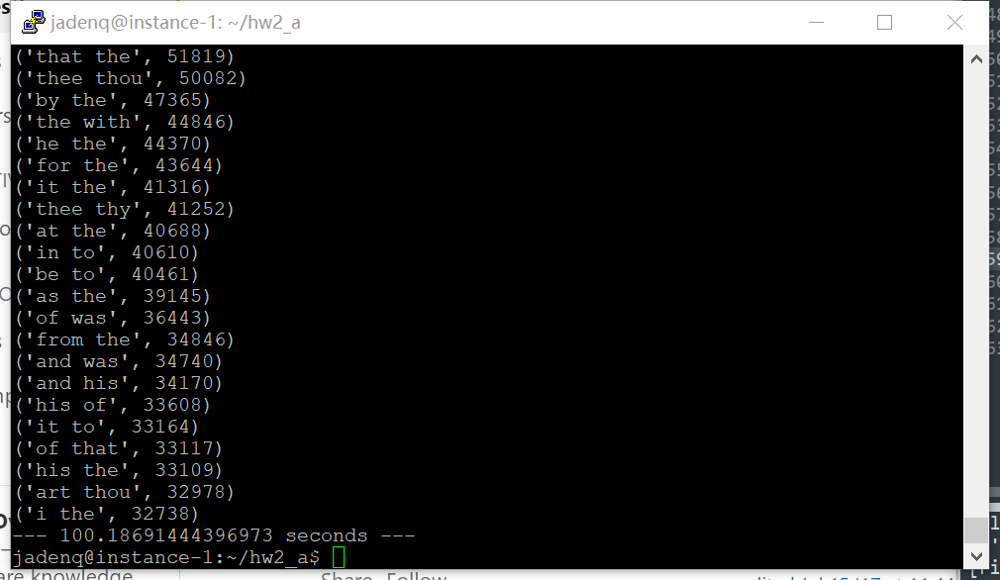

### Homework2 Report

[TOC]

#### Question1 (a)

The requirement and relation between buckets average count, total number of buckets and threshold is $$Average Count=\frac{d}{total\#buckets}≤0.4*s$$.

Since the total number of buckets is $$total\#buckets = 300million = 3*10^8$$.

Therefore, $$s≥0.834*10^{-9}*d$$.

#### Question1 (b)

According to a nice property of maximal frequent itemset, all subset of a maximal frequent itemset are frequent.

The maximum frequent itemsets are {A, B, D} and {C, E}, then all the other frequent itemsets are:

{A}, {B}, {D}, {A, B}, {A, D}, {B, D}, {C}, {E}

#### Question2 (a)

##### 1.Download and prepare dataset

```shell
wget https://drive.google.com/u/0/uc?id=1A5Qx1bRdOFMyFuh5Qe9HnZofabclvhCx&export=download
mv uc?id=1A5Qx1bRdOFMyFuh5Qe9HnZofabclvhCx shakespeare_basket.zip
unzip shakespeare_basket.zip
# 将两个文件合并
cat shakespeare_basket1 shakespeare_basket2 > shakespeare_basket
# 执行python script
python3 hw2_a.py shakespeare_basket/shakespeare_basket
```

##### 2.Python script: hw2_a.py

```python
import sys
import time
start_time = time.time()

fname = sys.argv[1] # input file
basket_num = 0 # num of baskets
word_count = {} # key: word (individual item), value: frequency
freq_item = {} # key:word (frequent individual item), value: frequency
threshold = 0.005 # support threshold
freq_pairs = {} # key: item pair, value: frequency
topK = 40

# Pass1
with open(fname) as f:
	for line in f.readlines():
		basket_num += 1 # count the number of baskets
		line = line.strip()
		words = line.split(' ')
		words = list(set(words)) # remove the duplicates in one basket
		for word in words:
			if word not in word_count:
				word_count[word] = 1
			else: word_count[word] += 1


# s = threshold * basket_num
s = threshold * basket_num
for word in word_count:
	if word_count[word] >= s:
		freq_item[word] = word_count[word]

# Pass2

# get the candidate pair
with open(fname) as f:
	for line in f.readlines():
		line = line.strip()
		words = line.split(' ')
		words = list(set(words)) # remove the duplicates in one basket
		for i in range(0, len(words) - 1):
			for j in range(i+1, len(words)):
				if (words[i] in freq_item) and (words[j] in freq_item): # both elements are frequent
					# there should be no order within item pair
					if (words[i] <= words[j]):
						pair = words[i] + " " + words[j]
					else: pair = words[j] + " " + words[i]
					if pair in freq_pairs:
						freq_pairs[pair] += 1
					else: freq_pairs[pair] = 1

# get the frequent pair
result = {}
for pair in freq_pairs:
	if freq_pairs[pair] > s:
		result[pair] = freq_pairs[pair]

# sort the frequent item pairs according to frequency
if len(freq_pairs) > topK:
	result = sorted(result.items(), key = lambda x:x[1], reverse = True)[:topK]
	# sort according to value
else:
	result = sorted(result.items(), key = lambda x:x[1], reverse = True)

for pair in result:
	print(pair)

print("--- %s seconds ---" % (time.time() - start_time))
```

##### Output

```
('of the', 352310)
('and the', 174876)
('in the', 146017)
('the to', 145171)
('and of', 106824)
('a of', 100121)
('a the', 84377)
('and to', 74266)
('in of', 73828)
('of to', 68015)
('a and', 66899)
('and in', 62592)
('the was', 62453)
('thou thy', 61455)
('a to', 57495)
('a in', 54897)
('is the', 54866)
('on the', 53910)
('that the', 51819)
('thee thou', 50082)
('by the', 47365)
('the with', 44846)
('he the', 44370)
('for the', 43644)
('it the', 41316)
('thee thy', 41252)
('at the', 40688)
('in to', 40610)
('be to', 40461)
('as the', 39145)
('of was', 36443)
('from the', 34846)
('and was', 34740)
('and his', 34170)
('his of', 33608)
('it to', 33164)
('of that', 33117)
('his the', 33109)
('art thou', 32978)
('i the', 32738)
```



It takes a single node Google Cloud instance 100 seconds to finish this task.

#### Question2 (b)

##### Data Preparation

```shell
 hdfs dfs -mkdir hw2
 hdfs dfs -copyFromLocal hw2/shakespeare_basket/shakespeare_basket ./hw2
```

##### MapReduce Job1

###### Mapper_b1.py

- Run A-Priori algorithm on the chunk using support  threshold, use the same threshold $s$ and the corresponding basket number for each node.
- Output the frequent pairs for that chunk  (F, c), where F is the key  (itemset) and c is count  (or proportion)

```python
#!/usr/bin/env python
import sys
import gc
# Mapper for Job1
# Run A-Priori Algorithm in each chunk
basket_num = 0 # num of baskets
word_count = {} # key: word (individual item), value: frequency
freq_item = {} # key:word (frequent individual item), value: frequency
threshold = 0.005 # support threshold
freq_pairs = {} # key: item pair, value: frequency
baskets = [] # the list to store baskets for counting pass
# income from standard input
for line in sys.stdin:
	line = line.strip()
	words = line.split(' ')
	words = list(set(words))
	baskets.append(words)
	for word in words:
		if word not in word_count:
			word_count[word] = 1
		else: word_count[word] += 1

# find frequent itemset in subsets

basket_num = len(baskets)

# s = threshold * basket_num * p 
s = threshold * basket_num

for word in word_count:
	if word_count[word] >= s:
		freq_item[word] = word_count[word]

# garbage collect
del word_count
gc.collect()

for basket in baskets:
	for i in range(0, len(basket) - 1):
		for j in range(i+1, len(basket)):
			if (basket[i] in freq_item) and (basket[j] in freq_item): # both elements are frequent
				# there should be no order within item pair
				if (basket[i] <= basket[j]):
					pair = basket[i] + " " + basket[j]
				else: pair = basket[j] + " " + basket[i]
				if pair in freq_pairs:
					freq_pairs[pair] += 1
				else: freq_pairs[pair] = 1

# save intermediate result
# only pairs more frequent than s can be saved
for pair in freq_pairs:
	if (freq_pairs[pair] >= s):
		print("%s\t%s" % (pair, freq_pairs[pair]))

# a b	count 
```

###### Reducer_b1.py

- Output the candidate pairs to be verified in the Job 2, aggregate the candidate pairs of each chunk
- Given (F,c), discard c and output all candidate pairs F’s

```python
#!/usr/bin/env python
import sys
# aggregate the result of candidate pairs from multiple chunks
current_pair = None
for line in sys.stdin:
	line = line.strip()
	pair, count = line.split('\t')
	if pair == current_pair:
		continue
	else:
		if current_pair:
			print(current_pair)
		current_pair = pair
	# discard c and output all candidate itemsets F's
if current_pair == pair:
	print(current_pair)
```

##### MapReduce Job2

Firstly, we get the total number of basket using the following script to simplify the reduce2 procedures.

```python
import sys
basket_num = 0
fname = './shakespeare_basket/shakespeare_basket'
with open(fname) as f:
        for a in f.readlines():
                basket_num += 1
print('basket_num is:',basket_num)

[Output] basket_num is: 4340061
```

###### Mapper_b2.py

- For all the candidate pairs produced by Job 1, count the frequency in local chunk

```python
#!/usr/bin/env python
import sys

# Mapper for Job2
# for all the candidate itemsets produced by Job1, count the frequency in local chunk

# stdin: the output result of last MR work
fname = 'candPair_b.txt'
freq_pairs = {} # key: item pair, value: frequency
with open(fname) as f:
	for line in f.readlines():
		pair = line.strip()
		freq_pairs[pair] = 0 # reset to 0
        
for line in sys.stdin:
	line = line.strip()
	words = line.split(' ')
	words = list(set(words)) # remove the duplicates in one basket
	for i in range(0, len(words) - 1):
		for j in range(i+1, len(words)):
				# there should be no order within item pair
				if (words[i] <= words[j]):
					pair = words[i] + " " + words[j]
				else: pair = words[j] + " " + words[i]
				# only count the frequent pairs
				if pair in freq_pairs:
					freq_pairs[pair] += 1


for pair in freq_pairs:
	print("%s\t%s" % (pair, freq_pairs[pair]))
```

###### Reducer_b2.py

- Aggregate the o/p of the Mapper of Job 2 and sum the count to get the frequency of each candidate pairs across the entire input file.
- Filter out the pairs with support smaller than $$s$$

```python
#!/usr/bin/env python

import sys

# Aggregate the output of the Job2 mapper
current_pair = None # a itemset checker used to aggregate the same candidate itemset from different chuncks
overall_count = 0 # the frequency of each candidate itemsets across the overall input file
threshold = 0.005 # support threshold
basket_num = 0 # num of baskets

# Since we aggregate the counts of frequent pairs across all chunks(the same pairs goes to the same reducer, we can just use total number of baskets to evaluate)
basket_num = 4340061

s = threshold * basket_num
# get the pair - count
for line in sys.stdin:
	line = line.strip()
	pair, count = line.split('\t')
	count = int(count)
	if pair == current_pair:
		 overall_count += count # the same itemset, agg_sum
	else:
		if current_pair:
			if overall_count >= s: # if the iteration is not over AND s is more than the threshold			 
				print("%s\t%s" % (current_pair, overall_count))
		overall_count = count
		current_pair = pair # update the itemset checker
```

##### Debug

```shell
cat ./shakespeare_basket/shakespeare_basket | python3 ./mapper_b1.py
cat ./shakespeare_basket/shakespeare_basket | python3 ./mapper_b1.py | sort -k1 | python3 ./reducer_b1.py
cat ./shakespeare_basket/shakespeare_basket | python3 ./mapper_b1.py | sort -k1 | python3 ./reducer_b1.py | python3 ./mapper_b2.py 
cat ./shakespeare_basket/shakespeare_basket | python3 ./mapper_b1.py | sort -k1 | python3 ./reducer_b1.py | python3 ./mapper_b2.py | python3 ./reducer_b2.py
```

##### Shell script for execution

```shell
chmod +x mapper_b1.py
chmod +x reducer_b1.py
chmod +x mapper_b2.py
chmod +x reducer_b2.py

# hdfs dfs -rm -r ./hw2/output_b1
hadoop jar /usr/lib/hadoop-mapreduce/hadoop-streaming.jar \
-D mapred.output.key.comparator.class=org.apache.hadoop.mapred.lib.KeyFieldBasedComparator \
-D mapred.job.name='Job_b1' \
-D mapred.map.tasks=3 \
-D mapred.reduce.tasks=1 \
-file mapper_b1.py -mapper mapper_b1.py \
-file reducer_b1.py -reducer reducer_b1.py \
-input ./hw2/shakespeare_basket \
-output ./hw2/output_b1

# candidate pair - intermediate result
hdfs dfs -getmerge ./hw2/output_b1 ~/hw2/candPair_b.txt

hadoop jar /usr/lib/hadoop-mapreduce/hadoop-streaming.jar \
-D mapred.output.key.comparator.class=org.apache.hadoop.mapred.lib.KeyFieldBasedComparator \
-D mapred.job.name='Job_b2' \
-D mapred.map.tasks=3 \
-D mapred.reduce.tasks=1 \
-file ./candPair_b.txt \
-file mapper_b2.py -mapper mapper_b2.py \
-file reducer_b2.py -reducer reducer_b2.py \
-input ./hw2/shakespeare_basket \
-output ./hw2/output_b2

hdfs dfs -cat ./hw2/output_b2/* > output_b.txt

hdfs dfs -rm -r ./hw2/output_b1
hdfs dfs -rm -r ./hw2/output_b2
```

###### Result


###### Time compare

Single node A-prior algorithm time (task A) is 100s 

MapReduce1 time:  55s for A-prior Algorithm

MapRecude2 time: 60s

Overall time for task B is 115s.


#### Question2 (c)

##### Relationship with Task B

According to the requirement, we need a result of triplets with lower threshold than the Task B, which means if we still use the **definition of frequent pairs** result from above, that may leads to **some results missing** for Task C. So I implement the code (*mapper_b1.py, reducer_b1.py, mapper_b2.py, reducer_b2.py*) from Question2 (b) and **ONLY** change the threshold from 0.005 to 0.0025 (the scripts are modified into *mapper_c1.py, reducer_c1.py, mapper_c2.py, reducer_c2.py*) to get the intermediate result (with more frequent pairs) for Task C and save in folder *output_c2.*

##### MapReduce1 & MapReduce2

As mentioned above, I implemented the Task B code with lower threshold to help **find all the frequent pairs** with 0.0025 threshold, so to find the complete frequent triplets with 0.0025 threshold.

###### Mapreduce1

```python
#!/usr/bin/env python

import sys
import gc

# Mapper for Job1
# Run A-Priori Algorithm in each chunk
basket_num = 0 # num of baskets
word_count = {} # key: word (individual item), value: frequency
freq_item = {} # key:word (frequent individual item), value: frequency
threshold = 0.0025 # support threshold
freq_pairs = {} # key: item pair, value: frequency

baskets = [] # the list to store baskets for counting pass

# income from standard input
for line in sys.stdin:
	line = line.strip()
	words = line.split(' ')
	words = list(set(words))
	baskets.append(words)
	for word in words:
		if word not in word_count:
			word_count[word] = 1
		else: word_count[word] += 1

# find frequent itemset in subsets

basket_num = len(baskets)

s = threshold * basket_num

for word in word_count:
	if word_count[word] >= s:
		freq_item[word] = word_count[word]

# garbage collect
del word_count
gc.collect()

for basket in baskets:
	for i in range(0, len(basket) - 1):
		for j in range(i+1, len(basket)):
			if (basket[i] in freq_item) and (basket[j] in freq_item): # both elements are frequent
				# there should be no order within item pair
				if (basket[i] <= basket[j]):
					pair = basket[i] + " " + basket[j]
				else: pair = basket[j] + " " + basket[i]
				if pair in freq_pairs:
					freq_pairs[pair] += 1
				else: freq_pairs[pair] = 1

# save intermediate result
# only pairs more frequent than s can be saved
for pair in freq_pairs:
	if (freq_pairs[pair] >= s):
		print("%s\t%s" % (pair, freq_pairs[pair]))

# a b	count 
```

```python
#!/usr/bin/env python
import sys
current_pair = None
for line in sys.stdin:
	line = line.strip()
	pair, count = line.split('\t')
	if pair == current_pair:
		continue
	else:
		if current_pair:
			print(current_pair)
		current_pair = pair
	# discard c and output all candidate itemsets F's
if current_pair == pair:
	print(current_pair)
```

###### Mapreduce2

```python
#!/usr/bin/env python
import sys

# Mapper for Job2
# for all the candidate itemsets produced by Job1, count the frequency in local chunk

# stdin: the output result of last MR work
fname = 'candPair_c.txt'
freq_pairs = {} # key: item pair, value: frequency

with open(fname) as f:
	for line in f.readlines():
		pair = line.strip()
		freq_pairs[pair] = 0 # reset to 0


for line in sys.stdin:
	line = line.strip()
	words = line.split(' ')
	words = list(set(words)) # remove the duplicates in one basket
	for i in range(0, len(words) - 1):
		for j in range(i+1, len(words)):
				# there should be no order within item pair
				if (words[i] <= words[j]):
					pair = words[i] + " " + words[j]
				else: pair = words[j] + " " + words[i]
				# only count the frequent pairs
				if pair in freq_pairs:
					freq_pairs[pair] += 1


for pair in freq_pairs:
	print("%s\t%s" % (pair, freq_pairs[pair]))
```

```python
#!/usr/bin/env python

import sys

# Aggregate the output of the Job2 mapper
current_pair = None # a itemset checker used to aggregate the same candidate itemset from different chuncks
overall_count = 0 # the frequency of each candidate itemsets across the overall input file
threshold = 0.0025 # support threshold
basket_num = 4340061 # num of total baskets

s = threshold * basket_num
# get the pair - count
for line in sys.stdin:
	line = line.strip()
	pair, count = line.split('\t')
	count = int(count)
	if pair == current_pair:
		 overall_count += count # the same itemset, agg_sum
	else:
		if current_pair:
			if overall_count >= s: # if the iteration is not over AND s is more than the threshold			 
				print("%s\t%s" % (current_pair, overall_count))
		overall_count = count
		current_pair = pair # update the itemset checker
```

##### MapReduce3

###### mapper_c3.py

- Run A-Priori algorithm on the chunk using support  threshold.
- Output the frequent triplets for that chunk  (F, c), where F is the key  (itemset) and c is count  (or proportion)

- I use function *orderTriplets* to uniform the triplets and *orderPairs* to uniform the pairs.

```python
#!/usr/bin/env python
import sys

# Mapper for Job2
# for all the candidate itemsets produced by Job1, count the frequency in local chunk

# stdin: the output result of last MR work
fname = 'freqPair_c.txt'
freq_pairs = []
freq_triplets = {} # key: item triplet, value: frequency
threshold = 0.0025 # support threshold
basket_num = 0

# uniform the triplets
def orderTriplet(a, b, c):
	ordered_list = [a, b, c]
	ordered_list.sort()
	return ' '.join(ordered_list)

# uniform the pairs
# align with the process of Task B
def orderPair(a,b):
	if (a <= b):
		pair = a + " " + b
	else: pair = b + " " + a
	return pair

with open(fname) as f:
	for line in f.readlines():
		pair, count = line.strip().split('\t')
		freq_pairs.append(pair)


for line in sys.stdin:
	line = line.strip()
	words = line.split(' ')
	words = list(set(words)) # remove the duplicates in one basket
	basket_num += 1 # count the basket number for each chunk
	for i in range(0, len(words) - 2):
		for j in range(i+1, len(words) - 1):
			for k in range(j+1, len(words)):
				# find the frequent pairs
				pair1 = orderPair(words[i], words[j])
				pair2 = orderPair(words[j], words[k])
				pair3 = orderPair(words[i], words[k])
				# 1. pairs of frequent triplets should all be frequent
				# 2. there should be no order within item triplet
				if (pair1 in freq_pairs) and (pair2 in freq_pairs) and (pair3 in freq_pairs):
					triplet = orderTriplet(words[i], words[j], words[k])
					if triplet in freq_triplets:
						freq_triplets[triplet] += 1
					else: freq_triplets[triplet] = 1

# save intermediate result
s = threshold * basket_num
# only triplets more frequent than s can be saved
for triplet in freq_triplets:
	if (freq_triplets[triplet] >= s):
		print("%s\t%s" % (triplet, freq_triplets[triplet]))
```

###### reducer_c3.py

- Output the candidate triplets to be verified in the Job 4
- Given (F,c), discard c and output all candidate triplets F’s

```python
#!/usr/bin/env python
import sys

current_triplet = None
for line in sys.stdin:
	line = line.strip()
	triplet, count = line.split('\t')
	if triplet == current_triplet:
		continue
	else:
		if current_triplet:
			print(current_triplet)
		current_triplet = triplet
	# discard c and output all candidate itemsets F's
if current_triplet == triplet:
	print(current_triplet)
```

##### MapReduce4

###### mapper_c4.py

- For all the candidate triplets produced by Job 3, count the frequency in local chunk

```python
#!/usr/bin/env python
import sys

# Mapper for Job2
# for all the candidate itemsets produced by Job1, count the frequency in local chunk

# stdin: the output result of last MR work
fname = 'candTriplet_c.txt'
freq_triplets = {} # key: item triplet, value: frequency


# uniform the triplets
def orderTriplet(a, b, c):
	ordered_list = [a, b, c]
	ordered_list.sort()
	return ' '.join(ordered_list)

with open(fname) as f:
	for line in f.readlines():
		triplet = line.strip()
		freq_triplets[triplet] = 0 # reset to 0

for line in sys.stdin:
	line = line.strip()
	words = line.split(' ')
	words = list(set(words)) # remove the duplicates in one basket
	for i in range(0, len(words) - 2):
		for j in range(i+1, len(words) - 1):
			for k in range(j+1, len(words)):
				# there should be no order within item triplet
				triplet = orderTriplet(words[i], words[j], words[k])
				# only count the frequent triplets
				if triplet in freq_triplets:
					freq_triplets[triplet] += 1


for triplet in freq_triplets:
	print("%s\t%s" % (triplet, freq_triplets[triplet]))
```

###### reducer_c4.py

- Aggregate the o/p of the Mapper of Job 3 and sum the count to get the frequency of each candidate triplets across the entire input file.
- Filter out the triplets with support smaller than $$s$$

```python
#!/usr/bin/env python

import sys

# Aggregate the output of the Job2 mapper
current_triplet = None # a itemset checker used to aggregate the same candidate itemset from different chuncks
overall_count = 0 # the frequency of each candidate itemsets across the overall input file
threshold = 0.0025 # support threshold
basket_num = 4340061 # aggregate all the node

s = threshold * basket_num
# get the triplet - count
for line in sys.stdin:
	line = line.strip()
	triplet, count = line.split('\t')
	count = int(count)
	if triplet == current_triplet:
		 overall_count += count # the same itemset, agg_sum
	else:
		if current_triplet:
			if overall_count >= s: # if the iteration is not over AND s is more than the threshold			 
				print("%s\t%s" % (current_triplet, overall_count))
		overall_count = count
		current_triplet = triplet # update the itemset checker
```

##### Shell script for execution

```shell
chmod +x mapper_c1.py
chmod +x reducer_c1.py
chmod +x mapper_c2.py
chmod +x reducer_c2.py
chmod +x mapper_c3.py
chmod +x reducer_c3.py
chmod +x mapper_c4.py
chmod +x reducer_c4.py

# mapreduce1
hadoop jar /usr/lib/hadoop-mapreduce/hadoop-streaming.jar \
-D mapred.output.key.comparator.class=org.apache.hadoop.mapred.lib.KeyFieldBasedComparator \
-D mapred.job.name='Job_c1' \
-D mapred.map.tasks=3 \
-D mapred.reduce.tasks=1 \
-file mapper_c1.py -mapper mapper_c1.py \
-file reducer_c1.py -reducer reducer_c1.py \
-input ./hw2/shakespeare_basket \
-output ./hw2/output_c1

hdfs dfs -getmerge ./hw2/output_c1 ~/hw2/candPair_c.txt
# mapreduce2 - result is the frequent pairs (0.0025 threshold), more than that from Task B
hadoop jar /usr/lib/hadoop-mapreduce/hadoop-streaming.jar \
-D mapred.output.key.comparator.class=org.apache.hadoop.mapred.lib.KeyFieldBasedComparator \
-D mapred.job.name='Job_c2' \
-D mapred.map.tasks=3 \
-D mapred.reduce.tasks=1 \
-file ./candPair_c.txt \
-file mapper_c2.py -mapper mapper_c2.py \
-file reducer_c2.py -reducer reducer_c2.py \
-input ./hw2/shakespeare_basket \
-output ./hw2/output_c2

hdfs dfs -getmerge ./hw2/output_c2 ~/hw2/freqPair_c.txt

# mapreduce3
hadoop jar /usr/lib/hadoop-mapreduce/hadoop-streaming.jar \
-D mapred.output.key.comparator.class=org.apache.hadoop.mapred.lib.KeyFieldBasedComparator \
-D mapred.job.name='Job_c3' \
-D mapred.map.tasks=40 \
-D mapred.reduce.tasks=10 \
-file ./freqPair_c.txt \
-file mapper_c3.py -mapper mapper_c3.py \
-file reducer_c3.py -reducer reducer_c3.py \
-input ./hw2/shakespeare_basket \
-output ./hw2/output_c3

hdfs dfs -getmerge ./hw2/output_c3 ~/hw2/candTriplet_c.txt

# mapreduce4 - result is the frequent triplets with 0.0025 threshold
hadoop jar /usr/lib/hadoop-mapreduce/hadoop-streaming.jar \
-D mapred.output.key.comparator.class=org.apache.hadoop.mapred.lib.KeyFieldBasedComparator \
-D mapred.job.name='Job_c4' \
-D mapred.map.tasks=50 \
-D mapred.reduce.tasks=10 \
-file ./candTriplet_c.txt \
-file mapper_c4.py -mapper mapper_c4.py \
-file reducer_c4.py -reducer reducer_c4.py \
-input ./hw2/shakespeare_basket \
-output ./hw2/output_c4

hdfs dfs -cat ./hw2/output_c4/* > output_c.txt

hdfs dfs -rm -r ./hw2/output_c1
hdfs dfs -rm -r ./hw2/output_c2
hdfs dfs -rm -r ./hw2/output_c3
hdfs dfs -rm -r ./hw2/output_c4
```

###### Output


#### Question2 (d)

##### MapReduce1

I build a hash table to encode the pairs and allocate them into 100000 buckets in the first pass of A-prior algorithm, then eliminate the pairs from infrequent buckets to get less candidate pairs in the second pass.

###### mapper_d1.py

```python
#!/usr/bin/env python

import sys
import gc

# Mapper for Job1
# Run A-Priori Algorithm in each chunk
basket_num = 0 # num of baskets
word_count = {} # key: word (individual item), value: frequency
freq_item = {} # key:word (frequent individual item), value: frequency
threshold = 0.005 # support threshold
freq_pairs = {} # key: item pair, value: frequency

baskets = [] # the list to store baskets for counting pass

def orderPair(a,b):
	if (a <= b):
		pair = a + " " + b
	else: pair = b + " " + a
	return pair

# income from standard input
hashTable = [0 for i in range(100000)]

for line in sys.stdin:
	line = line.strip()
	words = line.split(' ')
	words = list(set(words))
	baskets.append(words)
	for word in words:
		if word not in word_count:
			word_count[word] = 1
		else: word_count[word] += 1
	for i in range(0, len(words) - 1):
		for j in range(i+1, len(words)):
		# define a hashtable
		# hash all the pairs into 100000 bucktes
			hashIndex = hash(orderPair(words[i], words[j])) % 100000 # index of the hash table
			hashTable[hashIndex] += 1 # count into the hash table

# find frequent itemset in subsets
basket_num = len(baskets)

s = threshold * basket_num

for word in word_count:
	if word_count[word] >= s:
		freq_item[word] = word_count[word]

# garbage collect
del word_count
gc.collect()

for basket in baskets:
	for i in range(0, len(basket) - 1):
		for j in range(i+1, len(basket)):
			if (basket[i] in freq_item) and (basket[j] in freq_item): # both elements are frequent
				# there should be no order within item pair
				pair = orderPair(basket[i], basket[j])
				# verify freq pairs using hashtable
				hashIndex = hash(pair) % 100000
				if hashTable[hashIndex] >= s:
					if pair in freq_pairs:
						freq_pairs[pair] += 1
					else: freq_pairs[pair] = 1

# save intermediate result
# only pairs more frequent than s can be saved
for pair in freq_pairs:
	if (freq_pairs[pair] >= s):
		print("%s\t%s" % (pair, freq_pairs[pair]))

# a b	count 
```

###### reducer_d1.py

```python
#!/usr/bin/env python
import sys

current_pair = None
for line in sys.stdin:
	line = line.strip()
	pair, count = line.split('\t')
	if pair == current_pair:
		continue
	else:
		if current_pair:
			print(current_pair)
		current_pair = pair
	# discard c and output all candidate itemsets F's
if current_pair == pair:
	print(current_pair)
```

##### MapReduce2

###### mapper_d2.py

```python
#!/usr/bin/env python
import sys

# Mapper for Job2
# for all the candidate itemsets produced by Job1, count the frequency in local chunk

# stdin: the output result of last MR work
fname = 'candPair_d.txt'
freq_pairs = {} # key: item pair, value: frequency


with open(fname) as f:
	for line in f.readlines():
		pair = line.strip()
		freq_pairs[pair] = 0 # reset to 0


for line in sys.stdin:
	line = line.strip()
	words = line.split(' ')
	words = list(set(words)) # remove the duplicates in one basket
	for i in range(0, len(words) - 1):
		for j in range(i+1, len(words)):
				# there should be no order within item pair
				if (words[i] <= words[j]):
					pair = words[i] + " " + words[j]
				else: pair = words[j] + " " + words[i]
				# only count the frequent pairs
				if pair in freq_pairs:
					freq_pairs[pair] += 1


for pair in freq_pairs:
	print("%s\t%s" % (pair, freq_pairs[pair]))
```

###### reducer_d2.py

```python
#!/usr/bin/env python

import sys

# Aggregate the output of the Job2 mapper
current_pair = None # a itemset checker used to aggregate the same candidate itemset from different chuncks
overall_count = 0 # the frequency of each candidate itemsets across the overall input file
threshold = 0.005 # support threshold
basket_num = 0 # num of baskets

basket_num = 4340061

s = threshold * basket_num
# get the pair - count
for line in sys.stdin:
	line = line.strip()
	pair, count = line.split('\t')
	count = int(count)
	if pair == current_pair:
		 overall_count += count # the same itemset, agg_sum
	else:
		if current_pair:
			if overall_count >= s: # if the iteration is not over AND s is more than the threshold			 
				print("%s\t%s" % (current_pair, overall_count))
		overall_count = count
		current_pair = pair # update the itemset checker
```

##### Shell script for execution

```shell
chmod +x mapper_d1.py
chmod +x reducer_d1.py
chmod +x mapper_d2.py
chmod +x reducer_d2.py

hadoop jar /usr/lib/hadoop-mapreduce/hadoop-streaming.jar \
-D mapred.output.key.comparator.class=org.apache.hadoop.mapred.lib.KeyFieldBasedComparator \
-D mapred.job.name='Job_d1' \
-D mapred.map.tasks=3 \
-D mapred.reduce.tasks=1 \
-file mapper_d1.py -mapper mapper_d1.py \
-file reducer_d1.py -reducer reducer_d1.py \
-input ./hw2/shakespeare_basket \
-output ./hw2/output_d1

# candidate pair - intermediate result
hdfs dfs -getmerge ./hw2/output_d1 ~/hw2/candPair_d.txt

hadoop jar /usr/lib/hadoop-mapreduce/hadoop-streaming.jar \
-D mapred.output.key.comparator.class=org.apache.hadoop.mapred.lib.KeyFieldBasedComparator \
-D mapred.job.name='Job_d2' \
-D mapred.map.tasks=3 \
-D mapred.reduce.tasks=1 \
-file ./candPair_d.txt \
-file mapper_d2.py -mapper mapper_d2.py \
-file reducer_d2.py -reducer reducer_d2.py \
-input ./hw2/shakespeare_basket \
-output ./hw2/output_d2

hdfs dfs -cat ./hw2/output_d2/* > output_d.txt

hdfs dfs -rm -r ./hw2/output_d1
hdfs dfs -rm -r ./hw2/output_d2
```

##### Top20 Result (python script)

```python
# get the top20 result
import sys

fname = sys.argv[1] # input file
freq_pairs = {}
topK = 20

with open(fname) as f:
	for line in f.readlines():
		pair, count = line.strip().split('\t')
		freq_pairs[pair] = int(count)

if len(freq_pairs) > topK:
	result = sorted(freq_pairs.items(), key = lambda x:x[1], reverse = True)[:topK]
	# sort according to value
else:
	result = sorted(freq_pairs.items(), key = lambda x:x[1], reverse = True)

for pair in result:
	print(pair)
```

##### Output

Correction check: the total result of task B and task D is the same, which are 86 lines. (output_b.txt and output_d.txt in supplementary files)

###### Output_d20.txt


#### Conclusion

##### Comparations

###### Comparing (a) and (b)

- Time

100s v.s. 55s for A-Prior process

Due to the use of multiple mapper and reducers, the distributed computing saves time. 

###### Comparing (b) and (d)

- Time

For task d, the MapReduce1 time is 129s, and the MapReduce2 time is 59s.


For task b, the MapReduce1 time:  55s, MapRecude2 time: 60s.

The PYC algorithm takes longer time to hash the pairs in MapReduce1.

- Memory

The size of intermediate result is different, since the PYC use less memory to maintain a dictionary instead of pairs and corresponding values compared with SON algorithm.

##### Summary

SON algorithm is a distributed version of A-prior using the basic concept, the frequent itemset should be frequent in at least on subset, so we can find the candidates in different chunks to save time in computing in distributions.

PYC algorithm is a trade of between time and memory, the PYC use more time to hash but only need to maintain a smaller dictionary, we can use them in practice accordingly.

##### Supplementary files

Text version of outputs are stored in: https://pan.baidu.com/s/1n2JPlSI_zxQcb6HoLhbKvg , code is 8una.

#### Reference

1. Sort dictionary according to value: https://careerkarma.com/blog/python-sort-a-dictionary-by-value/

2. SON algorithm: https://www.geeksforgeeks.org/the-son-algorithm-and-map-reduce/

   