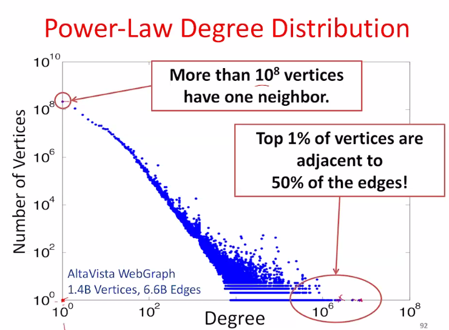
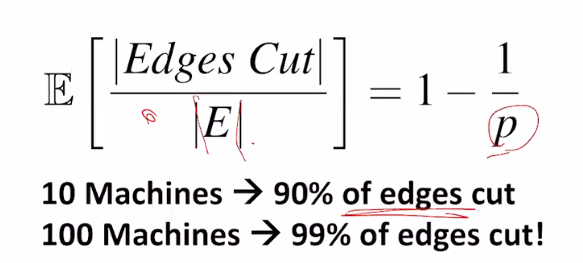

# PowerGraph (Graph Ver.2)

### Problem

The exsiting distributed graph tool perform poorly on natural graph.

#### Natural Graph

##### What's natural graph

The graph data derive from real-world.

##### Properties of natural graph

###### Degree

I/O of each vertice, number of neighbors.

###### Power-Law degree distribution

Most of vertices in the graph has few neighbors, log distribution.

If we see it as a straight line, C = log x + log y. Power-law should be  $y = Bx^{-\alpha}$, which is slower than $y=Ae^{-x}$ exponential law.

#### Challenges of High-Degree Vertices

The high degree vertices should be assigned to **one server (single machine)** and all the communications related to that vertice, because it may represent a very popular person. This architecture can be very hard to do load balance.

1. Sequentially process edges

2. Sends many messages (Pregel)

3. Touches a large fraction of graph (GraphLab)

4. Edge meta-data too large for a single machine

5. Asynchronous Execution requires heavy locaking (GraphLab)

   Race condition.

6. Synchronous Execution prone to stragglers (Pregel)

   Take more time for nodes with heavy duty.

#### Communication Overhead for High-Degree Vertices

##### Pregel

###### Message Combiners on Fan-In

*Communicative and associative* User define communicative association, merge locally on one machine before send to other machine.

*Unsolved* Broadcast sends many copies of the **same messages** to the same machine. This broadcast is limited to the same message, struglling with *Fan-Out*. Large degree of fan-out is still not managable.

##### GraphLab

###### GraphLab Ghosting

Opposite to Pregel, GraphLab creates a ghost (a mirror) one machine 1 can emulate the calculation and combine before sending out. However, high *Fan-In* in machine 1 is very costly for memory.

#### Graph Partitioning

Graph parallel abstractions, to minimize communication and balance computation and storage.

*Unsolved* Power-Law graph are difficult to partition, power-law graphs do not have low-cost balanced cuts [Leskovec et al. 08, Lang 04].

##### Random Partition

Random hashed partitioning on natural graphs. It is proved that 100 machine using random partitioning, 99% edges will be cut and separated into different machines, lead to low efficient computing.

### PowerGraph

#### Vertex Partitioning

Split high-degree vertices, better than cutting the edges.

Using new abstraction -> equivalence on split vertices, is assign edges to different machine.

Problem: redundant node.

##### Minimizing Communication in PowerGraph

- Communication is linear in the number of machines each vertex spans
- A vertex-cut minimizes machines each vertex spans. 
- Natural graph has good vertex cut - Proved.

##### New approach to partition

For any edge-cut, we can directly construct a vertex-cut which requires strictly less communication and storage.

:rocket: LET'S GO FOR VERTEX-CUT

#### GAS Decomposition

##### Update function, STEPS overview

- *Gather (Reduce)*:  Accumulate inforamtion about neighborhood (How to gather information)
  - User defined
- *Apply*: Apply the accumulated value to center vertex (How to update vertex)
- *Scatter*: Update adjacent edges and vertices (How to scatter)
  - Distribute the information to neighbor, modify edge data.

##### Distributed execution of a PowerGraph Vertex-Program

###### Constructing Vertex-cuts

- Evenly assign edges to machines
- Assign each edge as it is loaded
  - Touch each edge only once
- Propose three distributed approaches
  - Random
  - Coordinated Greedy
  - Oblivious Greedy

###### Random

Assign edge randomly. No optimization. Sometimes putting some vertices on the same machine is better, need optimization.

###### Greedy

Place the edge on machines which already have the vertices in that edge.