## Homework 3 Report

[TOC]

### Question 1

#### a) Setup for standalone Spark Cluster

###### 1. Download Spark

```shell 
wget -c -N https://dlcdn.apache.org/spark/spark-3.2.1/spark-3.2.1-bin-hadoop3.2.tgz -O ./spark/spark.tgz
tar xzvf spark.tgz
sudo mv spark/ /usr/lib/
```

###### 2. Add path on .bashrc

```shell
sudo vim ~/.bashrc
```

```shell
export SPARK_HOME=/usr/lib/spark/spark-3.2.1-bin-hadoop3.2
export PATH=$PATH:$SPARK_HOME/bin
export LD_LIBRARY_PATH=$HADOOP_HOME/lib/native:$LD_LIBRARY_PATH
```

```shell
source ~/.bashrc
```

###### 3. Run Spark in standalone mode

```shell
spark-shell
```

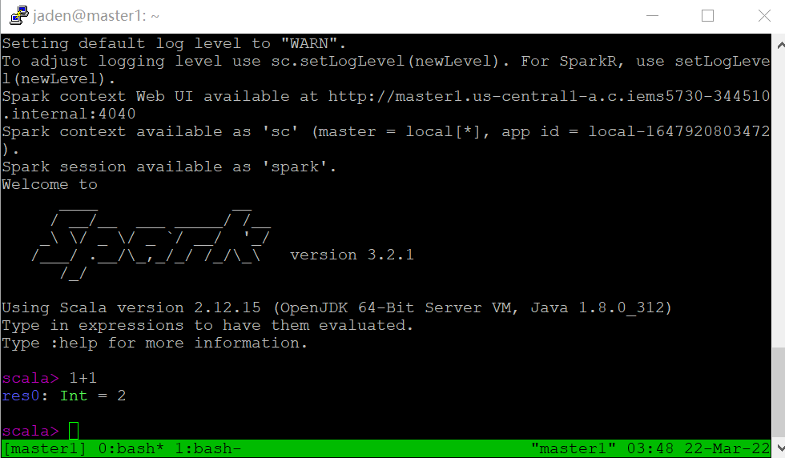

#### b) Bonus: Setup for multi-node Spark Cluster - Method 1: Build Spark on Yarn from Scratch

I use VM from google cloud platform, and pre install Hadoop Yarn to perform this task. The cluster I create consists of 3 VMs, which are one master and 2 slaves.

##### 1. Setup Hadoop 3.3 multi-node 

###### 1. Download Hadoop and setup JAVA environment

```shell
wget https://archive.apache.org/dist/hadoop/common/hadoop-3.3.0/hadoop-3.3.0.tar.gz
tar xvzf hadoop-3.3.0.tar.gz /usr/local

vim hadoop-2.9.2/etc/hadoop/hadoop-env.sh
# set to the root of your Java installation
whereis java
export JAVA_HOME=/usr/lib/jvm/java-1.8.0-openjdk-amd64
```

Environment setup.

```shell
sudo apt-get install openjdk-8-jdk # download jdk8 which support hadoop2.9.x
java -version

# Edit the system Path file
export JAVA_HOME=/usr/lib/jvm/java-1.8.0-openjdk-amd64
echo $JAVA_HOME
export PATH=$PATH:$JAVA_HOME/bin
echo PATH
sudo vim /etc/environment
```

###### 2. Connect the servers

```shell
vi /etc/hosts
```

```sehll
10.128.0.5 master1.us-central1-a.c.iems5730-344510.internal master1
10.128.0.3 slave1.us-central1-a.c.iems5730-344510.internal slave1
10.128.0.4 slave2.us-central1-a.c.iems5730-344510.internal slave2
```

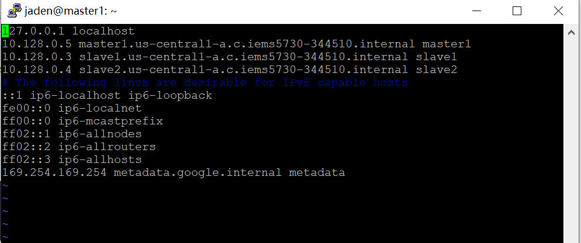

Give Hadoop the permission to change file using SSH, do this in all the nodes.

```shell
#If you don't already have openssh-server installed:
sudo apt-get upgrade
sudo apt-get update
sudo apt-get install openssh-server
sudo service ssh start
#Then take the following steps to enable sshing to localhost:

cd ~/.ssh
ssh-keygen #to generate a public/private rsa key pair; use the default options
cat id_rsa.pub >> authorized_keys # to append the key to the authorized_keys file
chmod 640 authorized_keys # to set restricted permissions
sudo service ssh restart # to pickup recent changes
ssh localhost

# do the above steps to all machines

# send keys to other machine
sudo scp .ssh/authorized_keys jaden@slave1:~/.ssh/authorized_keys
sudo scp .ssh/authorized_keys jaden@slave2:~/.ssh/authorized_keys
ssh jaden@slave1 # if can SSH without password, success
```

###### 3. Configure Hadoop cluster

```shell
mkdir -p ./hadoop/hadoop_store/tmp
mkdir -p ./hadoop/hadoop_store/hdfs/namenode
mkdir -p ./hadoop/hadoop_store/hdfs/datanode
mkdir -p ./hadoop/hadoop_store/hdfs/secondarydatanode
chown -R jaden:jaden ./hadoop/hadoop_store
```

a) Set up hdfs-site.xml

```shell
vim ./hadoop/hadoop-3.3.0/etc/hadoop/hdfs-site.xml
```

```xml
<configuration>
    <property>
    <name>dfs.replication</name>
    <value>3</value>
    <description>Default block replication.
    The actual number of replications can be specified when the file is created.
    The default is used if replication is not specified in create time.
    </description>
    </property>
    <property>
    <name>dfs.namenode.name.dir</name>
    <value>file:/home/jaden/hadoop/hadoop_store/hdfs/namenode</value>
    </property>
    <property>
    <name>dfs.datanode.data.dir</name>
    <value>file:/home/jaden/hadoop/hadoop_store/hdfs/datanode</value>
    </property>
    <property>
    <name>dfs.namenode.checkpoint.dir</name>
    <value>file:/home/jaden/hadoop/hadoop_store/hdfs/secondarynamenode</value>
    </property>
    <property>
    <name>dfs.namenode.checkpoint.period</name>
    <value>3600</value>
    </property>
</configuration>
```

b) Set up core-site.xml

```shell
vim ./hadoop/hadoop-3.3.0/etc/hadoop/core-site.xml
```

```xml
<configuration>
    <property>
    <name>hadoop.tmp.dir</name>
    <value>/home/jaden/hadoop/hadoop_store/tmp</value>
    <description>A base for other temporary directories.</description>
    </property>
    <property>
    <name>fs.default.name</name>
    <value>hdfs://master1:9000</value>
    <description>
    The name of the default file system. A URI whose scheme and authority determine the FileSystem
    implementation. The uri's scheme determines the config property fs.SCHEME.impl) naming the
    FileSystem implementation class. The uri's authority is used to determine the host, port, etc. for a
    filesystem.
    </description>
    </property>
</configuration>
```

c) Set up mapred-site.xml to configure the host and port

```shell
 vim /home/jaden/hadoop/hadoop-3.3.0/etc/hadoop/mapred-site.xml
```

```xml
<configuration>
<property>
<name>mapreduce.framework.name</name>
<value>yarn</value>
</property>
<property>
        <name>yarn.app.mapreduce.am.env</name>
        <value>HADOOP_MAPRED_HOME=${HADOOP_HOME}</value>
    </property>
    <property>
        <name>mapreduce.map.env</name>
        <value>HADOOP_MAPRED_HOME=${HADOOP_HOME}</value>
    </property>
    <property>
        <name>mapreduce.reduce.env</name>
        <value>HADOOP_MAPRED_HOME=${HADOOP_HOME}</value>
    </property>
</configuration>
```

d) Set up yarn-site.xml to manage resource, for master node.

```shell
vim /home/jaden/hadoop/hadoop-3.3.0/etc/hadoop/yarn-site.xml
```

```xml
<configuration>
    <!-- Site specific YARN configuration properties -->
    <property>
     <name>yarn.resourcemanager.hostname</name>
     <value>master1</value>
    </property>
    <property>
    <name>yarn.nodemanager.aux-services</name>
    <value>mapreduce_shuffle</value>
    </property>
    <property>
    <name>yarn.nodemanager.aux-services.mapreduce.shuffle.class</name>
    <value>org.apache.hadoop.mapred.ShuffleHandler</value>
    </property>
</configuration>
```

e) Configure environment

```shell
vim .bashrc
```

```shell
# add these commands
export HADOOP_PREFIX=/home/jaden/hadoop/hadoop-3.3.0
export HADOOP_HOME=/home/jaden/hadoop/hadoop-3.3.0
export HADOOP_MAPRED_HOME=${HADOOP_HOME}
export HADOOP_COMMON_HOME=${HADOOP_HOME}
export HADOOP_HDFS_HOME=${HADOOP_HOME}
export YARN_HOME=${HADOOP_HOME}
export HADOOP_CONF_DIR=${HADOOP_HOME}/etc/hadoop
# Native Path
export HADOOP_COMMON_LIB_NATIVE_DIR=${HADOOP_PREFIX}/lib/native
export HADOOP_OPTS="-Djava.library.path=$HADOOP_PREFIX/lib"
export PATH=$PATH:$HADOOP_HOME/bin:$HADOOP_HOME/sbin
export JAVA_HOME=/usr/lib/jvm/java-1.8.0-openjdk-amd64
export JRE_HOME=/usr/lib/jvm/java-1.8.0-openjdk-amd64/jre
export PATH=$PATH:/usr/lib/jvm/java-1.8.0-openjdk-amd64/bin:/usr/lib/jvm/java-1.8.0-openjdk-amd64/jre/bin
```

```shell
# need to be moved to /usr/local/ under root account
cd /home/jaden/hadoop/hadoop-3.3.0/etc/hadoop
scp -r hdfs-site.xml core-site.xml mapred-site.xml yarn-site.xml hadoop-env.sh slave1:/home/jaden
scp -r /home/jaden/hadoop/hadoop_store slave1:/home/jaden/
# no further movement needed
scp -r /home/jaden/.bashrc slave1:/home/jaden/
# need to be moved to /usr/local/ under root account
cd /home/jaden/hadoop/hadoop-3.3.0/etc/hadoop
scp -r hdfs-site.xml core-site.xml mapred-site.xml yarn-site.xml hadoop-env.sh slave2:/home/jaden
scp -r /home/jaden/hadoop/hadoop_store slave2:/home/jaden/
# no further movement needed
scp -r /home/jaden/.bashrc slave2:/home/jaden/

scp -r ./hw3.pub slave1:/home/jaden/
scp -r ./hw3.pub slave2:/home/jaden/
```

```shell
source ~/.bashrc
mv *.xml ~/hadoop/hadoop-3.3.0/etc/hadoop
mv *.sh ~/hadoop/hadoop-3.3.0/etc/hadoop
```

To configure `workers` file (This file in the old version was called `slaves`, because the political movement of technology was changed to `workers`, The concrete is `/data/hadoop/app/etc/hadoop/workers`:

```
master1
slave1
slave2
```

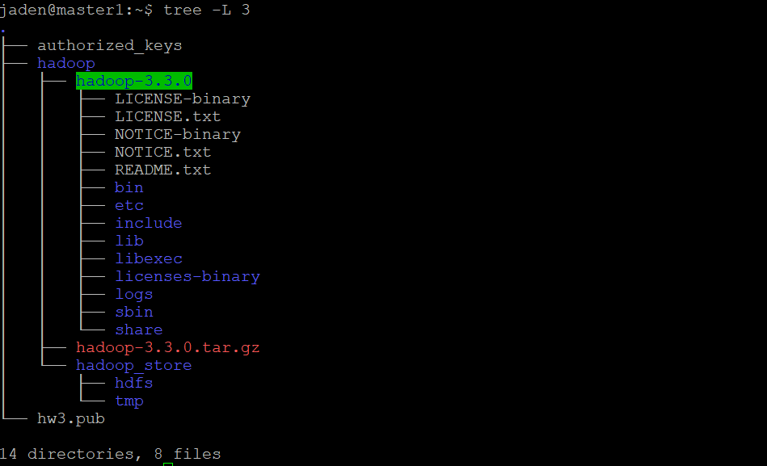

Start the service.

```
start-dfs.sh
start-yarn.sh
jps
```

Check the cluster ID to make sure the nodes of HDFS is on the same cluster, if not, just change them to the same ID.

```shell
vim /home/jaden/hadoop/hadoop_store/hdfs/datanode/current/VERSION
vim /home/jaden/hadoop/hadoop_store/hdfs/namenode/current/VERSION
```

Installation of Hadoop cluster success!

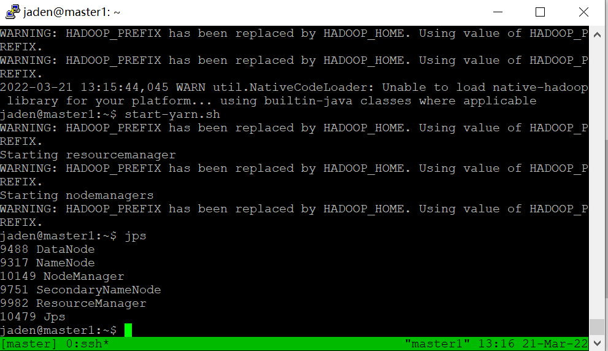

###### 4. Check the installation of HDFS and YARN

On http://ip:9870 web UI to check HDFS.

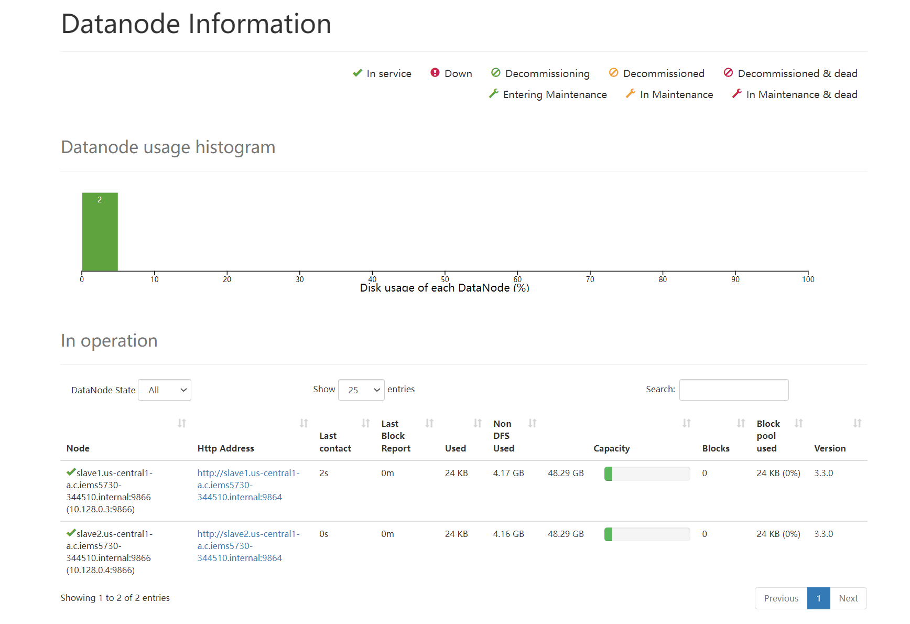

On http://ip:8088 to check YARN resource manager and node manager.

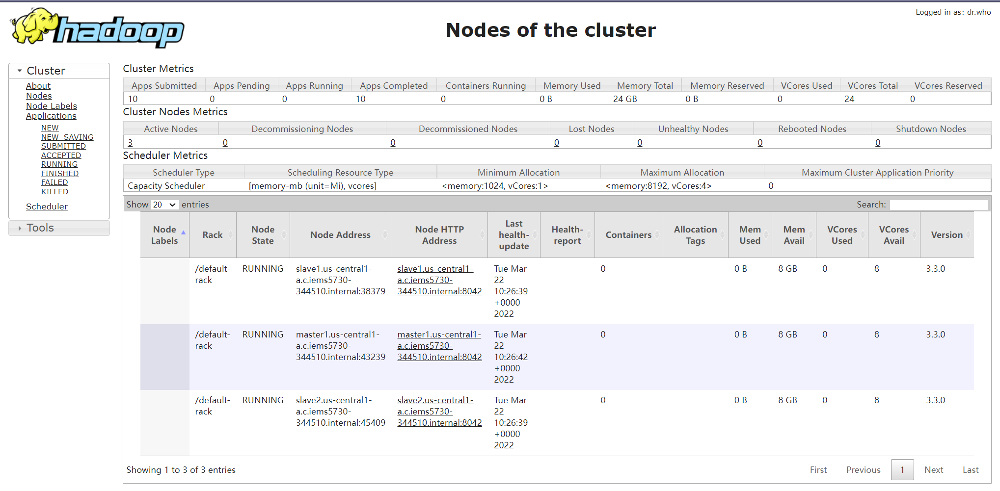

```shell
stop-yarn.sh
stop-dfs.sh
hadoop namenode -format
hdfs namenode -format
```

##### 2. Install Spark on Hadoop Cluster

###### 1. Download Spark

```shell 
wget -c -N https://dlcdn.apache.org/spark/spark-3.2.1/spark-3.2.1-bin-hadoop3.2.tgz -O ./spark/spark.tgz
tar xzvf spark.tgz
sudo mv spark/ /usr/lib/
```

###### 2. Add path on .bashrc

```shell
sudo vim ~/.bashrc
```

```shell
export SPARK_HOME=/usr/lib/spark/spark-3.2.1-bin-hadoop3.2
export PATH=$PATH:$SPARK_HOME/bin
export LD_LIBRARY_PATH=$HADOOP_HOME/lib/native:$LD_LIBRARY_PATH
```

```shell
source ~/.bashrc
```

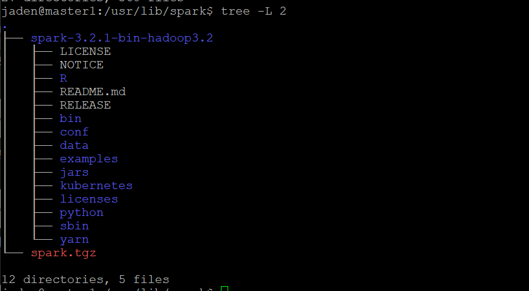

###### 3. Use YARN for multi-node Spark cluster

Add JAVA_HOME to yarn-env.sh

```shell
export JAVA_HOME=/usr/lib/jvm/java-1.8.0-openjdk-amd64
```

```shell
vim $SPARK_HOME/conf/spark-defaults.conf
```

```shell
spark.master yarn
spark.driver.memory 512m
spark.yarn.am.memory 512m
spark.executor.memory 512m
```

Add environment and master IP to spark-env.sh.

```shell
sudo vim spark-env.sh
```

```shell
export SPARK_MASTER_HOST='10.128.0.5'
export JAVA_HOME=/usr/lib/jvm/java-1.8.0-openjdk-amd64
```

Add workers.

```shell
sudo cp workers.template workers
sudo vim workers
```

```
master1
slave1
slave2
```

###### 4. Run Spark-3.2.1 on Yarn

Start Spark cluster.

```shell
start-all.sh
```

Spark shell.

```shell
spark-shell --master yarn --deploy-mode client
```

The following warning indicates that if we put jar on HDFS and assign the location as spark.yarn.jars, the initialization of Spark on Yarn can be faster, because it bypass the uploading process of jar files.

Spark can be successfully launched.

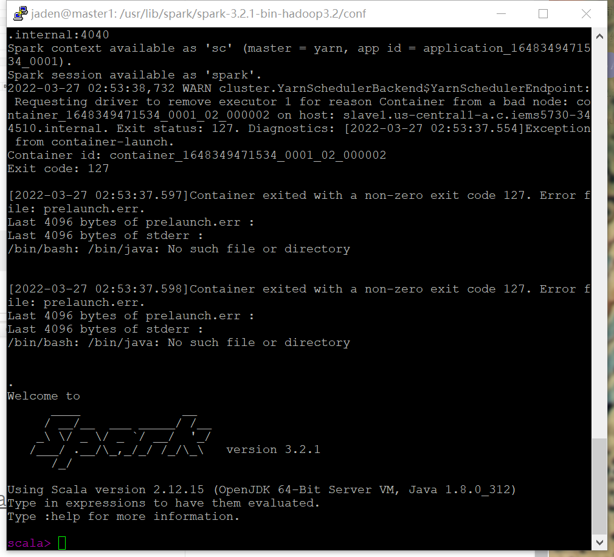

### Question 2

#### a) Naive implementation of PageRank in spark

##### 1. Dataset Preparation

```shell
 wget https://snap.stanford.edu/data/web-Google.txt.gz
 gzip -d web-Google.txt.gz
```

##### 2. Scala Programming

I set the iteration to 10 times.

`pagerank.scala`

```scala
import org.apache.spark.{SparkContext, SparkConf}

object pagerank{

    def main(args: Array[String]){
        val ITERATIONS = 10
        val conf = new SparkConf().setAppName("pagerank").setMaster("yarn")
        val sc = new SparkContext(conf)
        val raw = sc.textFile("./hw3/web-Google.txt")
        // filter the headers
        val links = raw.map{ 
        s => val parts = s.split("\\s+")
        (parts(0), parts(1))
        }.distinct().groupByKey()

        var ranks = links.mapValues(v => 1.0).distinct()
        // collect garbage
        raw.unpersist()

        for (i <- 1 to ITERATIONS) {
            val contribs = links.join(ranks).flatMap{
            case(url, (links, rank)) =>
            links.map(dest => (dest, rank/(links.size).toDouble))
        }
        ranks = contribs.reduceByKey(_+_)
        .mapValues(0.15 + 0.85 * _)
        }
        ranks.saveAsTextFile("./hw3/q2_a_2")
        sc.stop()
    }
}
```

##### 3. Run Scala Script

###### 1. Install sbt

```shell
sudo apt-get update
sudo apt-get install apt-transport-https curl gnupg -yqq
echo "deb https://repo.scala-sbt.org/scalasbt/debian all main" | sudo tee /etc/apt/sources.list.d/sbt.list
echo "deb https://repo.scala-sbt.org/scalasbt/debian /" | sudo tee /etc/apt/sources.list.d/sbt_old.list
curl -sL "https://keyserver.ubuntu.com/pks/lookup?op=get&search=0x2EE0EA64E40A89B84B2DF73499E82A75642AC823" | sudo -H gpg --no-default-keyring --keyring gnupg-ring:/etc/apt/trusted.gpg.d/scalasbt-release.gpg --import
sudo chmod 644 /etc/apt/trusted.gpg.d/scalasbt-release.gpg
sudo apt-get update
sudo apt-get install sbt
```

###### 2. [Compile Jar file](https://www.scala-sbt.org/1.x/docs/Installing-sbt-on-Linux.html)

Submit to Spark cluster: it can only submit jar file, I use sbt to get the jar file using my VM.

`build.sbt`

```shell
name := "PageRank"

version := "1.2-yarn"

scalaVersion := "2.11.8"

libraryDependencies += "org.apache.spark" %% "spark-sql" % "2.3.0"
```

```shell
sbt package
```

###### 3. Run on Spark

Run Spark on cluster.

```shell
spark-submit \
--master yarn \
--deploy-mode cluster \
--class pagerank pagerank_2.11-1.2-yarn.jar
```

`DEBUG MODE` To easily debug, I use the following script to run Scala script on Spark shell.

```shell
cat pagerank.scala | spark-shell
```

###### 4. Format the result for Top 100 nodes

```shell
# remove the brackets
awk -F "[()]" '{print $2}' ./q2_a/part-00000 > rst
# use -n number to rank, -r reverse, -k the 2nd col, use -t to separate, > overwrite
sort -n -r -k 2 -t , rst > rst2
head -n 100 rst2 > q2a_rst
```

Time: 1 min 58 secs.

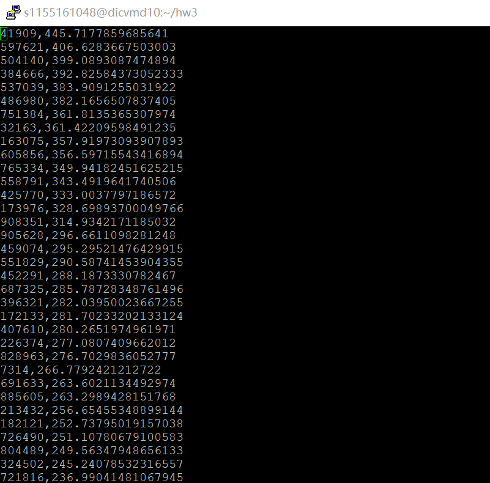

```
41909,445.7177859685641
597621,406.6283667503003
504140,399.0893087474894
384666,392.82584373052333
537039,383.9091255031922
486980,382.1656507837405
751384,361.8135365307974
32163,361.42209598491235
163075,357.91973093907893
605856,356.59715543416894
765334,349.94182451625215
558791,343.4919641740506
425770,333.0037797186572
173976,328.69893700049766
908351,314.9342171185032
905628,296.6611098281248
459074,295.29521476429915
551829,290.58741453904355
452291,288.1873330782467
687325,285.78728348761496
396321,282.03950023667255
172133,281.70233202133124
407610,280.2651974961971
226374,277.0807409662012
828963,276.7029836052777
7314,266.7792421212722
691633,263.6021134492974
885605,263.2989428151768
213432,256.65455348899144
182121,252.73795019157038
726490,251.10780679100583
804489,249.56347948656133
324502,245.24078532316557
721816,236.99041481067945
277876,233.4825039368369
599130,233.36584578706737
245186,231.7506082237541
185067,228.87421918562274
402132,228.19557839268074
54147,227.57684176408952
587935,223.48188409931288
185821,221.14852171845496
448961,219.13169671375888
57791,218.60319393508246
399699,218.32012210961037
621670,217.78711378379336
555924,210.76345432627198
191990,209.43009916575434
434134,207.18961566533102
870811,206.6488138580463
699754,199.39261525784445
323129,197.73674134490096
614831,197.29121491144454
486434,196.8111375935217
468736,195.26147753654752
715883,191.60983258338157
626893,187.00053551470623
818382,186.07981938181052
596972,185.11846358075357
354640,184.74857572617591
183501,182.8509054390336
74397,179.44020250534058
819223,178.84424802037046
846221,177.29519497561068
21682,176.79800542211726
1536,176.39570919750503
637936,171.8390644979761
587721,170.4666122286264
223236,169.7706736695765
666882,168.70393256398216
557124,167.85095554549426
466323,167.355070757594
483532,163.3087056611838
138746,162.84888625943498
227675,160.30037790267292
812640,157.9755836674466
187242,157.548134461372
438493,156.04383592698073
522190,155.48332945832996
369102,155.11774193650612
772466,153.9280093189821
798584,152.58942793879862
427629,146.39551390023803
495084,146.22720347992663
298511,145.51276521495407
133962,142.9368312579909
438491,139.80187443500148
564521,137.6932865127337
36292,136.9407855164268
48888,136.83717645193883
704396,135.64489261274252
887710,133.92928077482173
655158,128.52313818101894
556129,126.7380254489762
456932,126.04758256982146
673065,125.5212132499487
352975,124.99433737011346
539241,124.24430480521193
232639,122.10533577340209
671193,121.33470171682715
```

#### b) Advanced implementation of PageRank in Spark

##### 1. Scala Programming

The same as the above implementation, the arguments includes [*time of iterations*, *hash*, *input*,*output*].

`adv_pagerank.scala`

```scala
import org.apache.spark.{SparkContext, SparkConf, HashPartitioner}

object adv_pagerank{
    def main(args: Array[String]){
        val iters = args(0).toInt
        val hash = args(1).toInt
        val input = args(2)
        val output = args(3)
        val conf = new SparkConf().setAppName("adv_pagerank").setMaster("yarn")
        val sc = new SparkContext(conf)
        val raw = sc.textFile(input)
        // filter the headers
        val links = raw.map{ 
        s => val parts = s.split("\\s+")
        (parts(0), parts(1))
        }.distinct().groupByKey().partitionBy(new HashPartitioner(hash))
        var ranks = links.mapValues(v => 1.0).distinct()
        // collect garbage
        raw.unpersist()
        for (i <- 1 to iters) {
            val contribs = links.join(ranks).flatMap{
            case(url, (links, rank)) =>
            links.map(dest => (dest, rank/(links.size).toDouble))
        }
        ranks = contribs.reduceByKey(_+_)
        .mapValues(0.15 + 0.85 * _)
        }
        ranks.saveAsTextFile(output)
        sc.stop()
    }
}
```

##### 2. Run the script

The same way to debug, compile and submit.

```shell
spark-submit \
--master yarn \
--deploy-mode cluster \
--class adv_pagerank pagerank_2.11-1.3-yarn.jar 10 8 "./hw3/web-Google.txt" "./hw3/q2_b"
```

```shell
spark-submit \
--master yarn \
--deploy-mode cluster \
--class adv_pagerank pagerank_2.11-1.3-yarn.jar 10 20 "./hw3/web-Google.txt" "./hw3/q2_b_20"
```

```shell
spark-submit \
--master yarn \
--deploy-mode cluster \
--class adv_pagerank pagerank_2.11-1.3-yarn.jar 10 3 "./hw3/web-Google.txt" "./hw3/q2_b_3"
```

Partition of result is the same as set in HashPartitioner.

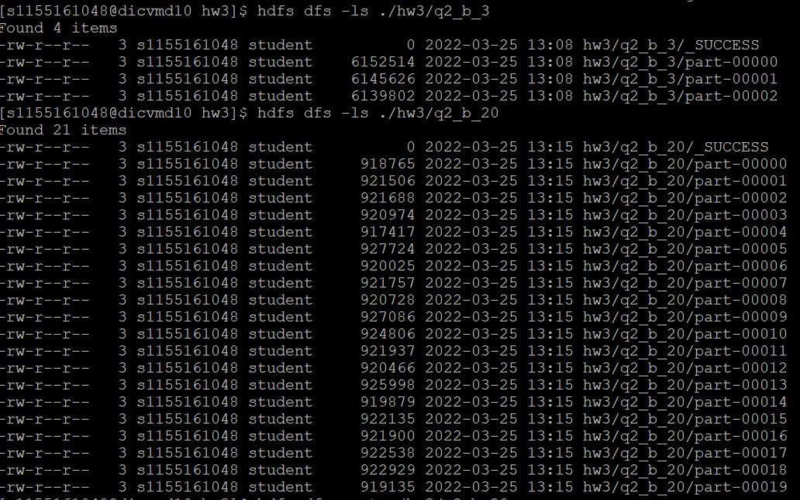

Result is the same with Q2-(a)

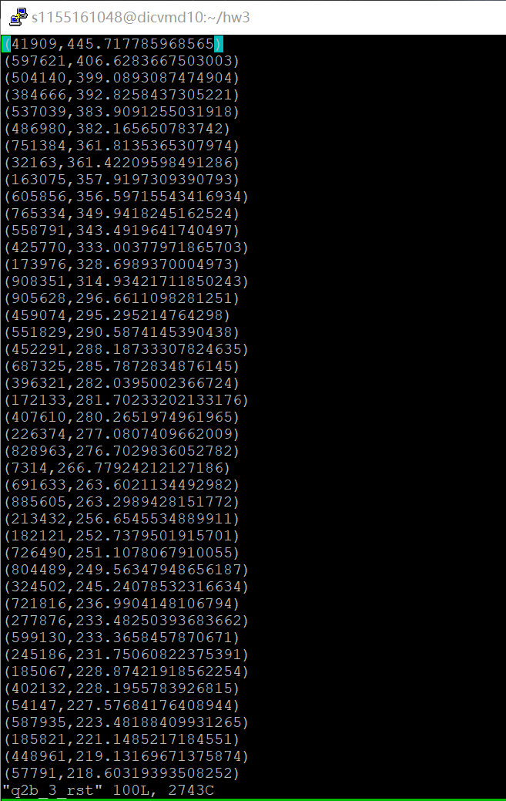

##### 3. Compare performances with other 2 different cases

| Hash Partition | No Partition |    3     |    8     |    20    |
| :------------: | :----------: | :------: | :------: | :------: |
|      Time      |   1min 58s   | 1min 39s | 2min 22s | 1min 42s |

### Question 3

I use spark-shell to check the correctness of code and run the scripts by compiling them into `spark-sql_2.11-1.0.jar`.

#### a) Load and truncate data file

I use `df.na.drop("any")` to drop rows with null data.

```scala
import org.apache.spark.sql.SparkSession
import org.apache.spark.sql.functions._

object sparkSQL_a{
    def main(args: Array[String]){
        val input = "./hw3/Crime_Incidents_in_2013.csv"
        val spark = SparkSession
        .builder()
        .appName("crimeInc")
        .master("yarn")
        .getOrCreate()
        import spark.implicits._
        val df = spark.read.option("header","true").csv(input)
        df.createOrReplaceTempView("crime")
        var crimeDF = spark.sql(
            "SELECT CCN, REPORT_DAT, OFFENSE, METHOD, END_DATE, DISTRICT FROM crime")
        crimeDF = crimeDF.na.drop("any")
        crimeDF.write.csv("./hw3/q3_a")
        spark.stop()
    }
}
```

#### b)  Query

```scala
import org.apache.spark.sql.SparkSession
import org.apache.spark.sql.functions.countDistinct
import org.apache.spark.sql.functions._

object sparkSQL_b{
    def main(args: Array[String]){
        val input = "./hw3/Crime_Incidents_in_2013.csv"
        val spark = SparkSession
        .builder()
        .appName("crimeInc2")
        .master("yarn")
        .getOrCreate()
        import spark.implicits._
        val df = spark.read.option("header","true").csv(input)

        df.createOrReplaceTempView("crime")
        var crimeDF = spark.sql(
            "SELECT CCN, SHIFT, REPORT_DAT, OFFENSE, METHOD, END_DATE, DISTRICT FROM crime")
        crimeDF = crimeDF.na.drop("any")
        // the number of each offenses
        val offenceCount = crimeDF.groupBy("OFFENSE").count().orderBy(desc("count"))
        val shiftCount = crimeDF.groupBy("SHIFT").count().orderBy(desc("count"))
        
        offenceCount.write.csv("./hw3/q3_b_offenceCount.csv")
        shiftCount.write.csv("./hw3/q3_b_shiftCount.csv")
        spark.stop()
    }
}
```

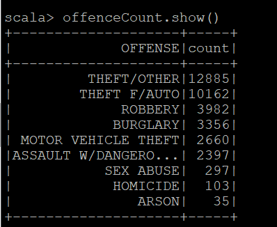

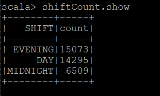

#### c) Union

```scala
import org.apache.spark.sql.{SparkSession,Row}
import org.apache.spark.sql.types.{StructType,StructField,StringType}
import org.apache.spark.sql.functions.countDistinct
import org.apache.spark.sql.functions._

object sparkSQL_c{
    def main(args: Array[String]){
        val spark = SparkSession
        .builder()
        .appName("crimeInc3")
        .master("yarn")
        .getOrCreate()
        import spark.implicits._
        val schema = StructType(
            StructField("REPORT_DAT", StringType, true) ::
            StructField("OFFENSE", StringType, true) :: Nil)
        var crimeDF = spark.createDataFrame(spark.sparkContext.emptyRDD[Row], schema)

        for(i <- 2010 to 2018){
            var input = s"./hw3/crimeIncidents/Crime_Incidents_in_$i.csv"
            val df = spark.read.option("header","true").csv(input).select("REPORT_DAT","OFFENSE")
            crimeDF = crimeDF.union(df)
        }
        crimeDF = crimeDF.na.drop("any")
        crimeDF = crimeDF.withColumn("YEAR", substring(col("REPORT_DAT"),1,4)).select("YEAR","OFFENSE")
        val crimeStats = crimeDF.groupBy("OFFENSE","YEAR").count()
        var crimeYear = crimeDF.groupBy("YEAR").count()
        crimeYear = crimeYear.withColumnRenamed("count","yearCount").withColumnRenamed("YEAR","YEAR_1")
        var crimeStats2 = crimeStats.join(crimeYear, crimeStats("YEAR") === crimeYear("YEAR_1"),"left")
        crimeStats2 = crimeStats2.select("OFFENSE","YEAR","count","yearCount")
                                 .withColumn("crimeRate",col("count")/col("yearCount"))
                                 .where(crimeStats2("OFFENSE")==="ASSAULT W/DANGEROUS WEAPON")
                                 .select("OFFENSE","YEAR","crimeRate")
                                 .orderBy(desc("YEAR"))
        
        crimeStats2.write.csv("./hw3/q3_c")
        spark.stop()
    }
}
```

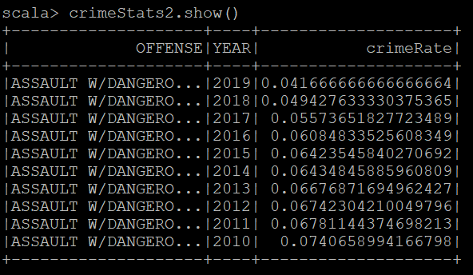

By checking the crime rate of offense "ASSULT W/DANGEROUS WEAPON", the decreasing rate indicates the effect of Obama's gun control policy.

#### Compile to Jar file and submit

```shell
name := "Spark-SQL"

version := "1.0"

scalaVersion := "2.11.8"

libraryDependencies ++= Seq("org.apache.spark" %% "spark-sql" % "2.3.0", "org.apache.spark" %% "spark-core" % "2.3.0")
```

```shell
spark-submit \
--master yarn \
--deploy-mode cluster \
--class sparkSQL_a spark-sql_2.11-1.0.jar

spark-submit \
--master yarn \
--deploy-mode cluster \
--class sparkSQL_b spark-sql_2.11-1.0.jar

spark-submit \
--master yarn \
--deploy-mode cluster \
--class sparkSQL_c spark-sql_2.11-1.0.jar
```

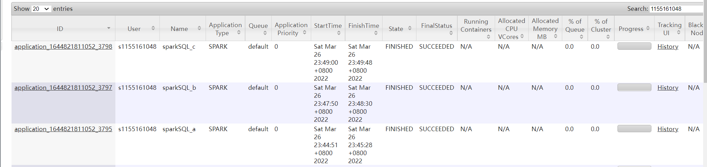

### Question 4 - Bonus

#### a)  Build docker image for Spark application

Under dir `:/usr/lib/spark/spark-3.2.1-bin-hadoop3.2`.

```shell
sudo ./bin/docker-image-tool.sh -r docker.io/jadenqi -t v3.2.1 build
```

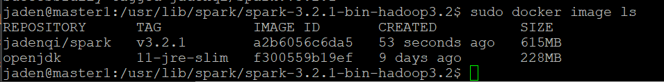

#### b) Push docker image to Docker hub

```shell
docker login
sudo ./bin/docker-image-tool.sh -r jadenqi -t v3.2.1 push
```

URL: https://hub.docker.com/repository/docker/jadenqi/spark

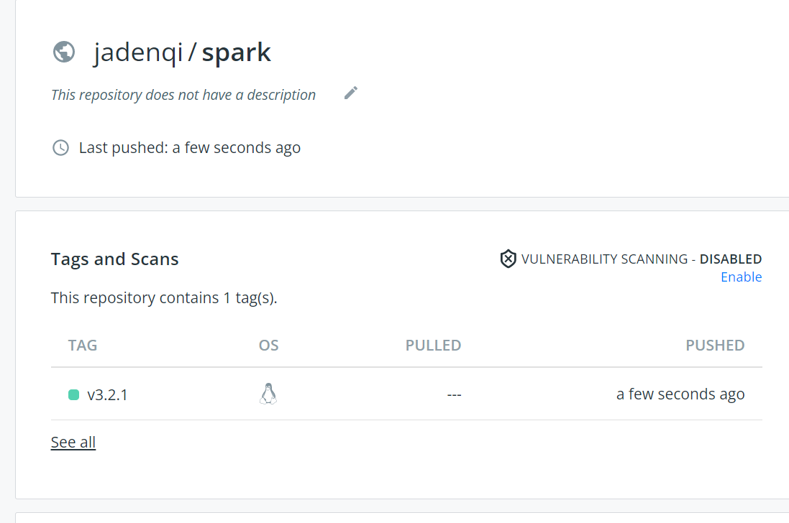

#### c)  Submit Spark job to K8s

##### 1. Namespace environment for K8s

Before doing that, I installed `docker` and `kubectl` like that in Homework1 on my Windows desktop.

```shell
mkdir ~/.kube
mv s1155161048.config ~/.kube/config
kubectl get pods -n s1155161048
```


##### 2. Submit Spark Word Count Job

```shell
$SPARK_HOME/bin/spark-submit \
     --master k8s://https://172.16.5.98:6443 \
     --deploy-mode cluster \
     --name wordCount \
     --class org.apache.spark.examples.JavaWordCount \
     --conf spark.app.name= wordcount\
     --conf spark.kubernetes.authenticate.driver.serviceAccountName=spark \
     --conf spark.kubernetes.namespace=s1155161048 \
     --conf spark.kubernetes.container.image=docker.io/jadenqi/spark:v3.2.1 \
     --conf spark.kubernetes.container.image.pullPolicy=Always \
local:///opt/spark/examples/jars/spark-examples_2.12-3.2.1.jar \
wordCountCase.txt ./wordCountResult
```

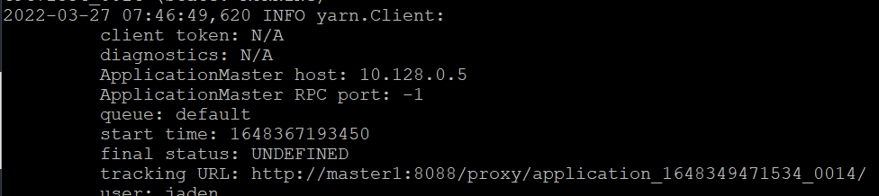

### Question 5 - Bonus

The Spark driver pod uses a Kubernetes service account to access the Kubernetes API server to create and watch executor pods.

#### a) Suddenly kill a Spark executor pod

```shell
kubectl delete pod xxxxxx -n s1155161048
kubectl get pods -n s1155161048
kubectl log spark-executor-pod -n s1155161048
```

Force deletions **do not** wait for confirmation from the kubelet that the Pod has been terminated. Irrespective of whether a force deletion is successful in killing a Pod, it will immediately free up the name from the apiserver. This would let the StatefulSet controller create a **replacement Pod with that same identity**; this can lead to the duplication of a still-running Pod

#### b) Suddenly kill a Spark driver pod

```shell
kubectl delete pod xxxxxx -n s1155161048
kubectl get pods -n s1155161048
kubectl log spark-driver-pod -n s1155161048
```

According to the log, deleting the driver pod will **clean up the entire spark application**, including all executors, associated service, etc. The driver pod can be thought of as the Kubernetes representation of the Spark application.

### References

1. Spark setup on Hadoop Yarn.https://sparkbyexamples.com/spark/spark-setup-on-hadoop-yarn/
2. Single Node Hadoop-3.3.0 (1)https://kontext.tech/article/448/install-hadoop-330-on-linux
3. Single Node Hadoop-3.3.0 (2)https://linuxhint.com/install-apache-hadoop-ubuntu/
4. Multi Node Hadoop-3.3.0 https://cdmana.com/2020/12/20201214004322747q.html
5. Install Spark on YARNhttps://sparkbyexamples.com/spark/spark-setup-on-hadoop-yarn/
6. Spark configurations and web UI https://spark.apache.org/docs/latest/configuration.html#spark-ui
7. Page rank on Scala http://www.openkb.info/2016/03/understanding-pagerank-algorithm-in.html
8. Page rank on Scala https://github.com/apache/spark/blob/master/graphx/src/main/scala/org/apache/spark/graphx/lib/PageRank.scala
9. Spark - Scala functions documenthttps://spark.apache.org/docs/1.5.1/api/java/org/apache/spark/SparkContext.html
10. Spark Installation on Linux Ubuntu https://sparkbyexamples.com/spark/spark-installation-on-linux-ubuntu/
11. Install Apache Spark on Ubuntu 22.04|20.04|18.04 https://computingforgeeks.com/how-to-install-apache-spark-on-ubuntu-debian/
12. Set up Apache Spark on a Multi-Node Cluster https://medium.com/ymedialabs-innovation/apache-spark-on-a-multi-node-cluster-b75967c8cb2b
13. Create jar from Scala scripts https://spark.apache.org/docs/latest/quick-start.html#self-contained-applications
14. Install sbt on Ubuntu https://www.scala-sbt.org/1.x/docs/Installing-sbt-on-Linux.html
15. Spark submit https://stackoverflow.com/questions/37132559/add-jar-files-to-a-spark-job-spark-submit
16. Spark SQL programming https://spark.apache.org/docs/2.3.0/sql-programming-guide.html
17. Spark SQL add/delete https://blog.csdn.net/lidongmeng0213/article/details/105784542
18. Official documentationhttps://spark.apache.org/docs/latest/api/scala/org/apache/spark/sql/Dataset.html
19. Data type transfer https://blog.csdn.net/wangpei1949/article/details/88754706
20. Submit applications to k8s https://spark.apache.org/docs/latest/running-on-kubernetes.html#docker-images
21. Pod life cycle and Pods https://spark.apache.org/docs/latest/running-on-kubernetes.html

